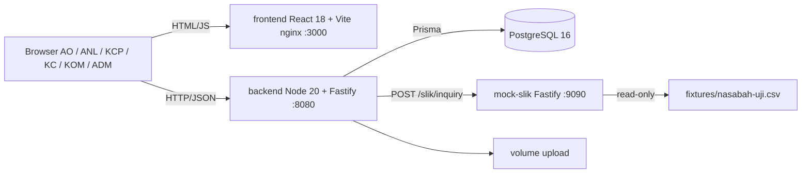

# iMitra — Sistem Originasi Pembiayaan Mikro Syariah

> **Berkas ini adalah TEMPLATE.** Setiap blok `<!-- ISI: ... -->` adalah placeholder yang wajib
> Anda ganti. Jangan biarkan satu pun `<!-- ISI: ... -->` tersisa di tag `v1.0.0` — penilai
> membaca README ini lebih dulu, sebelum menjalankan aplikasi Anda.
>
> Aturan praktis: kalau penilai tidak bisa menjalankan aplikasi Anda hanya dengan membaca
> berkas ini, aplikasi Anda dianggap tidak jalan.

---

## 1. Tim

<!-- ISI: nama tim. Bebas, tapi dipakai konsisten di semua dokumen dan di nama repo. -->

**Nama tim**: `<!-- ISI: nama tim -->`

Enam orang: **3 backend, 3 frontend**. Rincian kepemilikan modul, batas berkas per orang,
rencana per gate, dan daftar issue ada di [`docs/PEMBAGIAN-TIM.md`](docs/PEMBAGIAN-TIM.md).

| Nama | Peran | Fokus FR | Akun GitHub |
|---|---|---|---|
| Firman | Tech Lead / Integrator + DevOps / Release · **backend** | FR-01, FR-09, infra (compose, CI, migrasi, seed) | `<!-- ISI: @username -->` |
| Alfian | Backend — Risiko & Perhitungan + pemilik mock SLIK | FR-05, FR-06, FR-07, FR-13 | `<!-- ISI: @username -->` |
| Dani | Backend — Alur & Approval | FR-02, FR-03, FR-04, FR-08, FR-10 | `<!-- ISI: @username -->` |
| Reffa | Frontend Lead + QA / Verification | FR-12, fondasi UI (S-01, S-02, S-04, S-12) | `<!-- ISI: @username -->` |
| Ray | Frontend — layar lapangan & dokumen | FR-11, layar S-03, S-05, S-06, S-07 | `<!-- ISI: @username -->` |
| Eka | Frontend — layar analis/approver/admin + AI Workflow Officer | Layar S-08 s.d. S-11, S-13, S-14 | `<!-- ISI: @username -->` |

Brief §10 untuk tim 6 orang merancang 2 backend + 1 frontend. Kami memilih 3 + 3 karena
14 layar untuk 6 peran tidak selesai dengan satu orang frontend. Konsekuensinya — QA,
AI Workflow Officer, dan DevOps menjadi peran rangkap, dan risiko bergeser ke sisi backend —
dicatat beserta rencana kontinjensinya di
[`docs/PEMBAGIAN-TIM.md`](docs/PEMBAGIAN-TIM.md) bagian 0 dan 5.

**Perubahan peran selama hackathon**:

| Kapan | Perubahan | Alasan |
|---|---|---|
| 2026-08-20, Sprint 0 | Firman ↔ Ray ditukar: Firman ke backend sebagai Tech Lead, Ray ke frontend | Kepemilikan repo dan `AGENTS.md` ada pada Firman, sehingga peran Tech Lead lebih tepat di sana |
| `<!-- ISI -->` | `<!-- ISI -->` | `<!-- ISI -->` |

---

## 2. Cara Menjalankan

### 2.1 Prasyarat

- **Docker Engine ≥ 24** dan **Docker Compose v2** — hanya ini yang diperlukan untuk
  menjalankan seluruh sistem. Node dan PostgreSQL tidak perlu dipasang di host.
- **Node.js 20 LTS** — hanya kalau Anda mengembangkan tanpa Docker, atau menjalankan test.
- Port **3000**, **8080**, **9090**, dan **5432** harus bebas. Kalau bentrok, ubah nilainya
  di `.env` (bagian "Port layanan") — tidak perlu mengubah kode.

### 2.2 Langkah

```bash
git clone https://github.com/codebubub/iMitra-Tim-2.git
cd iMitra-Tim-2
cp .env.example .env
docker compose up --build
```

Selesai. Migrasi dan seed dijalankan otomatis oleh service `migrate`; tidak ada perintah
tambahan. Tunggu sampai `docker compose ps` menampilkan seluruh service `healthy`
(sekitar 2–4 menit pada build pertama), lalu buka <http://localhost:3000>.

**Dua mode database, satu perintah.** `.env.example` mengarah ke PostgreSQL lokal di dalam
compose — itu yang berjalan dengan langkah di atas, dan itu yang dipakai penilai. Anggota
tim mengubah dua baris di `.env` masing-masing untuk memakai PostgreSQL bersama (Aiven),
tanpa mengubah perintahnya. Rinciannya — termasuk pembagian schema per orang dan anggaran
koneksi — ada di [`docs/DATABASE.md`](docs/DATABASE.md).

> **Catatan untuk tim, bukan untuk penilai.** Direktori `backend/prisma/migrations/` harus
> sudah berisi migrasi awal sebelum langkah di atas bekerja. Migrasi itu dibangkitkan
> sekali oleh Tech Lead lalu di-commit:
>
> ```bash
> cd backend && npm install && npx prisma migrate dev --name skema_awal
> ```
>
> Setelah migrasi itu ada di `main`, langkah 2.2 berjalan apa adanya di mesin mana pun.

### 2.3 Alamat layanan setelah jalan

| Layanan | URL | Catatan |
|---|---|---|
| Frontend | <http://localhost:3000> | Hasil build Vite disajikan nginx |
| Backend API | <http://localhost:8080> | Kesehatan: `/health` · Daftar route: `/api/_routes` |
| Mock SLIK | <http://localhost:9090> | Kontrak brief §6.1: `POST /slik/inquiry` |
| Database | `localhost:5432` | Hanya untuk inspeksi manual (psql / DBeaver) |

### 2.4 Migrasi & seed

Keduanya berjalan **otomatis** saat `docker compose up`. Perintah di bawah hanya
diperlukan kalau Anda menjalankan backend langsung di host.

```bash
# Migrasi (dari direktori backend/)
npx prisma migrate deploy

# Seed — idempoten, aman dijalankan berulang
npm run seed

# Reset demo ke kondisi awal (menghapus volume database dan berkas upload)
docker compose down -v && docker compose up --build
```

### 2.5 Akun demo

Password seluruh akun sama, diambil dari `SEED_DEFAULT_PASSWORD` di `.env`.
Ini akun seed non-produksi; nilainya bukan rahasia.

| Peran | Username | Password | Dipakai untuk AC |
|---|---|---|---|
| AO | `ao` | `Demo1234!` | AC-01, AC-02, AC-03 |
| ANL | `anl` | `Demo1234!` | AC-03 s.d. AC-09 |
| KCP | `kcp` | `Demo1234!` | AC-10 |
| KC | `kc` | `Demo1234!` | AC-10 |
| KOM | `kom` | `Demo1234!` | AC-10 |
| ADM | `adm` | `Demo1234!` | AC-15 |
| KCP (merangkap pembuat) | `kcp2` | `Demo1234!` | **AC-11** — maker mencoba menjadi approver |

Akun `kcp2` ada khusus supaya AC-11 bisa didemokan: ia berperan approver **dan** membuat
pengajuan sendiri, sehingga penolakan BR-09 bisa ditunjukkan.

### 2.6 Test & lint

Perintah di bawah **identik** dengan `AGENTS.md` bagian 7 dan
`.github/workflows/ci.yml`. Kalau ketiganya berbeda, salah satunya sudah usang.

```bash
# Test unit — seluruh aturan bisnis, tanpa database
cd backend && npm run test:unit

# Test integrasi — butuh database yang sudah dimigrasi dan di-seed
cd backend && npm run test:integration

# Test kontrak mock SLIK
cd mock-slik && npm test

# Lint (jalankan di backend/, frontend/, dan mock-slik/)
npm run lint

# Semua sekaligus, sama seperti yang dijalankan CI
cd backend && npm run ci
```

---

## 3. Arsitektur Singkat

Empat container di satu jaringan Docker. Browser memanggil **frontend** (React, disajikan
nginx) dan **backend** (Fastify) lewat `localhost`; backend memanggil **mock-slik** lewat
nama service `http://mock-slik:9090` karena pemanggilnya container, bukan browser. Data
disimpan di **PostgreSQL**, berkas unggahan di volume terpisah.

Di dalam backend, seluruh aturan bisnis hidup di `src/domain/` sebagai **fungsi murni** —
tanpa Prisma, tanpa HTTP, tanpa `process.env` — sehingga setiap BR bisa diuji tanpa
menyalakan server. Parameter bisnis (bobot skor, ambang approval, rentang margin) dibaca
dari database **pada setiap pemanggilan**, tidak pernah di-cache di proses; itulah yang
membuat perubahan oleh ADM berlaku tanpa restart. Total plafon dan level approval **tidak
disimpan** sebagai kolom, melainkan dihitung dari anggota aktif saat dibaca.

Otorisasi ditegakkan di server dalam dua lapis: middleware peran per endpoint (setiap route
**wajib** mendeklarasikan peran yang berwenang — route yang lupa membuat proses gagal saat
start), dan pemeriksaan kepemilikan di service. Menyembunyikan tombol di frontend murni
kenyamanan navigasi.



**Stack yang dipilih**: TypeScript (Node 20) + Fastify · React 18 + Vite · PostgreSQL 16 ·
Prisma (client + migrate) · Vitest · ESLint + Prettier.
Alasan pemilihan ada di [`docs/adr/0001-pilihan-stack.md`](docs/adr/0001-pilihan-stack.md).

Rancangan lengkap — model data, 32 endpoint, keamanan, deployment — ada di
[`docs/SDD-iMitra.md`](docs/SDD-iMitra.md). Jangan duplikasi isinya ke sini.

**Aturan untuk AI agent**: [`AGENTS.md`](AGENTS.md)

---

## 4. Status Functional Requirements

<!-- ISI: kolom Status dan PR. Kolom FR / Requirement / Prioritas sudah benar sesuai brief §3
     — jangan diubah, penilai mencocokkannya.
     Nilai Status yang diizinkan, pilih satu:
       - Selesai & teruji  : lolos AC terkait, ada test otomatis, sudah di-merge ke main
       - Selesai           : jalan dan di-merge, tetapi belum ada test otomatis
       - Sebagian          : hanya sebagian AC terpenuhi. WAJIB dijelaskan di bagian 5
       - Tidak dikerjakan  : sengaja dibuang. WAJIB dijelaskan di bagian 5
     Jangan pakai "In progress" di tag v1.0.0 — pada saat itu tidak ada lagi yang sedang jalan.
     Kolom PR: nomor PR yang menyelesaikannya, mis. #14, #21.
     Perbarui tabel ini setiap kali PR di-merge, bukan sekali di akhir. -->

### P0 — WAJIB (batas lulus fungsional)

| FR | Requirement | Prioritas | Status | PR |
|---|---|---|---|---|
| FR-01 | Autentikasi & Otorisasi Berbasis Peran | P0 | Selesai & teruji |  |
| FR-02 | Pengajuan Pembiayaan Mikro | P0 |  |  |
| FR-03 | Upload & Verifikasi Dokumen | P0 |  |  |
| FR-04 | Survei Lapangan (OTS) | P0 |  |  |
| FR-05 | SLIK Check | P0 |  |  |
| FR-06 | Skoring Kelayakan Mikro | P0 |  |  |
| FR-07 | Perhitungan Margin / Nisbah | P0 |  |  |
| FR-08 | Approval Berjenjang | P0 |  |  |
| FR-09 | Audit Trail | P0 | Selesai & teruji |  |

### P1 — SEHARUSNYA (nilai penuh butuh ini)

| FR | Requirement | Prioritas | Status | PR |
|---|---|---|---|---|
| FR-10 | Pembiayaan Kelompok (Majelis) | P1 |  |  |
| FR-11 | Notifikasi Perubahan Status | P1 | Sebagian |  |
| FR-12 | Dashboard Pipeline | P1 |  |  |
| FR-13 | Parameter Terkonfigurasi | P1 |  |  |

### P2 — BOLEH (hanya kalau P0 dan P1 tuntas dan teruji)

| FR | Requirement | Prioritas | Status | PR |
|---|---|---|---|---|
| FR-14 | Simulasi angsuran murabahah & proyeksi bagi hasil musyarakah | P2 |  |  |
| FR-15 | Ekspor daftar pengajuan ke CSV | P2 |  |  |
| FR-16 | Mode draft offline untuk AO di lapangan | P2 |  |  |
| FR-17 | Deteksi lokasi palsu (mock location) pada survei lapangan | P2 |  |  |
| FR-18 | Laporan Turn-Around Time per tahap dan per petugas | P2 |  |  |

Penelusuran rinci FR → endpoint → test → PR ada di [`docs/TRACEABILITY.md`](docs/TRACEABILITY.md).

---

## 5. Tidak Diimplementasikan dan Mengapa

> **Bagian ini wajib ada dan wajib terisi.** Ia bukan pengakuan kegagalan — ia bukti bahwa
> tim memutuskan secara sadar.
>
> Kenapa penting: menurut brief §11 (Gate 3) dan §12, **fitur setengah jadi yang dibiarkan
> mengambang tanpa catatan bernilai negatif (−5 per fitur, maksimum −10), sementara fitur
> yang dibuang dengan alasan tertulis bernilai positif.** Membuang FR-14 dengan alasan
> "P0 belum semua teruji, kami pilih memperkuat FR-06" adalah keputusan rekayasa dan
> dinilai sebagai keahlian. Meninggalkan tombol yang tidak berfungsi tanpa penjelasan
> adalah utang yang tidak diakui.
>
> Tulis bagian ini pada Gate 3 (Jumat 11.20), bukan pada Jumat 14.55.

<!-- ISI: satu baris per FR atau bagian FR yang tidak selesai. Isi kolom Keputusan dengan
     "Dibuang" (sengaja tidak dikerjakan) atau "Sebagian" (ada yang jalan, ada yang tidak).
     Untuk "Sebagian", sebutkan dengan tepat apa yang jalan dan apa yang tidak, supaya
     penilai tidak menemukannya sendiri saat demo.
     Alasan harus alasan rekayasa (prioritas, risiko, waktu, dependensi), bukan "kehabisan waktu"
     tanpa keterangan. -->

| FR / Bagian | Keputusan | Apa yang jalan | Apa yang tidak | Alasan | Diputuskan kapan |
|---|---|---|---|---|---|
| FR-11 Notifikasi | Sebagian | Sisi backend: baris notifikasi ditulis di dalam transaksi yang sama dengan perubahan status, `GET /api/notifikasi` dan `POST /api/notifikasi/{id}/baca` jalan dan teruji, kepemilikan ditegakkan di server | Layar notifikasi di frontend (S-xx, milik Ray) | Backend-nya prasyarat layarnya, jadi ia dikerjakan lebih dulu supaya frontend tidak menunggu kontrak yang belum ada (risiko R-3). Sisanya menyusul di PR frontend | 2026-08-20, bersama FR-01/FR-09 |
|  |  |  |  |  |  |
|  |  |  |  |  |  |

**Utang teknis yang kami sadari**:

<!-- ISI: hal-hal yang jalan tapi Anda tahu belum benar. Contoh: validasi hanya di frontend
     pada satu form tertentu, indeks database belum ada, penanganan timeout SLIK masih kasar.
     Menyebutkannya lebih dulu lebih baik daripada ditemukan penilai. -->

- `<!-- ISI -->`

---

## 6. Catatan AI Workflow

Tim ini memakai AI sebagai alat rekayasa. Jejaknya ada di tiga tempat:

| Dokumen | Isi |
|---|---|
| [`AGENTS.md`](AGENTS.md) | Aturan repo yang dibaca AI agent: stack, struktur, konvensi, aturan bisnis, larangan |
| [`docs/AI-WORKFLOW.md`](docs/AI-WORKFLOW.md) | Tool dan model apa untuk tugas apa, cara memberi konteks, pembagian AI vs manual |
| [`docs/AI-DEVLOG.md`](docs/AI-DEVLOG.md) | Jurnal pemakaian AI: minimal 10 entri, minimal 3 di antaranya kasus AI salah dan kami menangkapnya |

<!-- ISI: 3-5 baris ringkasan. Bukan menyalin isi ketiga dokumen di atas, tetapi menjawab:
     apa satu pola pemakaian AI yang terbukti paling berguna bagi tim ini selama 2 hari,
     dan apa satu hal yang Anda putuskan untuk TIDAK diserahkan ke AI. Penilai kemungkinan
     besar akan menanyakan ini di sesi tanya jawab, jadi jawaban tertulisnya sebaiknya
     sudah Anda sepakati bersama. -->

`<!-- ISI: ringkasan -->`

**Keputusan arsitektur yang menolak saran AI**: `<!-- ISI: rujuk nomor ADR, mis. docs/adr/0003-....md -->`

---

## 7. Dokumen Lain

| Dokumen | Isi |
|---|---|
| [`docs/SRS-iMitra.md`](docs/SRS-iMitra.md) | Requirement ringkas turunan brief |
| [`docs/SDD-iMitra.md`](docs/SDD-iMitra.md) | Arsitektur, model data, daftar endpoint |
| [`docs/DATABASE.md`](docs/DATABASE.md) | PostgreSQL bersama tim: schema per orang, anggaran koneksi, alur migrasi |
| [`docs/PEMBAGIAN-TIM.md`](docs/PEMBAGIAN-TIM.md) | Peran, kepemilikan modul, rencana per gate, risiko |
| [`docs/UIUX-STITCH.md`](docs/UIUX-STITCH.md) | Design system + 14 prompt Google Stitch per layar |
| [`docs/TRACEABILITY.md`](docs/TRACEABILITY.md) | FR → AC → endpoint → test → PR |
| [`docs/DEMO-SCRIPT.md`](docs/DEMO-SCRIPT.md) | Skrip demo AC-01 s.d. AC-15 beserta data uji |
| [`docs/adr/`](docs/adr/) | Architecture Decision Records (minimal 3) |
| [`fixtures/nasabah-uji.csv`](fixtures/nasabah-uji.csv) | Data uji wajib untuk mock SLIK |
| [`SETUP-SPRINT-0.md`](SETUP-SPRINT-0.md) | Checklist Sprint 0 — kerjakan ini lebih dulu |
