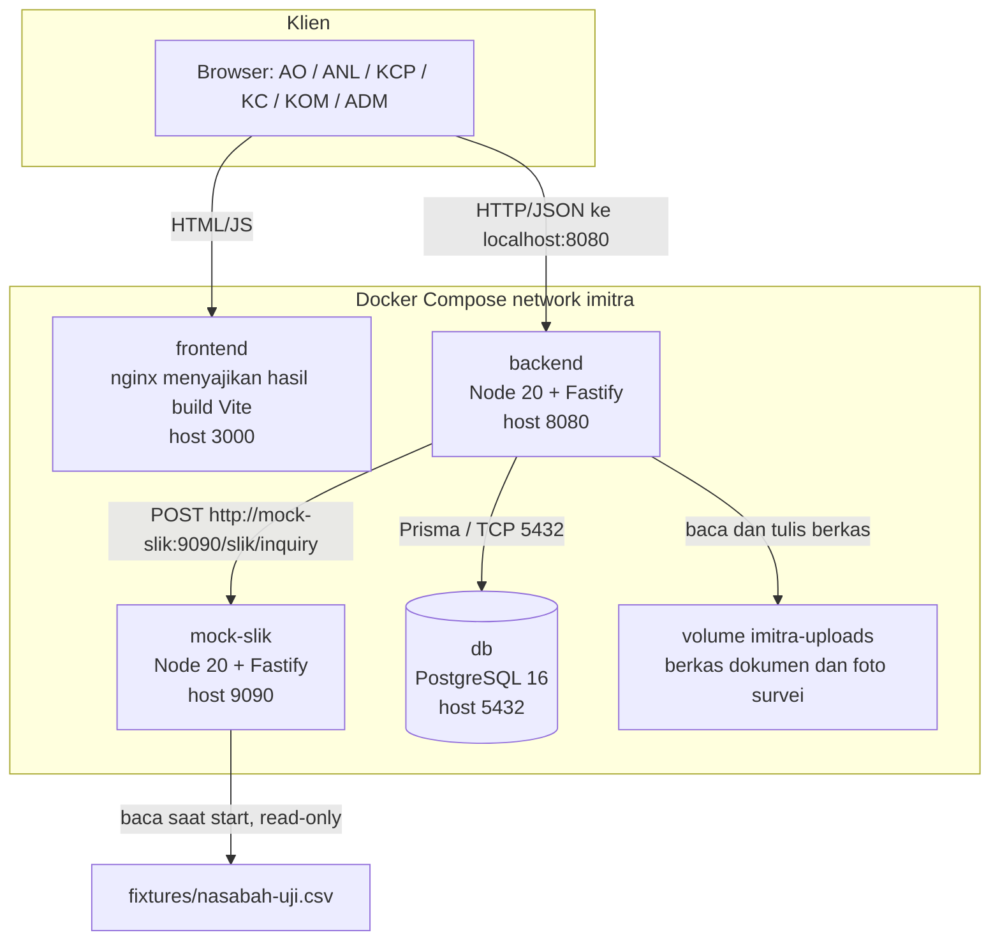
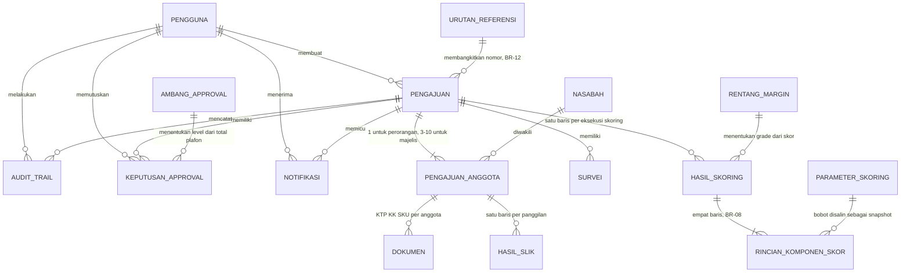
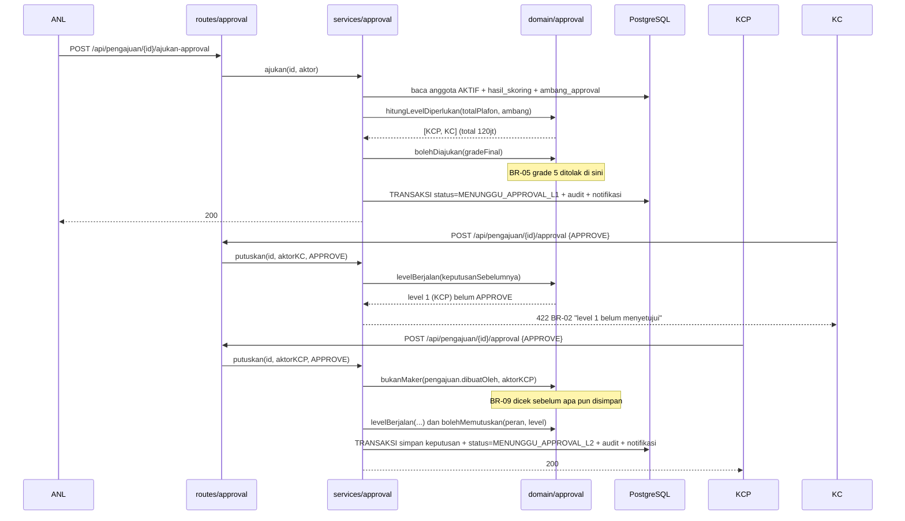
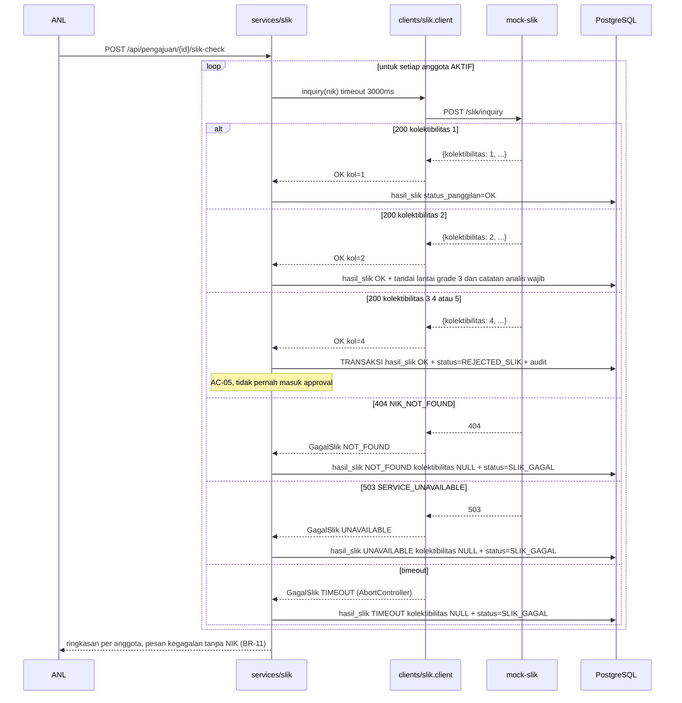
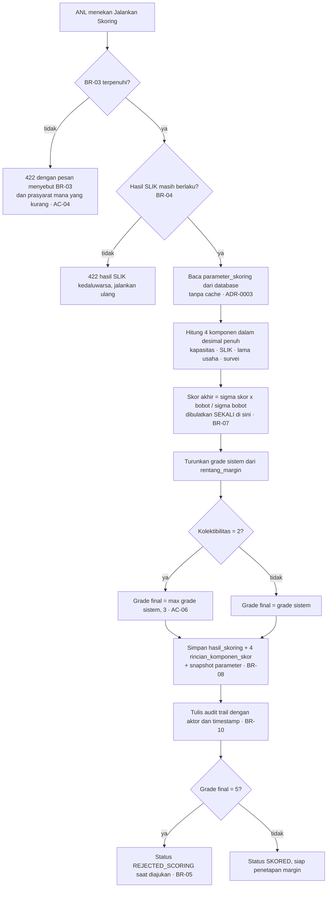
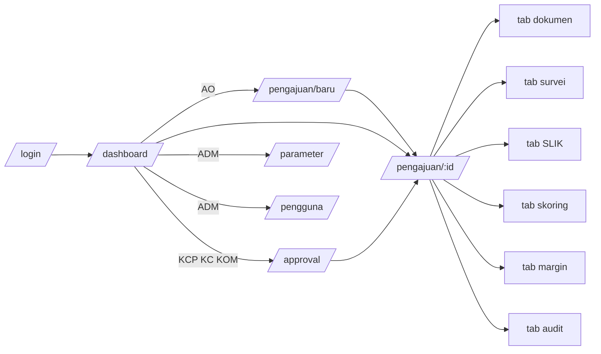

# SDD — iMitra (Software Design Document)

**Dokumen**: Software Design Document
**Sistem**: iMitra
**Tim**: `<!-- ISI: nama tim -->`
**Versi**: 1.0
**Tanggal**: 2026-08-20
**Penyusun**: Firman · Alfian · Dani · Reffa · Ray · Eka

---

## BAB 1 — DESIGN OVERVIEW

### 1.1 Tujuan Dokumen

Dokumen ini menjelaskan bagaimana requirement di `docs/SRS-iMitra.md` diwujudkan: arsitektur
layanan, pembagian lapisan di dalam backend, model data, daftar endpoint, dan rancangan
keamanan serta deployment. BAB 4 (model data) dan BAB 5 (daftar endpoint) adalah dua bagian
yang dilampirkan ke AI agent setiap kali meminta kode.

### 1.2 Prinsip Desain yang Kami Pegang

Lima prinsip berikut masing-masing punya konsekuensi yang bisa diperiksa di kode. Kalau
sebuah PR melanggarnya, PR itu ditolak review — bukan didiskusikan ulang.

1. **Aturan bisnis hidup di `domain/` sebagai fungsi murni.** Modul `domain/` tidak
   mengimpor Fastify, tidak mengimpor Prisma, dan tidak tahu apa pun tentang HTTP maupun
   database. Konsekuensi: seluruh BR bisa diuji dengan unit test tanpa menyalakan server.
2. **Parameter bisnis dibaca dari database pada setiap pemakaian, tidak pernah di-cache di
   proses** (ADR-0003). Konsekuensi: AC-15 terpenuhi tanpa restart, dan tidak ada jalan bagi
   nilai basi untuk hidup di memori.
3. **Nilai turunan tidak disimpan.** Total plafon dan level approval dihitung saat dibaca
   (ADR-0002). Konsekuensi: AC-14 bekerja otomatis; tidak ada kolom yang perlu disinkronkan.
4. **Kolom `status` hanya boleh ditulis satu modul**, `services/status.service.ts`, yang
   selalu menulis baris audit di transaksi yang sama. Konsekuensi: BR-10 tidak bisa dilanggar
   secara tidak sengaja, dan tidak ada perubahan status tanpa jejak.
5. **Otorisasi diperiksa di server pada setiap request**, di dua lapis: middleware peran
   (siapa boleh memanggil route ini) dan pemeriksaan kepemilikan di service (apakah orang ini
   berhak atas objek ini). Konsekuensi: menyembunyikan tombol di frontend murni kenyamanan.

### 1.3 Ringkasan Keputusan Teknologi

Alasan lengkap ada di [`adr/0001-pilihan-stack.md`](adr/0001-pilihan-stack.md).

| Lapisan | Teknologi | Versi |
|---|---|---|
| Backend | Node.js + TypeScript + Fastify | Node 20 LTS · TS 5.4 · Fastify 4.26 |
| ORM & migrasi | Prisma (`prisma migrate`) | 5.14 |
| Frontend | React + Vite + TanStack Query + React Router | React 18.2 · Vite 5.2 |
| Database | PostgreSQL | 16 (`postgres:16-alpine`) |
| Mock SLIK | Node.js + TypeScript + Fastify (layanan terpisah) | Node 20 LTS |
| Test | Vitest + Supertest | Vitest 1.6 |
| Lint / format | ESLint + Prettier | ESLint 8.57 |
| Orkestrasi lokal | Docker Compose | v2 |

---

## BAB 2 — HIGH-LEVEL ARCHITECTURE

### 2.1 Diagram Komponen

Empat container, satu jaringan bridge `imitra`. Frontend dipanggil browser lewat
`localhost:3000`; backend memanggil mock-slik lewat nama service `http://mock-slik:9090`
karena pemanggilnya adalah container, bukan browser.



### 2.2 Lapisan di Dalam Backend

Ketergantungan hanya boleh mengalir ke bawah. `domain/` adalah dasar dan tidak bergantung
pada apa pun di dalam repo.

| Lapisan | Tanggung jawab | Boleh memanggil | Tidak boleh |
|---|---|---|---|
| `routes/` | Parsing request, validasi bentuk (Zod), pemetaan hasil ke HTTP status | `services/` | Prisma, `domain/` langsung, membuat keputusan bisnis apa pun |
| `middleware/` | Autentikasi JWT, pemeriksaan peran, penanganan galat terpusat, korelasi log | `lib/` | `services/`, Prisma |
| `services/` | Orkestrasi kasus penggunaan, transaksi, penulisan audit | `domain/`, `repositories/`, `clients/` | Objek request/response Fastify |
| `domain/` | **Seluruh aturan bisnis dan perhitungan** sebagai fungsi murni | — (hanya tipe internal) | Prisma, HTTP, `process.env`, `Date.now()` tanpa injeksi |
| `repositories/` | Akses database lewat Prisma; satu berkas per agregat | Prisma client | `domain/`, `services/`, HTTP |
| `clients/` | Pemanggil HTTP keluar (`slik.client.ts`), termasuk timeout dan pemetaan galat | `lib/` | Prisma, `services/` |
| `config/` | Satu-satunya tempat `process.env` dibaca, divalidasi saat start | — | Semua lapisan lain |
| `lib/` | Logger dengan redaksi, kelas galat, util waktu | — | Semua lapisan lain |

**Aturan tambahan**: `routes/` tidak pernah menyentuh database langsung; `domain/` tidak
pernah tahu tentang HTTP. Setiap kali AI menghasilkan kode yang menaruh perhitungan di
route handler, kode itu ditolak — ini kesalahan paling umum pada keluaran AI dan sudah
tercantum di `AGENTS.md` bagian 3.

### 2.3 Di Mana Setiap Aturan Bisnis Ditegakkan

Pemetaan BR → berkas ada di `SRS-iMitra.md` BAB 6 dan `AGENTS.md` bagian 5; tidak
diduplikasi di sini. Yang perlu dicatat sebagai keputusan desain:

- **Seluruh transisi status ditegakkan di satu modul state machine**,
  `services/status.service.ts`, yang memuat tabel transisi yang sah. Tidak ada service lain
  yang menulis kolom `status`. Percobaan transisi yang tidak ada di tabel melempar
  `TransisiTidakSah` dan menghasilkan HTTP 422.
- **Seluruh aturan yang menghasilkan angka** (skoring, margin, level approval) berada di
  `domain/` dan menerima parameter sebagai argumen — bukan membacanya sendiri. Yang membaca
  database adalah service. Konsekuensi: unit test bisa memberi parameter apa pun tanpa
  database, dan test integrasi bisa mengubah baris parameter untuk membuktikan nilainya
  benar-benar berasal dari data.
- **BR-09 (maker ≠ approver) diperiksa di `domain/approval.ts`**, bukan di middleware peran,
  karena ia bergantung pada identitas pembuat objek — bukan pada peran.

### 2.4 Penanganan Kegagalan Integrasi SLIK

- **Timeout**: `SLIK_TIMEOUT_MS` (3000 ms) dibaca `config/` saat start; `slik.client.ts`
  memakai `AbortController` sehingga koneksi benar-benar diputus, bukan sekadar diabaikan.
- **Retry**: `SLIK_RETRY=0`. Tidak ada retry pada rilis ini. Retry yang tidak dicatat
  membuat kegagalan tidak terlihat, dan ANL berhak tahu bahwa panggilan gagal.
- **Representasi kegagalan di database**: setiap panggilan — berhasil maupun gagal — menulis
  satu baris `hasil_slik` dengan kolom `status_panggilan` bernilai `OK`, `NOT_FOUND`,
  `UNAVAILABLE`, atau `TIMEOUT`. Baris gagal punya `kolektibilitas = NULL`. Tidak ada
  nilai default, tidak ada `0`, tidak ada `1`.
- **Konsekuensi ke alur**: `domain/prasyarat-skoring.ts` mensyaratkan baris `hasil_slik`
  terakhir per anggota berstatus `OK` dan belum kedaluwarsa. Baris `UNAVAILABLE` karena itu
  memblokir skoring secara otomatis — bukan karena ada `if` khusus, melainkan karena tidak
  memenuhi prasyarat.
- **Bagaimana ANL tahu**: status pengajuan menjadi `SLIK_GAGAL`, layar SLIK menampilkan
  alasan, dan satu baris audit trail dengan aksi `SLIK_GAGAL` tercatat. Pesan tidak pernah
  memuat NIK (BR-11).
- **Yang dilarang keras**: `catch` yang hanya menulis log lalu melanjutkan; mengisi
  kolektibilitas dengan nilai apa pun saat gagal; memperlakukan 404 sebagai "bersih".

---

## BAB 3 — UML DESIGN

### 3.1 Entity Relationship

Kunci rancangan ini ada pada `PENGAJUAN_ANGGOTA`: **nasabah perorangan adalah pengajuan
dengan tepat satu anggota** (asumsi A-5). Tidak ada dua jalur kode. Karena plafon selalu
tersimpan per anggota, total plafon selalu bisa dihitung ulang — dan itulah yang membuat
AC-14 bekerja tanpa kolom turunan (ADR-0002).



### 3.2 Sequence Diagram — Approval Berjenjang

Perhatikan bahwa level **tidak dibaca dari kolom**: ia dihitung ulang dari total plafon
anggota aktif pada setiap keputusan. Itulah sebabnya penolakan satu anggota (AC-14)
langsung mengubah jumlah level tanpa kode tambahan.



### 3.3 Sequence Diagram — SLIK Check dan Jalur Error



### 3.4 Activity Diagram — Skoring (FR-06)



---

## BAB 4 — DATABASE DESIGN

### 4.1 Daftar Tabel

Konvensi: nama tabel dan kolom `snake_case`, kunci utama `id` bertipe `uuid`, seluruh
timestamp `timestamptz`.

| Table | Field | Type | Description |
|---|---|---|---|
| **pengguna** | id | uuid PK | |
| | username | text UNIQUE | Dipakai login |
| | nama | text | Ditampilkan di audit trail |
| | password_hash | text | bcrypt, cost dari `PASSWORD_HASH_COST` |
| | peran | enum | `AO` `ANL` `KCP` `KC` `KOM` `ADM` |
| | aktif | boolean | Pengguna nonaktif ditolak login |
| | dibuat_pada | timestamptz | |
| **nasabah** | id | uuid PK | |
| | nik | char(16) UNIQUE | **Data pribadi (BR-11)**: tidak pernah masuk log, pesan error, atau URL. Kolom ini hanya dibaca `slik.service` dan layar detail |
| | nama | text | |
| | alamat | text | |
| | jenis_usaha | text | |
| **pengajuan** | id | uuid PK | Dipakai di seluruh URL sebagai pengganti NIK |
| | nomor_referensi | text UNIQUE | `IMT-YYYYMMDD-NNNN` (BR-12) |
| | jenis_nasabah | enum | `PERORANGAN` `KELOMPOK` |
| | akad | enum | `MURABAHAH` `MUSYARAKAH` |
| | tenor_bulan | int | 3–36 |
| | status | text | 15 nilai, lihat SRS 3.2. **Hanya `status.service.ts` yang boleh menulis** |
| | margin_persen | numeric(5,2) NULL | Hasil FR-07, diisi setelah validasi BR-06 |
| | nisbah_bank_persen | numeric(5,2) NULL | Alternatif untuk musyarakah |
| | catatan_analis | text NULL | Wajib terisi bila ada anggota kolektibilitas 2 |
| | dibuat_oleh | uuid FK → pengguna | Dipakai BR-09 |
| | dibuat_pada / diubah_pada | timestamptz | |
| | | | **Tidak ada kolom `total_plafon` maupun `level_approval` — keduanya dihitung (ADR-0002)** |
| **pengajuan_anggota** | id | uuid PK | |
| | pengajuan_id | uuid FK | |
| | nasabah_id | uuid FK | |
| | plafon_diajukan | bigint | Rupiah, bilangan bulat |
| | status_anggota | enum | `AKTIF` `DITOLAK` — hanya `AKTIF` masuk hitungan total (AC-14) |
| | urutan | int | Anggota ke-1 pada perorangan |
| | | | UNIQUE (`pengajuan_id`, `nasabah_id`) |
| **dokumen** | id | uuid PK | Dipakai di URL berkas, bukan nama berkas |
| | pengajuan_anggota_id | uuid FK | Dokumen melekat pada anggota (asumsi A-9) |
| | jenis | enum | `KTP` `KK` `SKU` |
| | versi | int | Naik setiap unggah ulang; versi lama disimpan (AC-03) |
| | path_berkas | text | UUID di volume upload. **Tidak pernah masuk log (BR-11)** |
| | mime | text | |
| | ukuran_byte | int | |
| | status | enum | `MENUNGGU` `VERIFIED` `REJECTED` |
| | kode_alasan | enum NULL | Wajib bila `REJECTED` |
| | catatan | text NULL | |
| | diunggah_oleh / diverifikasi_oleh | uuid FK NULL | |
| | diunggah_pada / diverifikasi_pada | timestamptz | |
| | | | UNIQUE (`pengajuan_anggota_id`, `jenis`, `versi`) |
| **survei** | id | uuid PK | |
| | pengajuan_id | uuid FK | |
| | latitude / longitude | numeric(9,6) | Dari Geolocation API, fallback manual |
| | foto_path | text | Minimal satu; UUID di volume |
| | omzet_harian | bigint | Rupiah — masukan komponen kapasitas bayar |
| | lama_usaha_bulan | int | Masukan komponen lama usaha |
| | kondisi_usaha_skala | int NULL | 1–5, diisi **ANL** (A-10) |
| | catatan | text | |
| | status | enum | `DRAFT` `VALID` `TIDAK_VALID` — hanya `VALID` memenuhi BR-03 |
| | direkam_oleh / dinilai_oleh | uuid FK | |
| | direkam_pada / dinilai_pada | timestamptz | |
| **hasil_slik** | id | uuid PK | |
| | pengajuan_anggota_id | uuid FK | Satu baris per panggilan, tidak ditimpa |
| | status_panggilan | enum | `OK` `NOT_FOUND` `UNAVAILABLE` `TIMEOUT` |
| | kolektibilitas | int NULL | **NULL saat gagal — tidak ada nilai default** |
| | jumlah_fasilitas_aktif | int NULL | |
| | total_baki_debet | bigint NULL | |
| | tanggal_data | date NULL | Dasar perhitungan BR-04 |
| | reference_id | text NULL | Dari respons SLIK |
| | diperiksa_pada | timestamptz | |
| **hasil_skoring** | id | uuid PK | Satu baris per eksekusi; riwayat tidak ditimpa |
| | pengajuan_id | uuid FK | |
| | skor_akhir | int | Sudah dibulatkan, sekali (BR-07) |
| | grade_sistem | int | 1–5, hasil murni perhitungan |
| | grade_final | int | Setelah lantai kol-2 dan/atau override |
| | di_override | boolean | |
| | alasan_override | text NULL | Wajib ≥ 10 karakter bila `di_override` |
| | snapshot_parameter | jsonb | Salinan parameter yang dipakai — supaya hasil lama tetap bisa direkonstruksi setelah ADM mengubah bobot |
| | dihitung_oleh | uuid FK | |
| | dihitung_pada | timestamptz | |
| **rincian_komponen_skor** | id | uuid PK | **Empat baris per skoring (BR-08)** |
| | hasil_skoring_id | uuid FK | |
| | kode_komponen | text | `KAPASITAS_BAYAR` `RIWAYAT_SLIK` `LAMA_USAHA` `HASIL_SURVEI` |
| | bobot | numeric(6,3) | Nilai saat itu, bukan referensi ke tabel parameter |
| | nilai_mentah | numeric(14,3) | Mis. rasio angsuran 39,810 atau lama usaha 60 |
| | skor_komponen | numeric(6,3) | **Desimal, tidak dibulatkan** (A-3) |
| | kontribusi | numeric(9,3) | `skor_komponen × bobot` |
| **keputusan_approval** | id | uuid PK | |
| | pengajuan_id | uuid FK | |
| | level | int | 1, 2, atau 3 |
| | peran_wajib | enum | `KCP` `KC` `KOM` |
| | keputusan | enum | `APPROVE` `REJECT` `RETURN` |
| | alasan | text NULL | Wajib untuk `REJECT` dan `RETURN` |
| | diputuskan_oleh | uuid FK | Diperiksa terhadap `pengajuan.dibuat_oleh` (BR-09) |
| | diputuskan_pada | timestamptz | |
| **audit_trail** | id | bigserial PK | Urut naik = urut waktu |
| | pengajuan_id | uuid FK NULL | NULL untuk login dan perubahan parameter |
| | aktor_id | uuid FK NULL | NULL hanya untuk login gagal |
| | aktor_peran | text | Disalin, bukan join — peran bisa berubah nanti |
| | aksi | text | `LOGIN` `LOGIN_GAGAL` `UBAH_STATUS` `VERIFIKASI_DOKUMEN` `SLIK_OK` `SLIK_GAGAL` `SKORING` `OVERRIDE_GRADE` `SET_MARGIN` `KEPUTUSAN_APPROVAL` `UBAH_PARAMETER` |
| | status_sebelum / status_sesudah | text NULL | |
| | metadata | jsonb | **Tanpa NIK, nama, atau path berkas (BR-11)** |
| | terjadi_pada | timestamptz | |
| | | | **Append-only**: tanpa route tulis, dan hak `UPDATE`/`DELETE` dicabut (4.4) |
| **parameter_skoring** | id | uuid PK | |
| | kode | text UNIQUE | 4 kode komponen + `MARGIN_REFERENSI_SKORING` (A-1), `HARI_KERJA_PER_BULAN` dan `MARGIN_USAHA_PERSEN` (A-2), `SLIK_MASA_BERLAKU_HARI` (A-8) |
| | nama | text | Ditampilkan di layar ADM |
| | bobot | numeric(6,3) NULL | NULL untuk parameter non-komponen |
| | nilai | numeric(14,3) NULL | Untuk parameter skalar |
| | aturan | jsonb NULL | Titik linear, mis. `{"penuh":30,"nol":60}` untuk kapasitas bayar |
| | diubah_oleh / diubah_pada | | |
| **ambang_approval** | id | uuid PK | |
| | plafon_min / plafon_maks | bigint | Inklusif–inklusif; seed sesuai brief §4.1 |
| | urutan_peran | text[] | Mis. `{KCP,KC}` — panjang array = jumlah level |
| **rentang_margin** | id | uuid PK | |
| | grade | int UNIQUE | 1–5 |
| | skor_min / skor_maks | int | Dipakai juga untuk **menurunkan grade dari skor** |
| | margin_min / margin_maks | numeric(5,2) NULL | NULL untuk grade 5 |
| | nisbah_min / nisbah_maks | numeric(5,2) NULL | NULL untuk grade 5 |
| | dibiayai | boolean | `false` untuk grade 5 (BR-05) |
| **notifikasi** | id | uuid PK | |
| | pengguna_id | uuid FK | |
| | pengajuan_id | uuid FK NULL | |
| | pesan | text | Tanpa data pribadi |
| | dibaca | boolean | |
| | dibuat_pada | timestamptz | |
| **urutan_referensi** | tanggal | date PK | `YYYY-MM-DD` zona `Asia/Jakarta` (A-7) |
| | urutan_terakhir | int | Dinaikkan dengan `SELECT … FOR UPDATE` dalam transaksi pembuatan pengajuan (BR-12) |

**Indeks yang dibuat sejak migrasi pertama**: `pengajuan(status)`, `pengajuan(dibuat_oleh)`,
`pengajuan_anggota(pengajuan_id)`, `audit_trail(pengajuan_id, terjadi_pada)`,
`hasil_slik(pengajuan_anggota_id, diperiksa_pada DESC)`, `notifikasi(pengguna_id, dibaca)`.

### 4.2 Strategi Migrasi

- Tool: **Prisma Migrate**. Skema sumber `backend/prisma/schema.prisma`; migrasi SQL
  dihasilkan ke `backend/prisma/migrations/<timestamp>_<slug>/migration.sql` dan **ikut
  di-commit**.
- Penamaan: `20260820_1100_skema_awal`, `20260820_1430_tambah_notifikasi`.
- **Migrasi yang sudah di-merge ke `main` tidak boleh diubah atau dihapus.** Perubahan
  skema selalu berupa migrasi baru (`AGENTS.md` bagian 6 butir 2). Alasan: database anggota
  lain sudah menjalankannya, dan mengubahnya membuat riwayat mereka menyimpang.
- Pemilik direktori migrasi: **Tech Lead** (lihat `.github/CODEOWNERS`). Siapa pun boleh
  mengusulkan lewat PR; dua migrasi yang dibuat bersamaan diselesaikan dengan
  membuat ulang salah satunya di atas yang lain, bukan dengan mengedit keduanya.
- Dijalankan otomatis oleh service `migrate` di `docker-compose.yml`
  (`prisma migrate deploy && npm run seed`), yang selesai lalu berhenti; `backend`
  menunggunya dengan `condition: service_completed_successfully`.

### 4.3 Seed Data

Skrip `backend/prisma/seed.ts`, idempoten lewat `upsert` pada kunci alami (username, NIK,
kode parameter, nomor referensi). Menjalankannya dua kali tidak menghasilkan error dan tidak
menggandakan baris (NFR-09).

Yang di-seed:

1. **Enam akun**, satu per peran, password dari `SEED_DEFAULT_PASSWORD` — didokumentasikan
   di `README.md` bagian 2.5. Ditambah **satu akun KCP kedua** yang juga berperan sebagai
   pembuat pengajuan, khusus untuk mendemokan AC-11 (maker = approver).
2. **Parameter awal** persis dari brief §4.1, §4.3, §4.4, plus parameter asumsi A-1, A-2, A-8.
3. **12 baris `fixtures/nasabah-uji.csv`** sebagai `nasabah` di database iMitra dan sebagai
   sumber data mock SLIK (dibaca mock dari CSV yang di-mount read-only).
4. **Data siap-demo** yang tidak mungkin dibuat saat demo:
   - satu pengajuan lengkap berstatus `APPROVED` dengan audit trail penuh — untuk AC-12;
   - satu pengajuan bergrade 1 siap penetapan margin — untuk AC-09;
   - satu pengajuan kelompok 4 anggota × Rp 60.000.000 (total Rp 240.000.000) — untuk AC-14;
   - satu pengajuan Rp 120.000.000 di `MENUNGGU_APPROVAL_L1` — untuk AC-10.
5. **Reset demo**: `docker compose down -v && docker compose up` mengembalikan ke kondisi
   seed. Perintahnya ditulis di `README.md` bagian 2.4.

### 4.4 Bagaimana Audit Trail Dijaga Append-Only

Tiga lapis, dan yang ketiga adalah yang benar-benar mengikat:

1. **Tidak ada route.** Router hanya mendaftarkan `GET /api/pengajuan/{id}/audit` dan
   `GET /api/audit`. Tidak ada `POST`, `PUT`, `PATCH`, atau `DELETE` untuk sumber daya audit
   — penulisan hanya terjadi di dalam service, tidak pernah dari luar.
2. **Tidak ada method repository.** `repositories/audit.repo.ts` hanya mengekspor `tulis()`
   dan `cari()`. Tidak ada `ubah()` maupun `hapus()` untuk dipanggil siapa pun.
3. **Database yang menolak.** Migrasi `20260820134500_audit_append_only_trigger` memasang
   trigger `BEFORE UPDATE OR DELETE` pada `audit_trail` yang selalu melempar exception.
   Walaupun ada kode yang mencoba — kode kami besok, psql, atau Prisma Studio — PostgreSQL
   menolaknya. `INSERT` tetap diizinkan: audit ditulis, hanya tidak boleh diubah.

   > **Catatan koreksi.** Lapis ini semula hanya
   > `REVOKE UPDATE, DELETE ON audit_trail FROM imitra_app;` (migrasi `20260820121532`,
   > yang tetap dipertahankan sebagai pertahanan berlapis untuk peran non-pemilik).
   > REVOKE itu **tidak berpengaruh**, karena `imitra_app` adalah PEMILIK tabel — ia yang
   > menjalankan migrasi — dan pemilik punya hak implisit yang tidak bisa dicabut REVOKE.
   > Di compose maupun di CI, lapis ke-3 karena itu tidak berfungsi sama sekali sampai
   > trigger dipasang. Lihat `AGENTS.md` bagian 6 butir 16.

**Cara membuktikannya saat AC-13**, dua-duanya sekaligus:

- `GET /api/_routes` mencetak seluruh route terdaftar beserta method-nya (aktif hanya bila
  `APP_ENV != production`); penilai bisa membaca sendiri bahwa tidak ada method tulis untuk
  audit. Ini bukti dari daftar route, bukan dari kata-kata.
- `backend/tests/integration/audit-readonly.spec.ts` menembak database secara langsung —
  `UPDATE` dan `DELETE` atas `audit_trail` ditolak, `INSERT` lolos, dan baris yang sudah
  ditulis masih utuh sesudahnya. Penjagaan di database wajib punya test yang benar-benar
  menembak database; membaca kodenya saja tidak membuktikan apa pun (itulah sebabnya lubang
  REVOKE di atas sempat lolos review).

**Konsekuensi yang perlu diketahui sebelum menulis test**: menghapus baris `pengajuan` yang
sudah punya audit akan gagal, karena PostgreSQL harus meng-`UPDATE` `audit_trail.pengajuan_id`
menjadi NULL lebih dulu. Bersihkan data uji dengan `prisma migrate reset`, bukan dengan
menghapus baris pengajuan.

---

## BAB 5 — API DESIGN

Prefix `/api`. Semua kecuali yang bertanda **Publik** memerlukan header
`Authorization: Bearer <jwt>`; tanpa itu → 401, dengan peran yang tidak berwenang → 403.

| Endpoint | Method | Auth | Description |
|---|---|---|---|
| `/health` | GET | Publik | Status backend + koneksi database. Dipakai healthcheck compose |
| `/api/_routes` | GET | Publik (non-produksi) | Daftar seluruh route terdaftar — bukti AC-13 |
| `/api/auth/login` | POST | Publik | Username + password → JWT. Sukses & gagal masuk audit |
| `/api/auth/me` | GET | Semua | Profil dan peran pengguna saat ini |
| `/api/pengajuan` | POST | AO | Buat pengajuan `DRAFT` (perorangan atau kelompok) |
| `/api/pengajuan` | GET | Semua | Daftar terfilter peran (FR-12). Query: `status`, `q`, `page` |
| `/api/pengajuan/{id}` | GET | Semua berwenang | Detail + **total plafon dan level approval yang dihitung saat dibaca** |
| `/api/pengajuan/{id}` | PATCH | AO pemilik | Ubah data; hanya saat `DRAFT` atau `DIKEMBALIKAN` |
| `/api/pengajuan/{id}/submit` | POST | AO pemilik | BR-01 divalidasi di sini; nomor referensi dibangkitkan (AC-01) |
| `/api/pengajuan/{id}/anggota` | POST | AO pemilik | Tambah anggota majelis (3–10) |
| `/api/pengajuan/{id}/anggota/{anggotaId}` | PATCH | AO pemilik | Ubah plafon/nasabah anggota saat masih `DRAFT` |
| `/api/pengajuan/{id}/anggota/{anggotaId}/tolak` | POST | ANL | Tolak satu anggota → total & level dievaluasi ulang (AC-14) |
| `/api/pengajuan/{id}/dokumen` | POST | AO pemilik | Unggah `multipart/form-data`; unggah ulang membuat versi baru |
| `/api/pengajuan/{id}/dokumen` | GET | Semua berwenang | Daftar dokumen + status + kode alasan |
| `/api/dokumen/{dokumenId}/verifikasi` | POST | **ANL saja** | `VERIFIED`/`REJECTED` + kode alasan wajib. **AC-02 menembak endpoint ini sebagai AO dan harus 403** |
| `/api/dokumen/{dokumenId}/berkas` | GET | AO pemilik, ANL, approver | Unduh berkas. URL memakai id dokumen, bukan NIK (BR-11) |
| `/api/pengajuan/{id}/survei` | POST | AO pemilik | Rekam survei + foto |
| `/api/pengajuan/{id}/survei` | GET | Semua berwenang | Daftar survei |
| `/api/survei/{surveiId}/nilai` | POST | ANL | Skala kondisi usaha 1–5 + status `VALID`/`TIDAK_VALID` (A-10) |
| `/api/pengajuan/{id}/slik-check` | POST | ANL | Panggil mock SLIK per anggota; terapkan Tabel 4.2 (AC-05, AC-06) |
| `/api/pengajuan/{id}/slik` | GET | ANL, approver | Riwayat panggilan SLIK termasuk yang gagal |
| `/api/pengajuan/{id}/skoring` | POST | ANL | BR-03 diperiksa; menghasilkan skor + 4 rincian (AC-04, AC-07) |
| `/api/pengajuan/{id}/skoring` | GET | Semua berwenang | Hasil terakhir + rincian komponen |
| `/api/pengajuan/{id}/skoring/override` | POST | ANL | Override grade + alasan wajib (AC-08) |
| `/api/pengajuan/{id}/margin` | POST | ANL | Validasi terhadap `rentang_margin` grade final; di luar rentang → 422 BR-06 (AC-09) |
| `/api/pengajuan/{id}/ajukan-approval` | POST | ANL | BR-05 diperiksa; status → `MENUNGGU_APPROVAL_L1` |
| `/api/approval/antrian` | GET | KCP, KC, KOM | Hanya pengajuan pada level peran tersebut (FR-12) |
| `/api/pengajuan/{id}/approval` | POST | KCP, KC, KOM | `APPROVE`/`REJECT`/`RETURN` + alasan. BR-02 dan BR-09 diperiksa (AC-10, AC-11) |
| `/api/pengajuan/{id}/audit` | GET | Semua berwenang | Riwayat urut waktu dengan aktor (AC-12) |
| `/api/audit` | GET | ADM | Seluruh audit, difilter aktor/aksi/rentang tanggal |
| `/api/notifikasi` | GET | Semua | Notifikasi milik pengguna saat ini (FR-11) |
| `/api/notifikasi/{id}/baca` | POST | Semua | Tandai dibaca |
| `/api/dashboard/pipeline` | GET | Semua | Jumlah per tahap, dibatasi peran di query server (FR-12) |
| `/api/parameter/skoring` | GET / PUT | ADM | Bobot & aturan komponen. PUT langsung berlaku (AC-15) |
| `/api/parameter/ambang-approval` | GET / PUT | ADM | Ambang plafon per level |
| `/api/parameter/rentang-margin` | GET / PUT | ADM | Rentang skor & margin per grade |
| `/api/pengguna` | GET / POST / PATCH | ADM | Kelola pengguna |

**Endpoint mock SLIK** (kontrak dari brief §6.1, tidak boleh diubah):

| Endpoint | Method | Auth | Description |
|---|---|---|---|
| `/slik/inquiry` | POST | — | Inquiry kolektibilitas berdasarkan NIK. 200 / 404 `NIK_NOT_FOUND` / 503 `SERVICE_UNAVAILABLE` |
| `/health` | GET | — | Untuk healthcheck compose |
| `/slik/_control/mode` | POST | — (non-produksi) | `{"mode":"ok"\|"503"\|"timeout"}` — memaksa respons berikutnya, untuk mendemokan jalur error E-1 |

### 5.1 Bentuk Respons Error

Satu bentuk untuk seluruh API, identik dengan `AGENTS.md` bagian 4.3:

```json
{
  "error": "ATURAN_BISNIS_DILANGGAR",
  "message": "margin 10.00% di luar rentang grade 1 (11.00% - 13.00%)",
  "rule": "BR-06"
}
```

| Situasi | Kode HTTP | Catatan |
|---|---|---|
| Belum login / token tidak valid | 401 | `error: "TIDAK_TERAUTENTIKASI"` |
| Login tetapi peran tidak berwenang | **403** | `error: "AKSES_DITOLAK"`. AC-02 menguji ini langsung |
| Validasi bentuk input gagal | 400 | `error: "VALIDASI_GAGAL"` + daftar field |
| Pelanggaran aturan bisnis (BR-xx) | **422** | Field `rule` **wajib** terisi. AC-04 memeriksa `BR-03`, AC-09 memeriksa `BR-06` |
| Sumber daya tidak ada | 404 | |
| Mock SLIK tidak tersedia / timeout | **502** | `error: "SLIK_TIDAK_TERSEDIA"`. **Tidak pernah dianggap SLIK bersih** |
| Galat tak terduga | 500 | Tanpa stack trace ke klien; korelasi lewat `request_id` di log |

Seluruh error dibentuk oleh satu error handler di `middleware/error.ts`, yang melewatkan
`message` hanya untuk galat yang sengaja dibuat aplikasi. Galat tak terduga selalu memakai
pesan generik supaya tidak ada isi database yang bocor ke klien.

### 5.2 Autentikasi & Otorisasi

- **Mekanisme**: JWT HS256, masa berlaku `JWT_EXPIRES_IN` (8 jam — cukup untuk dua hari
  hackathon tanpa login ulang di tengah demo). Disimpan di `localStorage` frontend.
  Session server-side tidak dipakai karena backend tanpa state memudahkan test integrasi.
- **Lapis 1 — peran**: `middleware/rbac.ts` menerima daftar peran yang diizinkan per route,
  dideklarasikan di definisi route. Route tanpa deklarasi peran **gagal saat start**
  (fail-closed) — sehingga endpoint baru tidak bisa lolos tanpa otorisasi karena lupa.
- **Lapis 2 — kepemilikan**: service memeriksa apakah pengguna berhak atas objek itu
  (AO hanya pengajuan miliknya; approver hanya pada levelnya).
- **BR-09** tidak bisa diperiksa dari peran saja: ia membandingkan `pengajuan.dibuat_oleh`
  dengan `aktor.id`. Pemeriksaannya ada di `domain/approval.ts#bukanMaker`, dipanggil
  `services/approval.service.ts` **sebelum** apa pun disimpan.
- **Penukaran ke AD/SSO nanti**: seluruh verifikasi kredensial berada di balik antarmuka
  `PenyediaIdentitas` (`autentikasi(username, password) → ProfilPengguna`). Implementasi
  saat ini `PenyediaIdentitasLokal` (bcrypt terhadap tabel `pengguna`). Menukar ke LDAP/OIDC
  berarti menambah satu implementasi dan mengubah satu baris perakitan — tidak menyentuh
  route, service, maupun frontend. Dicatat di ADR-0001 bagian Lapisan Autentikasi.

---

## BAB 6 — UI/UX DESIGN

### 6.1 Daftar Layar per Peran

| Layar | Peran | Elemen utama | Catatan otorisasi |
|---|---|---|---|
| `/login` | Publik | Form username + password | — |
| `/dashboard` | Semua | Kartu jumlah per tahap + tabel pengajuan | Data sudah difilter server; frontend tidak menyaring apa pun |
| `/pengajuan/baru` | AO | Wizard 3 langkah: nasabah → akad & plafon → anggota (bila majelis) | Route frontend dijaga guard peran; endpoint tetap memeriksa sendiri |
| `/pengajuan/:id` | Semua berwenang | Header ringkasan + tab | Tab yang tidak berhak tidak dirender **dan** endpointnya 403 |
| `/pengajuan/:id/dokumen` | AO, ANL | AO: slot unggah per anggota. ANL: tombol verifikasi | Tombol verifikasi hanya untuk ANL; AC-02 menguji endpointnya langsung |
| `/pengajuan/:id/survei` | AO, ANL | AO: koordinat + foto + omzet. ANL: skala 1–5 + tetapkan `VALID` | |
| `/pengajuan/:id/slik` | ANL, approver | Tombol jalankan, hasil per anggota, pesan kegagalan eksplisit | |
| `/pengajuan/:id/skoring` | ANL, approver | Tabel rincian 4 komponen + form override | Form override hanya ANL |
| `/pengajuan/:id/margin` | ANL | Input margin + rentang grade tampil di sebelahnya | |
| `/pengajuan/:id/audit` | Semua berwenang | Tabel urut waktu, aktor per baris | Hanya baca |
| `/approval` | KCP, KC, KOM | Antrian level sendiri + tombol keputusan | Server hanya mengembalikan level orang itu |
| `/parameter` | ADM | Tiga tabel yang bisa diedit inline | |
| `/pengguna` | ADM | Daftar pengguna | |

### 6.2 Alur Navigasi



### 6.3 Keputusan UX Khusus iMitra

- **Rincian skor (BR-08, AC-07)** ditampilkan sebagai tabel lima kolom — komponen, bobot,
  nilai mentah, skor komponen, kontribusi — ditutup satu baris total yang memperlihatkan
  `Σ kontribusi ÷ Σ bobot = skor akhir`. Angka desimal ditampilkan apa adanya (3 desimal),
  bukan dibulatkan di UI: analis harus bisa merekonstruksi perhitungannya di depan auditor,
  dan skor akhir yang dibulatkan harus terlihat berasal dari angka yang ditampilkan.
- **Survei lapangan** memakai satu tombol "Ambil koordinat saat ini" (Geolocation API) dengan
  dua field manual di bawahnya sebagai fallback — AO bisa berada di lokasi tanpa sinyal GPS
  yang baik, dan gagal mengambil koordinat tidak boleh memblokir perekaman survei.
- **Form majelis** memakai daftar baris yang bisa ditambah/dikurangi (3–10), bukan satu form
  raksasa. Total plafon dihitung dan ditampilkan **live** di bawah daftar, beserta level
  approval yang akan diperlukan — sehingga AO melihat konsekuensi angkanya sebelum submit.
- **Pesan pelanggaran aturan** ditampilkan sebagai banner merah berisi kalimat yang bisa
  dipahami pengguna, dengan kode BR sebagai badge kecil di sampingnya —
  "Margin 10,0 % di bawah batas grade 1 (11,0 %)" + badge `BR-06`. Kodenya ada untuk
  penilai dan untuk pelaporan bug; kalimatnya ada untuk pengguna.
- **Tidak ada tombol yang tidak berfungsi.** Aksi yang belum boleh dijalankan ditampilkan
  nonaktif dengan tooltip berisi prasyarat yang kurang, bukan disembunyikan — supaya ANL
  tahu apa yang harus dilakukan berikutnya.

### 6.4 Catatan Aksesibilitas & Responsif

Layar AO (buat pengajuan, unggah dokumen, rekam survei) dirancang mobile-first dan diuji
pada lebar 360 px; layar ANL dan approver dioptimalkan untuk desktop tetapi tetap terpakai
di tablet. Seluruh input punya `<label>` yang terkait, fokus keyboard terlihat, dan status
tidak pernah disampaikan hanya lewat warna — setiap badge status memuat teks.

---

## BAB 7 — SECURITY DESIGN

| Aspek | Rancangan | Cara diverifikasi |
|---|---|---|
| Penyimpanan password | bcrypt, cost `PASSWORD_HASH_COST` (10 di lingkungan demo). Password tidak pernah dikembalikan API, termasuk di `/api/auth/me` | Test memastikan respons login tidak memuat `password_hash`; inspeksi tabel `pengguna` |
| Sesi / token | JWT HS256, `JWT_SECRET` dari env, berlaku 8 jam, disimpan di `localStorage`. Pencabutan: token berumur pendek, tidak ada daftar hitam (utang teknis yang diakui) | Test token kedaluwarsa → 401 |
| Otorisasi per endpoint | Deklarasi peran wajib pada setiap route; route tanpa deklarasi menggagalkan proses saat start (fail-closed) | AC-02 (panggilan API langsung harus 403) + `rbac.spec.ts` yang menguji seluruh route × seluruh peran |
| Pemisahan maker/checker (BR-09) | `domain/approval.ts#bukanMaker` membandingkan `pengajuan.dibuat_oleh` dengan aktor, dipanggil sebelum penyimpanan. Akun seed khusus disiapkan untuk mendemokannya | AC-11 |
| Perlindungan data pribadi (BR-11) | Logger memakai daftar redaksi (`nik`, `nama`, `path_berkas`, `foto_path`, `authorization`) yang diterapkan di serializer, bukan di pemanggil — sehingga tidak bisa dilewatkan karena lupa. Tidak ada route yang menerima NIK sebagai path/query param. Berkas diakses lewat id dokumen | NFR-03: `redaksi.spec.ts` + `docker compose logs backend` dicocokkan terhadap 12 NIK fixtures |
| Akses berkas upload | `/api/dokumen/{id}/berkas` memeriksa token dan kepemilikan sebelum menyajikan berkas dari volume. Volume **tidak** disajikan sebagai direktori statis oleh nginx | Test: unduh tanpa token → 401; sebagai AO lain → 403 |
| Audit trail append-only | Tiga lapis: tanpa route tulis, tanpa method repository, trigger `BEFORE UPDATE OR DELETE` di database | AC-13 lewat `GET /api/_routes` **dan** `tests/integration/audit-readonly.spec.ts` |
| Manajemen secret | Hanya `.env.example` berisi placeholder; `.env` ada di `.gitignore`; nilai dibaca `config/env.ts` yang memvalidasi keberadaannya saat start dan **gagal cepat** bila `JWT_SECRET` kosong | Job `higiene` di CI pada setiap push; `git log` diperiksa penilai |
| Validasi input | Zod di batas route untuk **setiap** endpoint; tipe hasil parsing yang dipakai service, bukan `req.body` mentah | Lint melarang akses `req.body` di luar berkas route |
| Batas unggahan | Maks 5 MB, MIME dalam daftar putih, nama berkas dibangkitkan UUID (nama asli tidak dipakai) | Test unggah 6 MB → 400; unggah `.exe` → 400 |

**Yang secara sadar tidak kami tangani di rilis ini** — dan mengapa aman untuk konteks
hackathon: rate limiting dan proteksi brute-force login (tidak ada akses publik; sistem hanya
hidup di mesin penilai selama demo); enkripsi at-rest untuk kolom NIK (data fiktif dari
fixtures, dan enkripsi kolom akan menyembunyikan bug BR-11 alih-alih memperbaikinya); rotasi
`JWT_SECRET`; pemindaian virus pada berkas unggahan; HTTPS (dihentikan di reverse proxy pada
lingkungan nyata). Keempatnya dicatat di `README.md` bagian 5 sebagai utang teknis yang
disadari.

---

## BAB 8 — DEPLOYMENT DESIGN

### 8.1 Topologi Docker Compose

| Service | Image / build | Port host:container | Bergantung pada | Healthcheck |
|---|---|---|---|---|
| `db` | `postgres:16-alpine` | `${DB_PORT}:5432` | — | `pg_isready -U $DB_USER -d $DB_NAME`, interval 5s, retries 10 |
| `mock-slik` | build `./mock-slik` | `${MOCK_SLIK_PORT}:9090` | — | `wget -qO- http://localhost:9090/health` |
| `migrate` | build `./backend` | — | `db` (`service_healthy`) | — (sekali jalan, `restart: "no"`) |
| `backend` | build `./backend` | `${BACKEND_PORT}:8080` | `db` (healthy), `mock-slik` (healthy), `migrate` (`service_completed_successfully`) | `wget -qO- http://localhost:8080/health` |
| `frontend` | build `./frontend` (nginx menyajikan hasil build) | `${FRONTEND_PORT}:80` | `backend` (healthy) | `wget -qO- http://localhost:80/` |

Volume: `imitra-db-data` (data PostgreSQL), `imitra-uploads` (berkas dokumen & foto survei).
Bind mount: `./fixtures:/app/fixtures:ro` pada `mock-slik` — mock membaca CSV, tidak
menyalinnya ke dalam kode.

### 8.2 Variabel Lingkungan

Sumber tunggal: `.env.example`, disalin menjadi `.env`. Nilainya tidak diduplikasi di sini.

- **Wajib diubah sebelum dipakai di luar demo**: `JWT_SECRET`, `DB_PASSWORD`,
  `DATABASE_URL`, `DATABASE_URL_TEST`.
- **Boleh dibiarkan default untuk demo**: seluruh port, `TZ=Asia/Jakarta` (A-7 bergantung
  pada ini — jangan diubah tanpa memperbarui SRS), `SLIK_TIMEOUT_MS`, `SLIK_RETRY=0`,
  `SEED_DEFAULT_PASSWORD`.
- **Dihapus dari `.env.example`**: `SLIK_RESULT_VALID_DAYS` — nilainya pindah ke tabel
  parameter sebagai `SLIK_MASA_BERLAKU_HARI` (asumsi A-8), supaya tidak ada dua sumber
  kebenaran untuk BR-04.
- Frontend memakai `VITE_API_BASE_URL=http://localhost:${BACKEND_PORT}`, dilewatkan sebagai
  **build arg** karena Vite menanamkan nilainya saat build. Memakai `http://backend:8080`
  di sini adalah kesalahan: yang memanggil adalah browser di host, bukan container.

### 8.3 Urutan Startup

1. `db` start → healthcheck `pg_isready` lulus.
2. `mock-slik` start → membaca `fixtures/nasabah-uji.csv` → `/health` lulus.
3. `migrate` start setelah `db` sehat → `prisma migrate deploy` → `npm run seed` → keluar
   dengan kode 0.
4. `backend` start setelah `migrate` selesai sukses **dan** `db` + `mock-slik` sehat →
   `config/env.ts` memvalidasi seluruh variabel wajib (gagal cepat bila ada yang kosong) →
   `/health` lulus.
5. `frontend` start setelah `backend` sehat.

Backend **tidak** memakai skrip tunggu-tunggu buatan sendiri; kesiapan database dijamin
`condition: service_healthy`. Ini penyebab paling umum "jalan di laptop saya, gagal di mesin
penilai", dan diselesaikan di lapisan compose, bukan dengan `sleep`.

### 8.4 CI

`.github/workflows/ci.yml`, berjalan pada setiap push dan pull request:

| Job | Isi | Durasi target |
|---|---|---|
| `higiene` | Memastikan tidak ada `.env` ter-commit, `.env.example` ada, artefak wajib ada, menghitung sisa placeholder | < 30 dtk |
| `lint` | `npm run lint` di `backend/`, `frontend/`, `mock-slik/` | < 1 mnt |
| `test-unit` | `npm run test:unit` — seluruh `domain/`, tanpa database | < 1 mnt |
| `test-integration` | Service `postgres:16`, lalu `prisma migrate deploy` + `npm run seed` + `npm run test:integration` | < 3 mnt |
| `ci` | Gerbang akhir; inilah nama yang didaftarkan sebagai required status check di branch protection `main` | — |

Perintah lint dan test **identik** dengan yang tertulis di `AGENTS.md` bagian 7 dan
`README.md` bagian 2.6. Kalau ketiganya berbeda, salah satunya sudah usang — ini diperiksa
pada checklist ADR-0001. CI merah di tag `v1.0.0` dikenai pengurangan −5.

### 8.5 Rilis

Tag `v1.0.0` dibuat **Tech Lead** pada Jumat pukul 15.00, setelah checklist berikut lulus:

- [ ] `docker compose up` berhasil dari clone bersih di direktori baru (dijalankan orang
      selain yang menulis compose-nya)
- [ ] Seed dijalankan dua kali tanpa error
- [ ] CI hijau pada commit yang akan di-tag
- [ ] Tidak ada `<!-- ISI:` tersisa di berkas mana pun
- [ ] Tabel status FR di `README.md` bagian 4 dan bagian 5 sudah final
- [ ] `docs/TRACEABILITY.md` tidak memuat status `In Progress`
- [ ] `docs/AI-DEVLOG.md` memuat ≥ 10 entri dengan ≥ 3 entri kegagalan AI
- [ ] Seluruh baris `DEMO-SCRIPT.md` berkolom "Status latihan" terisi

---

## Riwayat Revisi

| Versi | Tanggal | Oleh | Perubahan |
|---|---|---|---|
| 0.1 | 2026-08-20 | Tech Lead | Versi awal Sprint 0: BAB 1–8 lengkap dengan 5 diagram |
| `<!-- ISI -->` | `<!-- ISI -->` | `<!-- ISI -->` | `<!-- ISI: perbarui bila kode berubah arah, atau catat di ADR bahwa desain awal ditinggalkan -->` |
