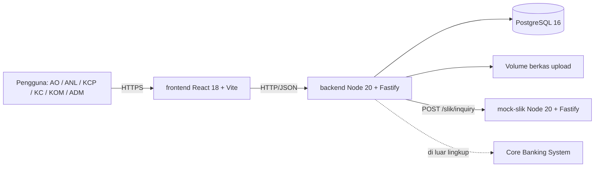
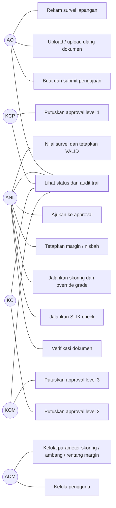
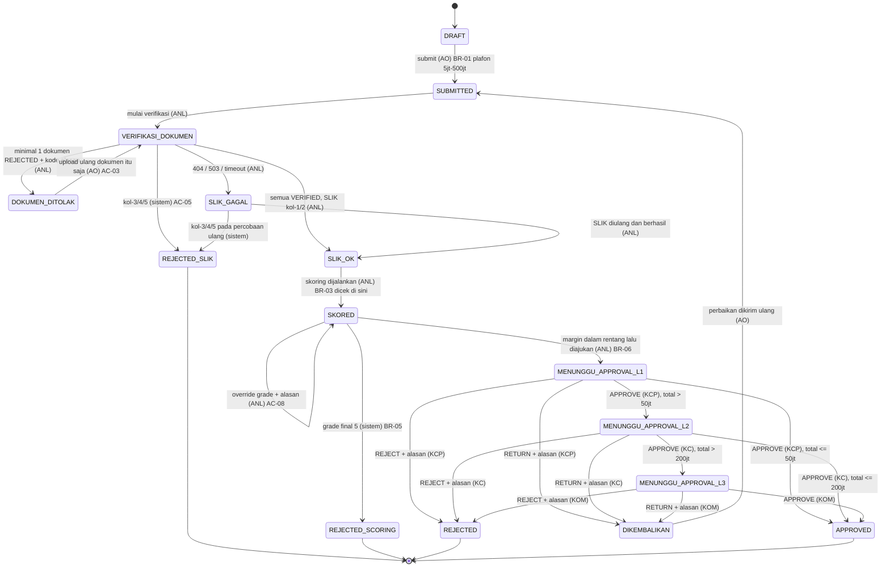

# SRS — iMitra (Sistem Originasi Pembiayaan Mikro Syariah)

**Dokumen**: Software Requirements Specification
**Sistem**: iMitra
**Tim**: `<!-- ISI: nama tim -->`
**Versi**: 1.0
**Tanggal**: 2026-08-20
**Penyusun**: Eka Purnamasari, Reffa, Hamdani, Alfian, Muhammad Rayhan Subhi
**Sumber requirement**: Brief Hackathon iMitra (20–21 Agustus 2026)

---

## BAB 1 — INTRODUCTION

### 1.1 Purpose

Dokumen ini menetapkan apa yang harus dibangun pada rilis hackathon iMitra dan bagaimana
tiap requirement dibuktikan terpenuhi. Pembacanya adalah anggota tim (untuk memutuskan
lingkup dan urutan kerja), penilai (untuk mencocokkan kode dengan requirement), dan AI
agent (yang menerima bagian dokumen ini sebagai konteks prompt).

Lingkupnya adalah **rilis hackathon**, bukan rilis produksi. Sejumlah hal yang wajib ada di
sistem perbankan nyata — rate limiting, enkripsi at-rest, rotasi kunci, HA database —
secara sadar tidak dikerjakan dan dicatat di BAB 4 dan SDD BAB 7.

### 1.2 Scope

**Termasuk dalam rilis ini**:

- FR-01 s.d. FR-09 (P0) — batas lulus fungsional, seluruhnya dikerjakan
- FR-10 Pembiayaan Kelompok, FR-12 Dashboard Pipeline, FR-13 Parameter Terkonfigurasi (P1)
- FR-11 Notifikasi Perubahan Status (P1) — versi minimal: tersimpan sebagai baris di tabel
  `notifikasi` dan ditampilkan sebagai daftar, bukan push real-time
- Mock SLIK sebagai layanan HTTP terpisah sesuai kontrak brief §6.1
- Seed idempoten, migrasi berbasis berkas, CI lint + test, `docker compose up` satu perintah

**Tidak termasuk**:

- Seluruh daftar di brief §1.4: disbursement, akuntansi, jadwal angsuran aktual, penagihan,
  restrukturisasi, integrasi nyata Core Banking / SLIK produksi, mobile native, SSO/AD nyata,
  multi-tenant, multi-currency, multi-bahasa
- FR-14 s.d. FR-18 (P2) — tidak dikerjakan. Alasan: brief §3 menyatakan mengerjakan P2
  sebelum P0 dan P1 tuntas **mengurangi** nilai. Keputusan final dikunci di Gate 3 dan
  dicatat di `README.md` bagian 5
- Real-time push / WebSocket untuk notifikasi — pemuatan saat halaman dibuka sudah cukup
  untuk kriteria verifikasi FR-11 yang kami tetapkan sendiri (lihat BAB 3, FR-11)

### 1.3 Definitions, Acronyms, and Abbreviations

| Istilah | Definisi |
|---|---|
| AO | Account Officer Mikro — membuat dan mengubah pengajuan miliknya, upload dokumen, merekam survei |
| ANL | Analis Mikro — verifikasi dokumen, SLIK check, skoring & override, perhitungan margin |
| KCP | Kepala Cabang Pembantu — approval level 1 |
| KC | Kepala Cabang — approval level 2 |
| KOM | Komite Pembiayaan — approval level 3 |
| ADM | Admin — kelola pengguna dan parameter |
| SLIK | Sistem Layanan Informasi Keuangan; sumber data kolektibilitas nasabah (di sistem ini: mock) |
| Kolektibilitas | Kualitas pembiayaan nasabah, skala 1–5 |
| OTS | On-The-Spot; survei lapangan di tempat usaha nasabah |
| Majelis | Kelompok nasabah 3–10 anggota dengan tanggung renteng |
| Murabahah | Akad jual beli dengan margin |
| Musyarakah | Akad kerja sama dengan nisbah bagi hasil |
| Plafon | Batas pembiayaan yang diajukan/disetujui |
| Maker / Checker | Pembuat / penyetuju; satu orang tidak boleh keduanya pada pengajuan yang sama |
| **Anggota pengajuan** | Baris `pengajuan_anggota`. Nasabah perorangan diwakili **satu** anggota; majelis diwakili 3–10 anggota. Istilah tim kami, tidak ada di brief |
| **Total plafon** | Σ `plafon_diajukan` dari anggota berstatus `AKTIF`. **Nilai turunan, tidak pernah disimpan** (lihat ADR-0002) |
| **Grade sistem** | Grade hasil perhitungan murni dari skor |
| **Grade final** | Grade yang berlaku setelah penerapan lantai kol-2 (Tabel 4.2) dan/atau override ANL. Inilah yang dipakai FR-07 |
| **Snapshot parameter** | Salinan nilai parameter yang dipakai saat satu skoring dijalankan, disimpan bersama hasilnya |

### 1.4 References

| Dokumen | Keterangan |
|---|---|
| `01-BRIEF-Hackathon-iMitra.md` | Sumber utama seluruh requirement, aturan bisnis, dan acceptance criteria |
| SRS & SDD iLoan Commercial | Acuan domain dan acuan format (produk saudara, segmen korporat) |
| `AGENTS.md` | Aturan repo untuk AI agent, termasuk daftar BR-01…BR-12 dan tabel parameter |
| `docs/SDD-iMitra.md` | Perwujudan requirement ini menjadi arsitektur, skema, dan endpoint |
| `docs/adr/` | Keputusan arsitektur (0001 stack, 0002 plafon per anggota, 0003 pembacaan parameter) |
| `docs/PEMBAGIAN-TIM.md` | Pemetaan FR → pemilik → gate |
| `fixtures/nasabah-uji.csv` | 12 baris data uji wajib |

---

## BAB 2 — OVERALL DESCRIPTION

### 2.1 Product Perspective

iMitra adalah sistem originasi yang berdiri sendiri pada rilis ini. Ia bergantung pada satu
sistem eksternal — SLIK — yang di rilis ini diwakili layanan mock terpisah yang dipanggil
via HTTP. Core Banking System berada di luar lingkup: pengajuan berakhir pada status
`APPROVED`, tidak ada handoff.



### 2.2 Product Functions

Satu pengajuan menempuh delapan tahap. Tahap tidak bisa dilompati; setiap perpindahan
dicatat dengan aktor dan timestamp (BR-10).

1. **AO** membuat pengajuan (`DRAFT`), mengisi data nasabah + akad + plafon + tenor, lalu
   submit — sistem memvalidasi batas plafon (BR-01) dan membangkitkan nomor referensi.
2. **AO** mengunggah KTP, KK, dan Surat Keterangan Usaha.
3. **ANL** memverifikasi tiap dokumen; penolakan wajib menyertakan kode alasan, dan AO
   mengunggah ulang **hanya** dokumen itu.
4. **AO** merekam survei lapangan (koordinat, foto, omzet harian, lama usaha); **ANL**
   menilai kondisi usaha 1–5 dan menetapkan survei `VALID`.
5. **ANL** menjalankan SLIK check. Kol-3/4/5 menghentikan pengajuan seketika
   (`REJECTED_SLIK`); kegagalan panggilan **tidak** dianggap bersih.
6. **ANL** menjalankan skoring — hanya boleh jika BR-03 terpenuhi. Sistem menghasilkan skor
   0–100, grade 1–5, dan rincian keempat komponen yang tersimpan permanen.
7. **ANL** menetapkan margin/nisbah; di luar rentang grade → diblokir (BR-06). Grade 5 →
   `REJECTED_SCORING` (BR-05).
8. **Approver** memutuskan berurutan sesuai level yang diturunkan dari total plafon.

### 2.3 User Characteristics

| Aktor | Karakteristik | Implikasi desain |
|---|---|---|
| AO | Bekerja di lapangan, layar ponsel, koneksi tidak stabil, satu tangan memegang HP | Form pengajuan dipecah per langkah dan bisa disimpan sebagai `DRAFT` kapan saja; koordinat diambil dari Geolocation API dengan fallback input manual; unggah foto dibatasi 5 MB |
| ANL | Di kantor, layar lebar, harus mempertanggungjawabkan keputusan ke auditor | Rincian komponen skor ditampilkan sebagai tabel angka lengkap (bobot, nilai mentah, skor komponen, kontribusi), bukan hanya skor akhir; setiap penolakan menyebut kode BR-nya |
| KCP / KC / KOM | Waktu singkat, hanya perlu melihat yang menunggu keputusannya | Antrian approval hanya berisi pengajuan pada level orang tersebut; ringkasan risiko (skor, grade, total plafon, kolektibilitas) tampil tanpa perlu membuka detail |
| ADM | Tidak menyentuh kode, tetapi mengubah angka yang memengaruhi keputusan pembiayaan | Form parameter berupa tabel yang bisa diedit; perubahan langsung berlaku pada skoring berikutnya tanpa restart, dan tercatat di audit trail |

### 2.4 Constraints

Dari brief §7.2 (mengikat, diuji penilai):

- **C-1** Satu perintah untuk menjalankan dari clone bersih: `cp .env.example .env && docker compose up`
- **C-2** Backend dan frontend terpisah, berkomunikasi via HTTP/JSON
- **C-3** Mock SLIK layanan terpisah yang dipanggil via HTTP, bukan fungsi lokal
- **C-4** Skema database dibangun dari migrasi, bukan `db.sql` yang di-restore
- **C-5** Seed dari skrip dan idempoten — aman dijalankan berulang
- **C-6** Otorisasi ditegakkan di server pada setiap endpoint
- **C-7** Tidak ada secret di repo; hanya `.env.example` berisi placeholder
- **C-8** CI hijau di commit terakhir, minimal lint + test

Batasan tim:

- **C-9** **9 jam koding bersih, 5 orang.** Konsekuensi langsung: FR-14…FR-18 tidak dikerjakan,
  dan satu orang merangkap QA + AI Workflow Officer + pemilik mock SLIK
- **C-10** Hanya satu orang penuh waktu di frontend. Lingkup UI dibatasi ke layar yang
  diperlukan AC-01…AC-15; tidak ada layar yang tidak dirujuk AC mana pun
- **C-11** Semua laptop harus bisa menjalankan Docker Desktop / Docker Engine ≥ 24

### 2.5 Assumptions and Dependencies

Brief menetapkan angka, tetapi tidak semua rumus. Asumsi berikut adalah keputusan tim, dan
setiap asumsi yang berupa angka **disimpan sebagai parameter di database**, bukan konstanta —
sehingga kalau instruktur mengoreksi asumsinya, koreksi itu satu baris data, bukan satu PR.

| # | Asumsi | Dampak kalau asumsi salah |
|---|---|---|
| **A-1** | Brief §4.4 memakai "angsuran bulanan" untuk komponen kapasitas bayar, tetapi FR-07 (penentuan margin) baru berjalan **setelah** FR-06. Angsuran karena itu dihitung dengan **margin referensi** yang disimpan sebagai parameter `MARGIN_REFERENSI_SKORING` (nilai awal 15,5 % p.a., titik bawah grade 3), skema flat: `angsuran = (plafon + plafon × margin_ref × tenor/12) ÷ tenor` | Skor kapasitas bayar bergeser seragam untuk semua nasabah. Karena nilainya parameter, koreksi = mengubah satu baris `parameter_skoring` lalu menjalankan ulang skoring |
| **A-2** | Angka "25 hari kerja" dan "margin usaha 30 %" pada §4.4 adalah **parameter**, bukan konstanta: `HARI_KERJA_PER_BULAN` dan `MARGIN_USAHA_PERSEN` | Kalau ternyata dimaksudkan konstanta, tidak ada kerugian — parameter yang tidak diubah berperilaku sama dengan konstanta |
| **A-3** | Skor komponen dan skor akhir dihitung penuh dalam desimal; pembulatan **hanya sekali** pada skor akhir (BR-07). Rincian komponen disimpan `NUMERIC(6,3)` | Pembulatan antara menggeser skor 0–1 poin dan bisa menggeser grade tepat di batas (85, 70, 55, 40), yang mengubah rentang margin yang divalidasi. Kegagalan halus yang tidak terlihat di jalur bahagia |
| **A-4** | Lantai grade untuk kolektibilitas 2 (Tabel 4.2) diterapkan **setelah** grade sistem dihitung dan **sebelum** override ANL. Override tidak boleh menghasilkan grade lebih baik dari lantai itu | Kalau urutannya dibalik, AC-06 gagal: nasabah kol-2 bisa berakhir di grade 2 |
| **A-5** | Nasabah perorangan direpresentasikan sebagai pengajuan dengan **tepat satu** `pengajuan_anggota`. Tidak ada dua jalur kode terpisah untuk perorangan dan kelompok | Kalau dipisah, total plafon dihitung di dua tempat berbeda dan AC-14 akan gagal di salah satunya |
| **A-6** | Satu NIK boleh punya **paling banyak satu** pengajuan aktif (status non-terminal). Percobaan kedua ditolak dengan pesan yang menyebut nomor referensi pengajuan yang sudah ada | Kalau dibolehkan, hasil SLIK dan skoring bisa saling menimpa dan audit trail menjadi ambigu |
| **A-7** | Bagian `YYYYMMDD` nomor referensi memakai zona waktu **`Asia/Jakarta`**, dipaksa lewat env `TZ` di seluruh container | Nomor referensi bergeser satu hari di mesin penilai kalau TZ berbeda; AC-01 memeriksa formatnya |
| **A-8** | Masa berlaku SLIK 30 hari (BR-04) adalah **parameter bisnis** (`SLIK_MASA_BERLAKU_HARI`), bukan variabel env. `SLIK_RESULT_VALID_DAYS` di `.env.example` dihapus supaya tidak ada dua sumber kebenaran | Dua sumber nilai yang berbeda menghasilkan perilaku berbeda antara test dan runtime |
| **A-9** | "Semua dokumen wajib `VERIFIED`" (BR-03) berarti tiga jenis dokumen (KTP, KK, SKU) **per anggota pengajuan** | Untuk majelis 4 anggota berarti 12 dokumen. Kalau ditafsirkan per pengajuan, kontrol dokumen kelompok kehilangan artinya |
| **A-10** | Penilaian kondisi usaha 1–5 diisi **ANL** (§4.4 menyebut "penilaian ANL"); data mentah survei (koordinat, foto, omzet, lama usaha) direkam **AO** | Kalau AO yang menilai, komponen skor menjadi self-assessment dan kontrolnya hilang |

**Dependensi**: mock SLIK harus hidup dan sehat sebelum backend menerima permintaan SLIK
check; `docker compose` menegakkannya dengan `condition: service_healthy`.

---

## BAB 3 — FUNCTIONAL REQUIREMENTS

| ID | Requirement | Actor | Description | Priority |
|---|---|---|---|---|
| FR-01 | Autentikasi & Otorisasi Berbasis Peran | Semua | **Input**: username + password. **Aturan**: password diverifikasi terhadap hash bcrypt; sukses menghasilkan JWT berisi `sub`, `peran`, `exp`. Setiap endpoint selain `/api/auth/login` dan `/health` menolak permintaan tanpa token valid dengan **401**, dan menolak peran tidak berwenang dengan **403** — diputuskan di middleware server, tidak pernah di frontend. Frontend menyembunyikan menu yang tidak relevan, tetapi itu kenyamanan, bukan kontrol. **Hasil**: token + profil pengguna. Login sukses dan gagal masuk audit trail | P0 |
| FR-02 | Pengajuan Pembiayaan Mikro | AO | **Input**: data nasabah (nama, NIK 16 digit, alamat, jenis usaha), akad (`MURABAHAH`/`MUSYARAKAH`), plafon diajukan, tenor bulan. **Validasi**: NIK 16 digit numerik; tenor 3–36 bulan; A-6 (satu pengajuan aktif per NIK); pada submit total plafon wajib Rp 5.000.000–Rp 500.000.000 (BR-01) dengan pesan yang menyebut kedua batas. **Hasil**: pengajuan `DRAFT` → `SUBMITTED` setelah submit, dengan nomor referensi `IMT-YYYYMMDD-NNNN` yang dibangkitkan **server**. AO hanya bisa melihat dan mengubah pengajuan miliknya sendiri | P0 |
| FR-02.1 | Nomor referensi unik | Sistem | Nomor dibangkitkan dalam transaksi yang sama dengan penyimpanan pengajuan, memakai baris terkunci pada tabel `urutan_referensi` per tanggal. Nomor yang sudah terpakai tidak pernah dipakai ulang, termasuk oleh pengajuan yang berakhir `REJECTED_SLIK`/`REJECTED_SCORING`/`REJECTED` (BR-12). Tidak dibangkitkan di frontend | P0 |
| FR-03 | Upload & Verifikasi Dokumen | AO / ANL | **Input AO**: berkas (JPEG/PNG/PDF, maks 5 MB) + jenis (`KTP`/`KK`/`SKU`) + anggota tujuan. **Input ANL**: keputusan `VERIFIED`/`REJECTED`; `REJECTED` **wajib** disertai kode alasan dari daftar tertutup (`BURAM`, `TIDAK_TERBACA`, `KADALUARSA`, `TIDAK_SESUAI_PEMOHON`, `BUKAN_JENIS_DOKUMEN`) dan boleh catatan bebas. **Aturan**: unggah ulang membuat **versi baru** dokumen jenis itu saja — versi lama disimpan, bukan ditimpa; tidak ada field pengajuan lain yang tersentuh (AC-03). Berkas diakses lewat `/api/dokumen/{id}/berkas` yang memeriksa peran dan kepemilikan; URL tidak pernah memuat NIK | P0 |
| FR-04 | Survei Lapangan (OTS) | AO / ANL | **Input AO**: latitude, longitude, minimal 1 foto, estimasi omzet harian (rupiah), lama usaha berjalan (bulan), catatan kondisi usaha. **Input ANL**: `kondisi_usaha_skala` 1–5 dan status `VALID`/`TIDAK_VALID` (A-10). **Aturan**: satu pengajuan boleh punya banyak survei; yang dipakai skoring adalah survei `VALID` **terbaru**. Tanpa minimal satu survei `VALID`, skoring ditolak (BR-03, AC-04) | P0 |
| FR-05 | SLIK Check | ANL | **Input**: id pengajuan. **Proses**: untuk **setiap** anggota aktif, backend memanggil `POST {SLIK_BASE_URL}/slik/inquiry` dengan NIK, timeout `SLIK_TIMEOUT_MS`. **Hasil per cabang**: 200 kol-1 → lanjut; 200 kol-2 → lanjut, grade final dilantai di 3 dan catatan analis menjadi wajib; 200 kol-3/4/5 → pengajuan langsung `REJECTED_SLIK` tanpa melalui approval (AC-05); 404 → `SLIK_GAGAL` alasan `NIK_TIDAK_DITEMUKAN`; 503/timeout → `SLIK_GAGAL` alasan `LAYANAN_TIDAK_TERSEDIA`. **Larangan**: kegagalan tidak boleh mengisi kolektibilitas dengan nilai apa pun dan tidak boleh melanjutkan alur. NIK tidak muncul di log maupun pesan error (BR-11) | P0 |
| FR-05.1 | Masa berlaku hasil SLIK | Sistem | Hasil SLIK lebih lama dari `SLIK_MASA_BERLAKU_HARI` (nilai awal 30, A-8) ditandai kedaluwarsa; skoring menolak memakainya dan meminta SLIK ulang (BR-04) | P0 |
| FR-06 | Skoring Kelayakan Mikro | ANL | **Prasyarat (BR-03)**: seluruh dokumen wajib tiap anggota aktif `VERIFIED` **dan** ada survei `VALID` **dan** SLIK sudah dijalankan dan belum kedaluwarsa. Prasyarat yang tidak terpenuhi ditolak HTTP 422 dengan pesan yang **menyebut `BR-03`** beserta prasyarat mana yang kurang (AC-04). **Proses**: empat komponen (§4.4) dihitung dari parameter yang dibaca dari database saat pemanggilan; skor akhir = Σ(skor × bobot) ÷ Σbobot, dibulatkan **sekali** di akhir (BR-07, A-3); grade sistem diturunkan dari rentang skor; grade final = max(grade sistem, 3) bila kolektibilitas 2 (A-4). **Hasil**: satu baris `hasil_skoring` + empat baris `rincian_komponen_skor` (bobot, nilai mentah, skor komponen desimal, kontribusi) yang **disimpan** dan ditampilkan (BR-08, AC-07), beserta snapshot parameter yang dipakai | P0 |
| FR-06.1 | Override grade oleh ANL | ANL | ANL boleh menetapkan grade final berbeda. Alasan **wajib**, minimal 10 karakter; alasan kosong ditolak 400. Override tidak boleh menghasilkan grade lebih baik dari lantai kol-2 (A-4). Grade sistem tetap tersimpan berdampingan dengan grade final, dan override tercatat di audit trail dengan identitas ANL, nilai sebelum, dan nilai sesudah (AC-08) | P0 |
| FR-07 | Perhitungan Margin / Nisbah | ANL | **Input**: margin p.a. (murabahah) atau nisbah bank (musyarakah) yang diusulkan ANL. **Validasi**: rentang diambil dari tabel `rentang_margin` berdasarkan **grade final**; nilai di luar rentang **diblokir** HTTP 422 dengan pesan yang menyebut `BR-06` beserta batas atas dan bawah yang berlaku (AC-09). Tidak ada jalur "lanjutkan saja", tidak ada mode peringatan. Grade 5 tidak punya rentang: pengajuan ditolak dengan status `REJECTED_SCORING` (BR-05) | P0 |
| FR-08 | Approval Berjenjang | ANL / KCP / KC / KOM | **Penentuan level**: dihitung ulang **setiap kali dibaca** dari total plafon anggota aktif terhadap tabel `ambang_approval`. **Aturan**: keputusan hanya boleh diberikan oleh peran pada level berjalan; level N ditolak 422 bila level N−1 belum `APPROVE` (BR-02, AC-10); pembuat pengajuan ditolak 403 bila mencoba menyetujui, apa pun perannya (BR-09, AC-11). **Keputusan**: `APPROVE` (naik level atau `APPROVED` bila level terakhir), `REJECT` (terminal), `RETURN` (kembali ke AO sebagai `DIKEMBALIKAN`, alasan tersimpan). Alasan wajib untuk `REJECT` dan `RETURN` | P0 |
| FR-09 | Audit Trail | Sistem | Setiap login (sukses & gagal), perubahan status, verifikasi/penolakan dokumen, hasil SLIK (termasuk kegagalan), skoring, override grade, penetapan margin, keputusan approval, dan perubahan parameter menulis satu baris berisi aktor, peran, aksi, status sebelum, status sesudah, timestamp, dan metadata JSON **tanpa data pribadi**. Bersifat **append-only**: tidak ada route `PUT`/`PATCH`/`DELETE` ke sumber daya audit, dan peran database aplikasi tidak diberi hak `UPDATE`/`DELETE` pada tabel itu (AC-13). Riwayat satu pengajuan bisa dibaca urut waktu dengan aktor di setiap baris (AC-12) | P0 |
| FR-10 | Pembiayaan Kelompok (Majelis) | AO / ANL | Satu pengajuan berjenis `KELOMPOK` mencakup 3–10 `pengajuan_anggota`, masing-masing dengan nasabah dan plafon sendiri. **Total plafon** = Σ plafon anggota `AKTIF`, dihitung saat dibaca, tidak pernah disimpan (ADR-0002). Menolak satu anggota mengubah statusnya menjadi `DITOLAK` dan **secara otomatis** mengubah total serta level approval yang diperlukan (AC-14). Menolak anggota sampai tersisa < 3 anggota aktif ditolak: kelompok harus dibubarkan, bukan menyusut menjadi tidak sah | P1 |
| FR-11 | Notifikasi Perubahan Status | Sistem | Setiap perubahan status menghasilkan baris `notifikasi` untuk aktor yang relevan (pembuat pengajuan; ANL saat dokumen siap; approver pada level berjalan). Tersimpan permanen, punya penanda dibaca/belum. **Kriteria verifikasi kami sendiri** (tidak ada AC di brief): setelah KCP menyetujui pengajuan Rp 120.000.000, AO pembuat dan KC masing-masing punya satu notifikasi baru yang masih ada setelah halaman dimuat ulang | P1 |
| FR-12 | Dashboard Pipeline | AO / ANL / Approver | Daftar pengajuan dengan jumlah per tahap, difilter status dan dibatasi peran: AO hanya pengajuan miliknya; ANL semua yang berada di tahap kerjanya; approver **hanya** yang berada di levelnya. Pembatasan ditegakkan di query server, bukan di filter frontend. **Kriteria verifikasi kami sendiri**: KC yang membuka dashboard tidak melihat satu pun pengajuan yang masih menunggu KCP | P1 |
| FR-13 | Parameter Terkonfigurasi | ADM | CRUD atas `parameter_skoring`, `ambang_approval`, dan `rentang_margin`. Perubahan berlaku pada pemakaian **berikutnya** tanpa restart dan tanpa deploy (AC-15) — dijamin ADR-0003: parameter dibaca dari database pada setiap pemanggilan, tidak pernah di-cache di memori proses. Validasi: bobot tidak boleh negatif; Σ bobot > 0; rentang skor antar grade tidak boleh tumpang tindih atau berlubang; `margin_min ≤ margin_maks`. Setiap perubahan masuk audit trail. Hasil skoring lama **tidak** dihitung ulang — ia menyimpan snapshot parameter yang dipakainya | P1 |
| FR-14 | Simulasi angsuran & proyeksi bagi hasil | ANL | Dibuang — lihat `README.md` bagian 5 | P2 |
| FR-15 | Ekspor daftar pengajuan ke CSV | ANL / Approver | Dibuang — lihat `README.md` bagian 5 | P2 |
| FR-16 | Mode draft offline untuk AO | AO | Dibuang — lihat `README.md` bagian 5 | P2 |
| FR-17 | Deteksi lokasi palsu pada survei | Sistem | Dibuang — lihat `README.md` bagian 5 | P2 |
| FR-18 | Laporan Turn-Around Time | ADM / Approver | Dibuang — lihat `README.md` bagian 5 | P2 |

### 3.1 Diagram Use Case



### 3.2 Diagram Transisi Status Pengajuan

Setiap panah adalah satu baris audit trail berisi aktor dan timestamp (BR-10). Status
`REJECTED_SLIK`, `REJECTED_SCORING`, `REJECTED`, dan `APPROVED` bersifat terminal.



---

## BAB 4 — NON-FUNCTIONAL REQUIREMENTS

| ID | Kategori | Requirement | Cara verifikasi |
|---|---|---|---|
| NFR-01 | Deployability | Dari clone bersih di direktori kosong, `cp .env.example .env && docker compose up` menghidupkan db, mock-slik, backend (termasuk migrasi + seed), dan frontend tanpa perintah tambahan, dalam ≤ 5 menit pada mesin tanpa cache image | Dijalankan oleh dua anggota berbeda di direktori baru sebelum Gate 2 dan sekali lagi sebelum code freeze; dicatat di `DEMO-SCRIPT.md` bagian 1 |
| NFR-02 | Keamanan otorisasi | Setiap endpoint selain `/api/auth/login` dan `/health` memeriksa token dan peran di server. Akses lintas peran → 403, bukan 200/404 | Test integrasi `rbac.spec.ts` menembak **setiap** route terdaftar dengan token tiap peran dan membandingkan hasilnya dengan matriks izin; AC-02 diuji langsung lewat curl saat demo |
| NFR-03 | Perlindungan data pribadi | NIK, nomor dokumen, dan path foto tidak muncul di log (level apa pun, termasuk `debug`), pesan error, atau URL (BR-11) | Test `redaksi.spec.ts` menjalankan alur AC-01…AC-05 dengan logger diarahkan ke buffer lalu memastikan tidak ada NIK dari fixtures yang muncul; ditambah pemeriksaan `docker compose logs backend` |
| NFR-04 | Ketahanan integrasi | SLIK 503, 404, dan timeout ditangani tanpa crash, tanpa nilai default, tanpa melanjutkan alur. Timeout ≤ 3 detik supaya bisa didemokan | Test `slik-client.spec.ts` dengan server stub yang menunda respons dan yang mengembalikan 503; jalur error E-1 dan E-2 di `DEMO-SCRIPT.md` |
| NFR-05 | Auditability | Tidak ada route yang bisa mengubah atau menghapus baris audit; hak `UPDATE`/`DELETE` pada tabel audit dicabut dari peran aplikasi | `GET /api/_routes` mencetak seluruh route terdaftar (hanya bila `APP_ENV != production`) — dipakai saat AC-13; ditambah test yang memastikan `UPDATE` langsung dari koneksi aplikasi gagal |
| NFR-06 | Konfigurabilitas | Perubahan parameter oleh ADM berlaku pada pemanggilan berikutnya tanpa restart | `parameter-live.spec.ts`: jalankan skoring, ubah bobot lewat endpoint ADM, jalankan skoring lagi dalam proses yang sama, pastikan hasilnya berbeda (AC-15) |
| NFR-07 | Kinerja | `GET /api/pengajuan` (50 baris) dan `POST /api/pengajuan/{id}/skoring` masing-masing < 500 ms pada dataset seed, di luar waktu panggilan SLIK | Diukur dari `duration_ms` yang dicatat backend; diperiksa sekali pada sesi hardening Jumat |
| NFR-08 | Usability AO di lapangan | Layar AO terpakai pada lebar 360 px tanpa scroll horizontal; form pengajuan bisa disimpan `DRAFT` di setiap langkah | Dicoba di DevTools device toolbar (iPhone SE) untuk layar buat pengajuan, upload dokumen, dan rekam survei |
| NFR-09 | Reproducibility | Seed dijalankan dua kali berurutan tanpa error dan tanpa menggandakan baris | `npm run seed && npm run seed` di job integrasi CI |
| NFR-10 | Higiene repo | Tidak ada `.env` atau berkas berisi secret yang ter-commit | Job `higiene` pada `ci.yml`, berjalan pada setiap push dan PR |

---

## BAB 5 — EXTERNAL INTERFACE REQUIREMENTS

### 5.1 User Interfaces

| Layar | Peran yang berhak | Fungsi utama |
|---|---|---|
| Login | Publik | Username + password; pesan galat tidak membocorkan mana yang salah |
| Dashboard Pipeline | AO, ANL, KCP, KC, KOM | Jumlah per tahap + daftar yang bisa difilter, sudah dibatasi peran di server (FR-12) |
| Buat / Ubah Pengajuan | AO | Data nasabah, akad, plafon, tenor; untuk majelis: daftar anggota 3–10 baris dengan plafon masing-masing |
| Detail Pengajuan | Semua peran yang berwenang | Ringkasan, total plafon, status, tab dokumen / survei / SLIK / skoring / approval / audit |
| Upload Dokumen | AO | Tiga slot per anggota (KTP/KK/SKU), riwayat versi, kode alasan penolakan terlihat jelas |
| Verifikasi Dokumen | ANL | Pratinjau berkas, tombol `VERIFIED`/`REJECTED`, kode alasan wajib saat menolak (AC-02: layar ini tidak terjangkau AO) |
| Rekam Survei | AO | Ambil koordinat, unggah foto, omzet harian, lama usaha, catatan |
| Nilai Survei | ANL | Tetapkan skala kondisi usaha 1–5 dan status `VALID`/`TIDAK_VALID` |
| SLIK Check | ANL | Tombol jalankan per anggota, hasil kolektibilitas, dan **pesan kegagalan eksplisit** untuk 404/503/timeout |
| Skoring | ANL | Tabel rincian empat komponen (bobot, nilai mentah, skor komponen, kontribusi), skor akhir, grade sistem, grade final, form override + alasan (AC-07, AC-08) |
| Margin / Nisbah | ANL | Input margin dengan rentang grade ditampilkan; penolakan menyebut BR-06 (AC-09) |
| Antrian Approval | KCP, KC, KOM | Hanya pengajuan pada level orang tersebut; tombol APPROVE / REJECT / RETURN + alasan |
| Audit Trail | Semua peran yang berwenang | Tabel urut waktu: waktu, aktor, peran, aksi, status sebelum → sesudah (AC-12) |
| Parameter | ADM | Tiga tabel parameter yang bisa diedit inline (FR-13, AC-15) |
| Kelola Pengguna | ADM | Daftar pengguna dan perannya |

### 5.2 Software Interfaces — Mock SLIK

Kontrak berikut mengikat dan tidak boleh diubah (brief §6.1):

```
POST /slik/inquiry
Content-Type: application/json

Request : { "nik": "3404xxxxxxxxxxxx" }
Response 200:
{
  "nik": "3404xxxxxxxxxxxx",
  "nama": "…",
  "kolektibilitas": 1,
  "jumlahFasilitasAktif": 2,
  "totalBakiDebet": 15000000,
  "tanggalData": "2026-08-20",
  "referenceId": "SLIK-…"
}
Response 404: { "error": "NIK_NOT_FOUND" }
Response 503: { "error": "SERVICE_UNAVAILABLE" }
```

Keputusan implementasi:

- **Timeout**: `SLIK_TIMEOUT_MS` (nilai awal 3000 ms), dibaca dari env oleh modul `config`.
  Nilainya sengaja kecil supaya jalur timeout bisa didemokan dalam hitungan detik.
- **Retry**: `SLIK_RETRY=0`. Tidak ada retry. Alasan: retry yang tidak dicatat menyembunyikan
  kegagalan, dan kegagalan SLIK di sini bukan kondisi yang layak disembunyikan.
- **Cara memaksa error saat demo**: dua cara — NIK pemicu `3404000000000503` dari fixtures,
  dan endpoint kontrol `POST /slik/_control/mode` pada mock (`{"mode":"ok|503|timeout"}`)
  yang memaksa **semua** respons berikutnya. Endpoint kontrol hanya aktif bila
  `APP_ENV != production`.
- **Cache**: hasil SLIK tidak di-cache di memori. Ia disimpan sebagai baris `hasil_slik`
  dengan `tanggal_data`; BR-04 ditegakkan dengan membandingkan `tanggal_data` terhadap
  parameter `SLIK_MASA_BERLAKU_HARI` setiap kali skoring dijalankan.

| Situasi | Perilaku sistem iMitra | Status pengajuan setelahnya |
|---|---|---|
| 200, kolektibilitas 1 | Simpan hasil; skor komponen SLIK = 100 | `SLIK_OK` |
| 200, kolektibilitas 2 | Simpan hasil; komponen SLIK = 40; grade final dilantai di 3; catatan analis wajib sebelum bisa diajukan ke approval | `SLIK_OK` |
| 200, kolektibilitas 3/4/5 | Simpan hasil; hentikan alur; tidak pernah masuk approval | `REJECTED_SLIK` |
| 404 `NIK_NOT_FOUND` | Simpan baris kegagalan `status_panggilan = NOT_FOUND`, tanpa kolektibilitas. Pesan ke ANL: "NIK tidak ditemukan di SLIK" — **tanpa mencantumkan NIK-nya** | `SLIK_GAGAL` |
| 503 `SERVICE_UNAVAILABLE` | Simpan baris kegagalan `status_panggilan = UNAVAILABLE`. Pesan: "Layanan SLIK tidak tersedia, coba lagi". Skoring tetap terkunci | `SLIK_GAGAL` |
| Timeout | Sama seperti 503, dengan `status_panggilan = TIMEOUT`. Permintaan dibatalkan lewat `AbortController` | `SLIK_GAGAL` |
| Hasil > `SLIK_MASA_BERLAKU_HARI` (BR-04) | Skoring ditolak 422 dengan pesan "hasil SLIK kedaluwarsa, jalankan ulang"; pengajuan ditandai perlu SLIK ulang | tetap, dengan penanda `slik_kedaluwarsa` |

### 5.3 Hardware / Communication Interfaces

- Seluruh komunikasi HTTP/JSON. Port host default: frontend 3000, backend 8080,
  mock-slik 9090, database 5432 — semuanya dari `.env`.
- Unggahan memakai `multipart/form-data`, maksimum 5 MB per berkas, tipe yang diterima
  `image/jpeg`, `image/png`, `application/pdf`.
- Koordinat survei diperoleh dari Geolocation API browser dengan fallback input manual
  (AO bisa berada di area tanpa GPS). Disimpan sebagai dua kolom `NUMERIC(9,6)`
  (`latitude`, `longitude`), bukan tipe geospasial — PostGIS tidak dipasang.
- Berkas upload disimpan di volume Docker `imitra-uploads`, bukan di database, dan namanya
  UUID — nama asli berkas maupun NIK tidak pernah menjadi bagian dari path (BR-11).

---

## BAB 6 — BUSINESS RULES

| ID | Aturan | Implementasi (modul / berkas) |
|---|---|---|
| BR-01 | Plafon < Rp 5.000.000 atau > Rp 500.000.000 ditolak saat submit dengan pesan yang menjelaskan batas | `backend/src/domain/plafon.ts` (`validasiBatasPlafon`), dipanggil `services/pengajuan.service.ts#submit` |
| BR-02 | Approval berurutan; level 2 tidak dapat memutuskan sebelum level 1 `APPROVE` | `backend/src/domain/approval.ts` (`levelBerjalan`, `bolehMemutuskan`) |
| BR-03 | Skoring butuh semua dokumen wajib `VERIFIED` + minimal satu survei `VALID` + SLIK sudah dijalankan | `backend/src/domain/prasyarat-skoring.ts` (`periksaPrasyarat`) |
| BR-04 | Hasil SLIK berlaku 30 hari; lewat itu ditandai perlu SLIK ulang | `backend/src/domain/prasyarat-skoring.ts` (`slikMasihBerlaku`) |
| BR-05 | Grade 5 tidak dapat diajukan ke approval; `REJECTED_SCORING` | `backend/src/domain/grade.ts` + `services/approval.service.ts#ajukan` |
| BR-06 | Margin/nisbah di luar rentang grade diblokir, bukan diperingatkan | `backend/src/domain/margin.ts` (`validasiMargin`) |
| BR-07 | Skor akhir = Σ(skor komponen × bobot) ÷ Σ bobot, dibulatkan sekali di akhir | `backend/src/domain/skoring.ts` (`hitungSkorAkhir`) |
| BR-08 | Rincian per komponen ditampilkan ke ANL dan disimpan bersama hasil skoring | `backend/src/domain/skoring.ts` mengembalikan rincian; `repositories/skoring.repo.ts` menyimpannya dalam transaksi yang sama |
| BR-09 | Maker tidak boleh menjadi approver pada pengajuan yang sama; ditegakkan di server | `backend/src/domain/approval.ts` (`bukanMaker`), dipanggil sebelum keputusan disimpan |
| BR-10 | Setiap perubahan status punya aktor dan timestamp | `backend/src/services/status.service.ts` — satu-satunya modul yang boleh menulis kolom `status`, dan ia selalu menulis audit di transaksi yang sama |
| BR-11 | NIK dan foto dokumen tidak boleh muncul di log, pesan error, atau URL | `backend/src/lib/logger.ts` (redaksi field `nik`, `path_berkas`, `nama`) + konvensi route memakai id pengajuan/dokumen |
| BR-12 | Nomor referensi `IMT-YYYYMMDD-NNNN` unik dan tidak pernah dipakai ulang | `backend/src/domain/nomor-referensi.ts` + tabel `urutan_referensi` dengan `SELECT … FOR UPDATE` |

### 6.1 Tabel Parameter

Nilai lengkap ada di `AGENTS.md` bagian 5.1 dan tidak diduplikasi di sini. Pemetaan ke
database:

| Kelompok parameter | Nama tabel | Yang boleh mengubah | Cara perubahan berlaku |
|---|---|---|---|
| Bobot & aturan komponen skor, plus asumsi A-1/A-2/A-8 | `parameter_skoring` | ADM | Dibaca dari database pada **setiap** pemanggilan skoring; tidak ada cache proses (ADR-0003). Hasil skoring lama tidak dihitung ulang karena menyimpan snapshot |
| Ambang approval per plafon | `ambang_approval` | ADM | Dibaca setiap kali level approval ditentukan — termasuk saat pembacaan detail pengajuan, sehingga AC-14 berlaku otomatis |
| Rentang margin/nisbah per grade | `rentang_margin` | ADM | Dibaca setiap kali margin divalidasi dan setiap kali grade diturunkan dari skor |

---

## BAB 7 — ACCEPTANCE CRITERIA

| ID | Kriteria | FR terkait | Cara diuji |
|---|---|---|---|
| AC-01 | AO login, membuat pengajuan Rp 30.000.000 murabahah, mendapat nomor referensi format `IMT-YYYYMMDD-NNNN` | FR-01, FR-02 | `backend/tests/integration/pengajuan.spec.ts` |
| AC-02 | AO tidak dapat mengakses layar verifikasi dokumen — dan panggilan API langsung ke endpoint verifikasi mengembalikan 403, bukan 200 | FR-01 | `backend/tests/integration/rbac.spec.ts` (matriks seluruh route × seluruh peran) + curl manual saat demo |
| AC-03 | ANL menolak dokumen KTP dengan kode alasan; AO mengunggah ulang hanya KTP; data pengajuan lain tidak hilang | FR-03 | `backend/tests/integration/dokumen.spec.ts` |
| AC-04 | Pengajuan tanpa survei valid ditolak saat mencoba masuk skoring, dengan pesan yang menyebut BR-03 | FR-04, BR-03 | `backend/tests/integration/skoring-prasyarat.spec.ts` (memastikan body respons memuat string `BR-03`) |
| AC-05 | Nasabah dengan SLIK kolektibilitas 4 otomatis berstatus `REJECTED_SLIK` tanpa melalui approval | FR-05, Tabel 4.2 | `backend/tests/integration/slik.spec.ts` dengan NIK `3404031292000004` |
| AC-06 | Nasabah dengan SLIK kolektibilitas 2 dapat lanjut, tetapi grade risikonya tidak pernah lebih baik dari 3 | FR-05, FR-06 | `backend/tests/unit/skoring.spec.ts` (grade sistem 2 → grade final 3) + integrasi dengan NIK `3404150688000003` |
| AC-07 | Skoring menampilkan rincian keempat komponen beserta bobot dan skor komponennya | FR-06, BR-08 | `backend/tests/integration/skoring.spec.ts` memeriksa 4 baris rincian tersimpan; manual di layar Skoring |
| AC-08 | ANL override grade dari 2 ke 3; sistem menolak jika alasan kosong; setelah diisi, override tercatat di audit trail dengan identitas ANL | FR-06, FR-09 | `backend/tests/integration/override.spec.ts` |
| AC-09 | Margin 10,0 % untuk grade 1 (di bawah batas 11,0 %) diblokir sistem | FR-07, BR-06 | `backend/tests/unit/margin.spec.ts` (batas 10,9/11,0/13,0/13,1) + `integration/margin.spec.ts` yang **mengubah baris `rentang_margin` lebih dulu** lalu memastikan hasilnya ikut berubah |
| AC-10 | Pengajuan Rp 30.000.000 hanya butuh approval KCP; Rp 120.000.000 butuh KCP lalu KC; KC tidak bisa memutuskan sebelum KCP | FR-08, BR-01, BR-02 | `backend/tests/unit/approval.spec.ts` (batas 50jt/50.000.001/200jt/200.000.001) + `integration/approval.spec.ts` |
| AC-11 | Pengguna yang membuat pengajuan tidak bisa menyetujuinya sendiri, meski perannya memungkinkan | FR-08, BR-09 | `backend/tests/integration/approval.spec.ts` (akun KCP yang juga pembuat) |
| AC-12 | Audit trail menampilkan riwayat lengkap satu pengajuan dari `DRAFT` sampai `APPROVED`, urut waktu, dengan aktor di setiap baris | FR-09 | `backend/tests/integration/audit.spec.ts` + data seed pengajuan `APPROVED` |
| AC-13 | Tidak ada endpoint yang bisa mengubah atau menghapus baris audit trail | FR-09 | `backend/tests/integration/audit-readonly.spec.ts` (daftar route tidak memuat PUT/PATCH/DELETE untuk audit) + `GET /api/_routes` saat demo |
| AC-14 | *(P1)* Pengajuan kelompok 4 anggota, total Rp 240.000.000, membutuhkan 3 level. Setelah satu anggota Rp 60.000.000 ditolak, total jadi Rp 180.000.000 dan level yang diperlukan turun menjadi 2 | FR-10 | `backend/tests/integration/kelompok.spec.ts` |
| AC-15 | *(P1)* ADM mengubah bobot komponen "Lama usaha" dari 20 ke 25; skoring berikutnya memakai bobot baru tanpa restart aplikasi | FR-13 | `backend/tests/integration/parameter-live.spec.ts` (dua skoring dalam satu proses, di antaranya PUT parameter) |

---

## Riwayat Revisi

| Versi | Tanggal | Oleh | Perubahan |
|---|---|---|---|
| 0.1 | 2026-08-20 | Tech Lead | Versi awal Sprint 0: BAB 1–7 lengkap, 10 asumsi tercatat |
| `<!-- ISI -->` | `<!-- ISI -->` | `<!-- ISI -->` | `<!-- ISI: revisi setelah Gate 1 / Gate 2 / Gate 3 -->` |
