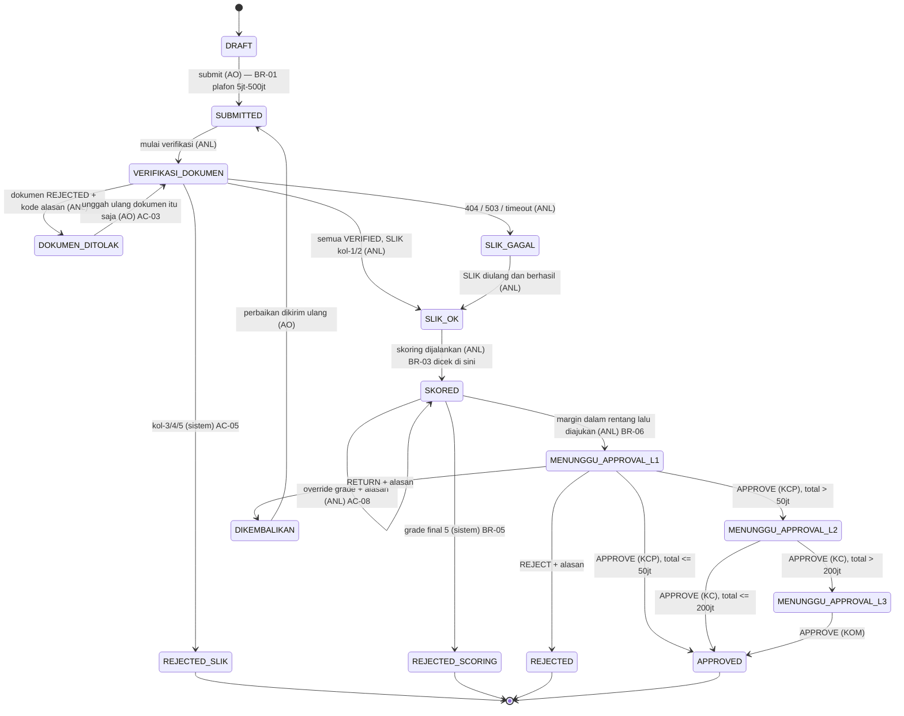

# TESTING — Dokumentasi Pengujian iMitra

**Sistem**: iMitra — Originasi Pembiayaan Mikro Syariah
**Dokumen ini menjawab**: siapa yang menguji (akun), data apa yang dipakai, alur mana yang
ditelusuri, apa yang harus terjadi di setiap langkah, dan mana yang sudah ditutup test
otomatis serta mana yang belum.

**Rujukan**: [SRS](SRS-iMitra.md) (FR, BR, AC) · [SDD](SDD-iMitra.md) (endpoint, model data) ·
[AGENTS.md](../AGENTS.md) (aturan bisnis & konvensi) · [DEMO-SCRIPT.md](DEMO-SCRIPT.md) (skrip demo) ·
[TRACEABILITY.md](TRACEABILITY.md) (status per FR)

> **Cara membaca**: isi dokumen ini dibaca dari kode yang benar-benar terdaftar
> (`backend/src/routes/`), dari seed (`backend/prisma/seed.ts`, `seed-demo.ts`), dan dari
> berkas test yang benar-benar ada. Kalau ada perbedaan antara dokumen ini dan kode,
> **kode yang benar** — perbarui dokumen ini, jangan menyesuaikan kode ke dokumen.

---

## Daftar Isi

1. [Strategi & ruang lingkup pengujian](#1-strategi--ruang-lingkup-pengujian)
2. [Menyiapkan lingkungan uji](#2-menyiapkan-lingkungan-uji)
3. [Daftar pengguna uji](#3-daftar-pengguna-uji)
4. [Data uji](#4-data-uji)
5. [Matriks otorisasi endpoint × peran](#5-matriks-otorisasi-endpoint--peran)
6. [Alur uji (flow)](#6-alur-uji-flow)
7. [Skenario uji fungsional](#7-skenario-uji-fungsional)
8. [Skenario uji jalur error](#8-skenario-uji-jalur-error)
9. [Skenario uji non-fungsional](#9-skenario-uji-non-fungsional)
10. [Test otomatis](#10-test-otomatis)
11. [Matriks keterlacakan AC → test](#11-matriks-keterlacakan-ac--test)
12. [Celah pengujian yang diketahui](#12-celah-pengujian-yang-diketahui)
13. [Checklist regresi sebelum rilis / demo](#13-checklist-regresi-sebelum-rilis--demo)
14. [Template laporan](#14-template-laporan)
15. [Aturan menulis test baru](#15-aturan-menulis-test-baru)

---

## 1. Strategi & Ruang Lingkup Pengujian

### 1.1 Lapisan pengujian

| Lapisan | Menguji apa | Butuh database? | Perintah | Lokasi |
|---|---|---|---|---|
| **Unit (domain)** | Aturan bisnis murni: BR-01, BR-02, BR-05, BR-06, BR-07, BR-09, BR-12, komposisi skor, lantai kolektibilitas | Tidak | `cd backend && npm run test:unit` | `backend/tests/unit/` |
| **Integrasi (API + DB)** | Kontrak HTTP, otorisasi, transaksi, audit trail, prasyarat lintas agregat | Ya | `cd backend && npm run test:integration` | `backend/tests/integration/` |
| **Kontrak mock SLIK** | Cabang 200/400/404/503 sesuai brief §6.1 | Tidak | `cd mock-slik && npm test` | `mock-slik/tests/` |
| **Unit frontend (lapisan api)** | Bentuk permintaan/respons, penerusan kode `rule`, penanganan 401 | Tidak | `cd frontend && npm test` | `frontend/src/api/__tests__/` |
| **Manual / UAT** | Alur end-to-end lewat UI, jalur error yang dipicu manusia, tampilan rincian skor | Ya | Dokumen ini bagian 6–9 | — |

### 1.2 Prinsip yang mengikat

1. **Test ditulis dari AC dan BR, bukan dari kode.** Test yang hanya memantulkan implementasi
   tidak membuktikan apa pun ketika implementasinya yang salah.
2. **Parameter bisnis tidak boleh di-hardcode di test.** Untuk AC-09 dan AC-15, test wajib
   **mengubah baris parameter di database lebih dulu** lalu memastikan hasil ikut berubah.
   Test yang memanggil fungsi dengan angka tetap tidak membuktikan parameter dibaca dari data.
3. **Kegagalan harus berupa kegagalan.** Tidak ada jalur "lanjutkan saja": SLIK gagal → status
   `SLIK_GAGAL`; margin di luar rentang → 422; grade 5 → `REJECTED_SCORING`.
4. **Kode HTTP adalah bagian dari hasil yang diuji.** 401 ≠ 403 ≠ 404 ≠ 422 ≠ 502. Menguji
   "ditolak" saja tidak cukup.
5. **Data pribadi diuji secara negatif**: test memastikan NIK **tidak** muncul di respons, log,
   dan pesan error (BR-11).

### 1.3 Di luar ruang lingkup pengujian

Tidak diuji karena tidak dibangun (brief §1.4): disbursement, akuntansi, jadwal angsuran,
penagihan, restrukturisasi, integrasi Core Banking / SLIK produksi, SSO/AD nyata, multi-tenant,
multi-currency, multi-bahasa, aplikasi mobile native.

---

## 2. Menyiapkan Lingkungan Uji

### 2.1 Prasyarat

- Docker Engine ≥ 24 + Docker Compose v2 (jalur yang dipakai penilai), **atau** Node.js 20 LTS
  untuk mode pengembangan dan menjalankan test.
- Port bebas: **3000** (frontend), **8080** (backend), **9090** (mock SLIK), **5432** (database).
  Kalau bentrok, ubah di `.env` bagian "Port layanan" — jangan ubah kode.

### 2.2 Menghidupkan sistem

```bash
git clone <repo> && cd iMitra-Tim-2
cp .env.example .env
docker compose up --build       # migrasi + seed berjalan otomatis
```

Tunggu seluruh service `healthy` (`docker compose ps`), lalu buka <http://localhost:3000>.

Alternatif tanpa Docker (hot reload, database tetap perlu tersedia):

```bash
npm run setup       # install seluruh workspace + prisma generate
npm run dev         # mock-slik + backend + frontend sekaligus; Ctrl+C mematikan ketiganya
npm run ports:kill  # bebaskan 9090/8080/3000 kalau ada sisa proses
```

### 2.3 Alamat layanan

| Layanan | URL | Pemeriksaan cepat |
|---|---|---|
| Frontend | <http://localhost:3000> | Halaman login tampil |
| Backend API | <http://localhost:8080> | `GET /health` → `{"status":"ok","database":"ok"}` |
| Daftar route | <http://localhost:8080/api/_routes> | Hanya aktif bila `APP_ENV != production` |
| Mock SLIK | <http://localhost:9090> | `GET /health` → `nasabahDimuat: 10`, `mode: "ok"` |
| Database | `localhost:5432` | Inspeksi manual (psql/DBeaver) |

### 2.4 Menyiapkan & mereset data uji

```bash
npm run db:migrate      # prisma migrate deploy
npm run db:seed         # idempoten — aman diulang, sekaligus memanggil seed demo
npm run db:seed:demo    # hanya data demo
npm run db:reset        # migrate reset --force lalu seed ulang (menghapus seluruh data)

docker compose down -v && docker compose up --build   # reset total termasuk volume & upload
```

> **Penting**: tabel `audit_trail` dilindungi trigger append-only. Menghapus pengajuan yang
> sudah punya baris audit **akan gagal**. Untuk mengulang dari nol pakai `db:reset`, bukan
> `DELETE` manual.

### 2.5 Variabel lingkungan yang memengaruhi pengujian

| Variabel | Nilai uji | Pengaruh |
|---|---|---|
| `APP_ENV` | `development` / `test` | Menyalakan `GET /api/_routes` dan endpoint kontrol mock SLIK |
| `SEED_DEFAULT_PASSWORD` | `Demo1234!` | Kata sandi seluruh akun seed |
| `PASSWORD_HASH_COST` | `4` di CI, `10` lokal | Kecepatan test yang melibatkan login |
| `SLIK_BASE_URL` | `http://mock-slik:9090` (Docker) / `http://localhost:9090` (dev) | Target panggilan SLIK |
| `SLIK_TIMEOUT_MS` | `3000` | Batas waktu sebelum jalur timeout dipicu |
| `JWT_EXPIRES_IN` | `8h` | Masa berlaku token uji |
| `TZ` | `Asia/Jakarta` | Bagian `YYYYMMDD` nomor referensi (asumsi A-7) |
| `DATABASE_URL_TEST` | schema `test_<nama>` | Test integrasi dialihkan ke sini oleh `backend/tests/setup-env.ts` sebelum modul aplikasi di-import. **Isi variabel ini** — kalau kosong, test menulis ke schema kerja Anda |

---

## 3. Daftar Pengguna Uji

Seluruh akun dibuat `backend/prisma/seed.ts` (idempoten). Kata sandi sama untuk semuanya,
diambil dari `SEED_DEFAULT_PASSWORD`. Ini akun seed non-produksi.

| # | Username | Kata sandi | Nama | Peran | Wewenang utama | Dipakai untuk |
|---|---|---|---|---|---|---|
| 1 | `ao` | `Demo1234!` | Andi Prasetya | `AO` | Buat/ubah pengajuan miliknya, tambah anggota, upload dokumen, rekam survei | AC-01, AC-02, AC-03 |
| 2 | `anl` | `Demo1234!` | Dewi Rahmawati | `ANL` | Verifikasi dokumen, nilai survei, SLIK check, skoring + override, margin, ajukan approval, tolak anggota | AC-03 … AC-09 |
| 3 | `kcp` | `Demo1234!` | Bagus Setiawan | `KCP` | Approval level 1 | AC-10 |
| 4 | `kc` | `Demo1234!` | Sri Handayani | `KC` | Approval level 2 | AC-10 |
| 5 | `kom` | `Demo1234!` | Komite Pembiayaan | `KOM` | Approval level 3 | AC-10 |
| 6 | `adm` | `Demo1234!` | Admin Sistem | `ADM` | Kelola pengguna, parameter skoring, ambang approval, rentang margin, baca seluruh audit | AC-15, AC-13 |
| 7 | `kcp2` | `Demo1234!` | Rina Kusuma | `KCP` | Approval level 1 **dan** pembuat pengajuan | **AC-11** (maker ≠ approver) |

**Kenapa `kcp2` ada**: tanpa akun yang berperan approver sekaligus menjadi pembuat pengajuan,
BR-09 tidak bisa dibuktikan — akan selalu lolos secara kebetulan.

### 3.1 Mengambil token untuk pengujian API

```bash
TOKEN_AO=$(curl -s -X POST http://localhost:8080/api/auth/login \
  -H 'content-type: application/json' \
  -d '{"username":"ao","password":"Demo1234!"}' | sed -E 's/.*"token":"([^"]+)".*/\1/')

curl -s http://localhost:8080/api/auth/me -H "Authorization: Bearer $TOKEN_AO"
```

Ulangi untuk `anl`, `kcp`, `kc`, `kom`, `adm`, `kcp2`. Simpan sebagai `TOKEN_ANL`, dst.

---

## 4. Data Uji

### 4.1 Nasabah fixtures — `fixtures/nasabah-uji.csv`

12 baris. **Jangan diubah, ditambah, atau dikurangi** — penilai memakai NIK dari daftar ini.
10 baris pertama dimuat mock SLIK sebagai data 200; dua baris terakhir sengaja tidak dimuat.

| NIK | Nama | Usaha | Kol | Omzet/hari | Lama usaha | Cabang yang diuji |
|---|---|---|---|---|---|---|
| `3404110985000001` | Siti Aminah | Warung Kelontong | 1 | 800.000 | 48 bln | Grade 1, plafon kecil, 1 level (AC-01, AC-10) |
| `3404220790000002` | Budi Santoso | Bengkel Motor | 1 | 500.000 | 30 bln | Grade 2, approval 2 level (AC-10) |
| `3404150688000003` | Wahyu Nugroho | Pedagang Sayur | **2** | 450.000 | 20 bln | Kol-2 → lantai grade 3 (AC-06) |
| `3404031292000004` | Endang Sulastri | Laundry Kiloan | **4** | 600.000 | 36 bln | Penolakan otomatis `REJECTED_SLIK` (AC-05) |
| `3404190883000005` | Joko Prasetyo | Toko Bangunan | 1 | 200.000 | 5 bln | Usaha baru → grade 4/5, uji BR-05 |
| `3404270995000006` | Ratna Dewi | Katering Rumahan | **3** | 550.000 | 28 bln | Penolakan otomatis (cadangan) |
| `3404080781000007` | Slamet Riyadi | Peternak Ayam | 1 | 1.200.000 | 60 bln | Grade 1, plafon besar, 3 level (AC-09, AC-10) |
| `3404121189000008` | Nur Hidayah | Konveksi | **5** | 700.000 | 42 bln | Penolakan otomatis (cadangan) |
| `3404300394000009` | Agus Setiawan | Servis Elektronik | **2** | 400.000 | 24 bln | Kol-2 + kapasitas sedang → grade 3 (AC-06, AC-07) |
| `3404060586000010` | Lestari Wulandari | Toko Sembako | 1 | 650.000 | 18 bln | Uji batas komponen "Lama usaha" (AC-07, BR-07) |
| `3404999999999999` | — | — | — | — | — | **404 `NIK_NOT_FOUND`** (jalur E-2) |
| `3404000000000503` | — | — | — | — | — | **503 `SERVICE_UNAVAILABLE`** (jalur E-1) |

> `omzet_harian` dan `lama_usaha_bulan` **bukan** bagian kontrak SLIK — keduanya nilai survei
> (FR-04). Pakai keduanya saat merekam survei supaya hasil skoring bisa diprediksi.

### 4.2 Pengajuan siap-demo — `backend/prisma/seed-demo.ts`

Skor dihitung dengan **fungsi domain yang sama** dengan aplikasi, jadi angkanya identik dengan
hasil kalau ANL menekan tombol Skoring sendiri. Bagian tanggal mengikuti hari seed dijalankan.

| Nomor referensi | Status | Skor | Grade | Total plafon | Jalur approval | Untuk |
|---|---|---|---|---|---|---|
| `IMT-…-9001` | `APPROVED` | 96 | 1 | Rp 30.000.000 | KCP | **AC-12** — audit trail lengkap `DRAFT`→`APPROVED` |
| `IMT-…-9002` | `SKORED` | 100 | 1 | Rp 40.000.000 | KCP | **AC-09** — siap penetapan margin |
| `IMT-…-9003` | `MENUNGGU_APPROVAL_L1` | 57 | 3 | Rp 120.000.000 | KCP → KC | **AC-10** — berjenjang 2 |
| `IMT-…-9004` | `MENUNGGU_APPROVAL_L1` | 46 | 4 | Rp 240.000.000 (4 anggota) | KCP → KC → KOM | **AC-14** — kelompok |
| `IMT-…-9005` | `SKORED` | 85 | sistem **1** → final **3** | Rp 20.000.000 | KCP | **AC-06** — lantai kol-2 |

`9005` adalah kasus yang paling bernilai: skor 85 jatuh di rentang grade 1, tetapi
kolektibilitas 2 menurunkannya ke grade 3. Tanpa kasus seperti ini, AC-06 hanya bisa
"ditunjukkan" pada pengajuan yang grade mentahnya memang sudah 3 — dan itu tidak membuktikan apa pun.

**NIK yang masih bebas** untuk membuat pengajuan baru saat pengujian (asumsi A-6: satu NIK hanya
boleh punya satu pengajuan aktif): `3404031292000004` (kol-4), `3404270995000006` (kol-3),
`3404121189000008` (kol-5).

### 4.3 Parameter awal hasil seed

Seluruhnya **data**, bukan konstanta — dan dapat diubah ADM tanpa deploy (FR-13, AC-15).

**Komponen skor** (`parameter_skoring`):

| Kode | Nama | Bobot | Aturan |
|---|---|---|---|
| `KAPASITAS_BAYAR` | Kapasitas bayar | 35 | `penuh: 30`, `nol: 60` (rasio angsuran %) |
| `RIWAYAT_SLIK` | Riwayat SLIK | 25 | `kol1: 100`, `kol2: 40` |
| `LAMA_USAHA` | Lama usaha | 20 | `penuh: 36`, `nol: 6` (bulan) |
| `HASIL_SURVEI` | Hasil survei lapangan | 20 | `pengali: 20` (skala 1–5) |

**Parameter skalar** (asumsi tim, SRS 2.5): `MARGIN_REFERENSI_SKORING` = 15,5 ·
`HARI_KERJA_PER_BULAN` = 25 · `MARGIN_USAHA_PERSEN` = 30 · `SLIK_MASA_BERLAKU_HARI` = 30 (BR-04).

**Ambang approval** (`ambang_approval`):

| Total plafon | Urutan peran |
|---|---|
| Rp 5.000.000 – Rp 50.000.000 | `KCP` |
| Rp 50.000.001 – Rp 200.000.000 | `KCP` → `KC` |
| Rp 200.000.001 – Rp 500.000.000 | `KCP` → `KC` → `KOM` |

**Rentang margin/nisbah** (`rentang_margin`):

| Grade | Skor | Margin murabahah | Nisbah musyarakah | Dibiayai |
|---|---|---|---|---|
| 1 | 85–100 | 11,0 – 13,0 % | 20 – 25 % | ya |
| 2 | 70–84 | 13,0 – 15,5 % | 25 – 30 % | ya |
| 3 | 55–69 | 15,5 – 18,0 % | 30 – 35 % | ya |
| 4 | 40–54 | 18,0 – 21,0 % | 35 – 40 % | ya |
| 5 | 0–39 | — | — | **tidak** |

---

## 5. Matriks Otorisasi Endpoint × Peran

Dibaca langsung dari `config.peran` tiap route. **Ini adalah oracle untuk AC-02 dan NFR-02**:
peran di luar kolom "Peran diizinkan" harus menerima **403**, bukan 200 dan bukan 404;
permintaan tanpa token harus **401**.

| Method | Endpoint | Peran diizinkan | FR |
|---|---|---|---|
| GET | `/health` | PUBLIK | — |
| GET | `/api/_routes` | PUBLIK (hanya non-produksi) | AC-13 |
| POST | `/api/auth/login` | PUBLIK | FR-01 |
| GET | `/api/auth/me` | semua peran | FR-01 |
| POST | `/api/pengajuan` | `AO` | FR-02 |
| GET | `/api/pengajuan` | semua peran | FR-02 |
| GET | `/api/pengajuan/:id` | semua peran | FR-02 |
| PATCH | `/api/pengajuan/:id` | `AO` | FR-02 |
| POST | `/api/pengajuan/:id/submit` | `AO` | FR-02 |
| GET | `/api/dashboard/pipeline` | semua peran | FR-12 |
| POST | `/api/pengajuan/:id/anggota` | `AO` | FR-10 |
| PATCH | `/api/pengajuan/:id/anggota/:anggotaId` | `AO` | FR-10 |
| POST | `/api/pengajuan/:id/anggota/:anggotaId/tolak` | `ANL` | FR-10 |
| POST | `/api/pengajuan/:id/dokumen` | `AO` | FR-03 |
| GET | `/api/pengajuan/:id/dokumen` | semua peran | FR-03 |
| POST | `/api/dokumen/:dokumenId/verifikasi` | **`ANL`** | FR-03, **AC-02** |
| GET | `/api/dokumen/:dokumenId/berkas` | `AO`,`ANL`,`KCP`,`KC`,`KOM` | FR-03 |
| POST | `/api/pengajuan/:id/survei` | `AO` | FR-04 |
| GET | `/api/pengajuan/:id/survei` | semua peran | FR-04 |
| POST | `/api/survei/:surveiId/nilai` | `ANL` | FR-04 |
| POST | `/api/pengajuan/:id/slik-check` | `ANL` | FR-05 |
| GET | `/api/pengajuan/:id/slik` | `ANL`,`KCP`,`KC`,`KOM`,`ADM` | FR-05 |
| POST | `/api/pengajuan/:id/skoring` | `ANL` | FR-06 |
| GET | `/api/pengajuan/:id/skoring` | `ANL`,`KCP`,`KC`,`KOM`,`ADM` | FR-06 |
| GET | `/api/pengajuan/:id/skoring/prasyarat` | `ANL`,`KCP`,`KC`,`KOM`,`ADM` | FR-06 |
| POST | `/api/pengajuan/:id/skoring/override` | `ANL` | FR-06.1 |
| POST | `/api/pengajuan/:id/margin` | `ANL` | FR-07 |
| GET | `/api/pengajuan/:id/margin` | `ANL`,`KCP`,`KC`,`KOM`,`ADM` | FR-07 |
| POST | `/api/pengajuan/:id/ajukan-approval` | `ANL` | FR-08 |
| GET | `/api/approval/antrian` | `KCP`,`KC`,`KOM` | FR-08 |
| POST | `/api/pengajuan/:id/approval` | `KCP`,`KC`,`KOM` | FR-08 |
| GET | `/api/pengajuan/:id/audit` | semua peran | FR-09 |
| GET | `/api/audit` | **`ADM`** | FR-09 |
| GET | `/api/notifikasi` | semua peran (milik pemanggil) | FR-11 |
| POST | `/api/notifikasi/:id/baca` | semua peran (milik pemanggil) | FR-11 |
| GET · POST | `/api/pengguna` | `ADM` | FR-01 |
| PATCH | `/api/pengguna/:id` | `ADM` | FR-01 |
| GET · PUT | `/api/parameter/skoring` | `ADM` | FR-13 |
| GET · PUT | `/api/parameter/ambang-approval` | `ADM` | FR-13 |
| GET · PUT | `/api/parameter/rentang-margin` | `ADM` | FR-13 |

**Dua sifat yang wajib tetap benar** (diuji `integration/rbac.spec.ts`):

- Tidak ada satu pun route tanpa deklarasi peran — proses **gagal saat start** kalau ada
  (fail-closed).
- **Tidak ada route `DELETE` sama sekali**, dan tidak ada `PUT`/`PATCH`/`DELETE` untuk sumber
  daya audit (AC-13).

---

## 6. Alur Uji (Flow)

### 6.1 Alur status pengajuan

Setiap panah = satu baris audit trail berisi aktor dan timestamp (BR-10).



Status terminal: `REJECTED_SLIK`, `REJECTED_SCORING`, `APPROVED`, `REJECTED`.

### 6.2 F-01 — Jalur bahagia end-to-end

**Tujuan**: membuktikan satu pengajuan dapat menempuh seluruh siklus dari nol sampai `APPROVED`.
**Data**: NIK `3404110985000001`, plafon Rp 30.000.000, murabahah, tenor 12 bulan → **1 level (KCP)**.

| Langkah | Peran | Layar / endpoint | Hasil yang diharapkan |
|---|---|---|---|
| 1 | `ao` | Login | Token terbit; baris audit `LOGIN` |
| 2 | `ao` | Buat Pengajuan → `POST /api/pengajuan` | **201**, status `DRAFT`, nomor `IMT-YYYYMMDD-NNNN` |
| 3 | `ao` | Upload dokumen KTP, KK, SKU → `POST /api/pengajuan/:id/dokumen` | Tiap dokumen versi 1, status `MENUNGGU` |
| 4 | `ao` | Rekam survei → `POST /api/pengajuan/:id/survei` | Survei tersimpan status `DRAFT` |
| 5 | `ao` | Submit → `POST /api/pengajuan/:id/submit` | Status `SUBMITTED`; audit mencatat aktor + waktu |
| 6 | `anl` | Verifikasi ketiga dokumen `VERIFIED` | Status pengajuan `VERIFIKASI_DOKUMEN` |
| 7 | `anl` | Nilai survei `VALID`, skala 4 → `POST /api/survei/:id/nilai` | Survei `VALID` |
| 8 | `anl` | SLIK check → `POST /api/pengajuan/:id/slik-check` | Kol-1 → status `SLIK_OK`; baris `hasil_slik` `OK` |
| 9 | `anl` | Skoring → `POST /api/pengajuan/:id/skoring` | Status `SKORED`; **4 baris rincian** tersimpan; grade sesuai skor |
| 10 | `anl` | Margin → `POST /api/pengajuan/:id/margin` (dalam rentang grade) | **200**, margin tersimpan |
| 11 | `anl` | Ajukan approval → `POST /api/pengajuan/:id/ajukan-approval` | Status `MENUNGGU_APPROVAL_L1`; notifikasi ke KCP |
| 12 | `kcp` | Antrian approval → `APPROVE` | Total ≤ 50 jt → langsung **`APPROVED`** |
| 13 | siapa pun | `GET /api/pengajuan/:id/audit` | Riwayat lengkap urut waktu, aktor di setiap baris |

### 6.3 F-02 — Penolakan otomatis SLIK

**Data**: NIK `3404031292000004` (kol-4). Langkah 1–7 sama dengan F-01.

| Langkah | Peran | Aksi | Hasil |
|---|---|---|---|
| 8 | `anl` | SLIK check | Kol-4 → status **`REJECTED_SLIK`** langsung, **tanpa** melalui approval |
| 9 | `anl` | Coba skoring | **422**, pesan menyebut `BR-03` — pengajuan terminal |
| 10 | siapa pun | Audit | Baris penolakan otomatis tercatat dengan sebab, **tanpa NIK** |

### 6.4 F-03 — Kol-2 dan lantai grade

**Data**: `IMT-…-9005` (siap pakai) atau NIK `3404150688000003` dari nol.

| Langkah | Peran | Aksi | Hasil |
|---|---|---|---|
| 1 | `anl` | Baca hasil skoring | Skor 85 → **grade sistem 1**, **grade final 3** |
| 2 | `anl` | Catatan analis | **Wajib** terisi untuk kol-2 |
| 3 | `anl` | Coba margin 12,0 % (rentang grade 1) | **422 `BR-06`** — rentang yang berlaku grade **3** (15,5–18,0 %) |
| 4 | `anl` | Margin 16,0 % | **200**, tersimpan |

### 6.5 F-04 — Approval berjenjang

**Data**: `IMT-…-9003` (Rp 120.000.000 → KCP → KC).

| Langkah | Peran | Aksi | Hasil |
|---|---|---|---|
| 1 | `kc` | Coba `APPROVE` lebih dulu | **422**, pesan menyebut `BR-02` |
| 2 | `kcp` | `APPROVE` | Status naik ke `MENUNGGU_APPROVAL_L2`; KC dinotifikasi |
| 3 | `kcp` | Buka antrian lagi | Pengajuan **tidak lagi** muncul di antrian KCP |
| 4 | `kc` | `APPROVE` | Total ≤ 200 jt → **`APPROVED`** |

### 6.6 F-05 — Kelompok / majelis

**Data**: `IMT-…-9004` — 4 anggota × Rp 60.000.000 = Rp 240.000.000.

| Langkah | Peran | Aksi | Hasil |
|---|---|---|---|
| 1 | siapa pun | Baca detail | Total Rp 240.000.000, **3 level** diperlukan |
| 2 | `anl` | Tolak satu anggota Rp 60.000.000 | Anggota `DITOLAK`; total Rp 180.000.000; level turun **otomatis** menjadi **2** |
| 3 | `anl` | Tolak anggota lagi sampai tersisa < 3 aktif | **Ditolak** — kelompok harus dibubarkan, bukan menyusut menjadi tidak sah |

### 6.7 F-06 — Maker ≠ approver

| Langkah | Peran | Aksi | Hasil |
|---|---|---|---|
| 1 | `kcp2` | Buat pengajuan sampai `MENUNGGU_APPROVAL_L1` | Berhasil |
| 2 | `kcp2` | `APPROVE` pengajuan itu — lewat UI **dan** API langsung | **403**, pesan menyebut `BR-09`. Menyembunyikan tombol saja **tidak cukup** |
| 3 | `kcp` | `APPROVE` pengajuan yang sama | Berhasil |

### 6.8 F-07 — Pengembalian ke AO

| Langkah | Peran | Aksi | Hasil |
|---|---|---|---|
| 1 | `kcp` | `RETURN` + alasan | Status `DIKEMBALIKAN`; alasan tersimpan; AO dinotifikasi |
| 2 | `ao` | `PATCH /api/pengajuan/:id` memperbaiki data | Diterima — hanya `DRAFT`/`DIKEMBALIKAN` yang boleh diubah |
| 3 | `ao` | Submit ulang | Status kembali `SUBMITTED`; audit memuat kedua transisi |

### 6.9 F-08 — Administrasi parameter

| Langkah | Peran | Aksi | Hasil |
|---|---|---|---|
| 1 | `anl` | Jalankan skoring pada pengajuan uji | Catat skor & grade |
| 2 | `adm` | Ubah bobot `LAMA_USAHA` 20 → 25 → `PUT /api/parameter/skoring` | **200**, tersimpan; audit mencatat perubahan |
| 3 | `anl` | Jalankan skoring **lagi** (tanpa restart) | Skor **berubah** memakai bobot baru |
| 4 | siapa pun | Baca hasil skoring lama | **Tidak** dihitung ulang — menyimpan snapshot parameter lamanya |

---

## 7. Skenario Uji Fungsional

Format kolom: **ID** · **Prasyarat** · **Langkah** · **Hasil yang diharapkan** · **Kode HTTP**.
Skenario bertanda ⭐ menutup AC resmi.

### 7.1 Autentikasi & otorisasi (FR-01)

| ID | Prasyarat | Langkah | Hasil diharapkan | HTTP |
|---|---|---|---|---|
| TC-AUTH-01 | Seed selesai | Login `ao` / `Demo1234!` | Token + profil `{id, nama, peran, username}`; baris audit `LOGIN` | 200 |
| TC-AUTH-02 | — | Login `ao` dengan sandi salah | Pesan **tidak** membedakan "user tidak ada" dari "sandi salah"; audit `LOGIN_GAGAL` | 401 |
| TC-AUTH-03 | — | Login username yang tidak ada | Pesan **identik** dengan TC-AUTH-02 | 401 |
| TC-AUTH-04 | — | `GET /api/pengajuan` tanpa header Authorization | Ditolak; bukan 403, bukan 200 | **401** |
| TC-AUTH-05 | — | `GET /api/pengajuan` dengan token acak/rusak | Ditolak tanpa membedakan sebab | **401** |
| TC-AUTH-06 ⭐ | Token AO | `POST /api/dokumen/:id/verifikasi` sebagai AO | Ditolak **di server**; bukan 200, bukan 404 | **403** (AC-02) |
| TC-AUTH-07 | Token AO | `GET /api/audit` sebagai AO | Ditolak | 403 |
| TC-AUTH-08 | — | Nyalakan server dengan satu route tanpa `config.peran` | **Proses gagal saat start**, bukan lolos tanpa otorisasi | — |
| TC-AUTH-09 | — | `GET /api/_routes` | Tidak ada `PUT`/`PATCH`/`DELETE` untuk audit; tidak ada `DELETE` sama sekali | 200 |

### 7.2 Pengajuan (FR-02)

| ID | Prasyarat | Langkah | Hasil diharapkan | HTTP |
|---|---|---|---|---|
| TC-PGJ-01 ⭐ | Login AO | Buat pengajuan Rp 30.000.000, murabahah, tenor 12 | Nomor referensi cocok pola `IMT-\d{8}-\d{4}`; status `DRAFT` | **201** (AC-01) |
| TC-PGJ-02 | Pengajuan `DRAFT` | Submit dengan plafon Rp 4.000.000 | Ditolak; pesan menyebut **kedua** batas (5 jt dan 500 jt) dan kode `BR-01` | **422** |
| TC-PGJ-03 | Pengajuan `DRAFT` | Submit dengan plafon Rp 600.000.000 | Sama seperti TC-PGJ-02 | 422 |
| TC-PGJ-04 | Pengajuan `DRAFT` | Submit plafon Rp 5.000.000 (batas bawah tepat) | **Diterima** — batas bersifat inklusif | 200 |
| TC-PGJ-05 | Pengajuan `DRAFT` | Submit plafon Rp 500.000.000 (batas atas tepat) | **Diterima** | 200 |
| TC-PGJ-06 | Dua pengajuan di hari yang sama | Bandingkan nomor referensi | Berurutan, **tidak pernah** dipakai ulang — termasuk untuk pengajuan yang ditolak (BR-12) | — |
| TC-PGJ-07 | — | Kirim NIK 15 digit | Ditolak, pesan menyebut field NIK | **400** |
| TC-PGJ-08 | Pengajuan `DIKEMBALIKAN` | `PATCH /api/pengajuan/:id` lalu submit ulang | Data terbarui; status kembali `SUBMITTED` | 200 |
| TC-PGJ-09 | Pengajuan `MENUNGGU_APPROVAL_L1` | `PATCH /api/pengajuan/:id` | Ditolak — hanya `DRAFT`/`DIKEMBALIKAN` yang boleh diubah | 422 |
| TC-PGJ-10 | Login ANL | `POST /api/pengajuan` sebagai ANL | Ditolak | **403** |

### 7.3 Dokumen (FR-03)

| ID | Prasyarat | Langkah | Hasil diharapkan | HTTP |
|---|---|---|---|---|
| TC-DOK-01 | Pengajuan ada | AO unggah KTP (JPEG/PNG/PDF, ≤ 5 MB) | Dokumen **versi 1**, status `MENUNGGU` | 201 |
| TC-DOK-02 | — | Unggah MIME di luar daftar | Ditolak | 400/422 |
| TC-DOK-03 | — | Unggah berkas kosong | Ditolak | 400/422 |
| TC-DOK-04 | — | Unggah berkas > 5 MB | Ditolak | 400/422 |
| TC-DOK-05 | — | Unggah berkas tepat di batas ukuran | **Diterima** | 201 |
| TC-DOK-06 ⭐ | Dokumen `MENUNGGU` | ANL menolak KTP dengan kode `BURAM` | Dokumen `REJECTED` + kode alasan tersimpan; status pengajuan `DOKUMEN_DITOLAK` | 200 (AC-03) |
| TC-DOK-07 ⭐ | TC-DOK-06 | AO unggah ulang **hanya KTP** | KTP menjadi **versi 2**; versi 1 tetap ada; **data pengajuan lain dan dokumen lain utuh** | 201 (AC-03) |
| TC-DOK-08 | Dokumen `MENUNGGU` | ANL menolak **tanpa** kode alasan | Ditolak — kode alasan wajib untuk `REJECTED` | 422 |
| TC-DOK-09 | Dokumen `MENUNGGU` | ANL menolak dengan kode di luar daftar tertutup | Ditolak | 400/422 |
| TC-DOK-10 | Dokumen `MENUNGGU` | ANL `VERIFIED` **dengan** kode alasan | Ditolak — `VERIFIED` tidak boleh membawa kode alasan | 400/422 |
| TC-DOK-11 | Dokumen ada | Ambil `GET /api/dokumen/:id/berkas` | URL **tidak memuat NIK**; peran & kepemilikan diperiksa | 200 |
| TC-DOK-12 | Majelis 2 anggota | Verifikasi 6 dokumen | Prasyarat dokumen terpenuhi hanya ketika **semua** anggota aktif lengkap | — |

### 7.4 Survei lapangan (FR-04)

| ID | Prasyarat | Langkah | Hasil diharapkan | HTTP |
|---|---|---|---|---|
| TC-SRV-01 | Pengajuan ada | AO rekam survei: lat, lon, ≥1 foto, omzet harian, lama usaha, catatan | Tersimpan status `DRAFT` | 201 |
| TC-SRV-02 | — | Rekam survei tanpa foto | Ditolak | 400 |
| TC-SRV-03 | Survei `DRAFT` | ANL beri `kondisiUsahaSkala` 4 dan status `VALID` | Survei `VALID` | 200 |
| TC-SRV-04 | — | Kirim `kondisiUsahaSkala` = 0 atau 6 | Ditolak (rentang 1–5) | 400 |
| TC-SRV-05 | Dua survei `VALID` | Jalankan skoring | Yang dipakai adalah survei `VALID` **terbaru** | — |
| TC-SRV-06 | Login AO | `POST /api/survei/:id/nilai` sebagai AO | Ditolak | **403** |

### 7.5 SLIK check (FR-05)

| ID | Prasyarat | Langkah | Hasil diharapkan | HTTP |
|---|---|---|---|---|
| TC-SLIK-01 | NIK `3404110985000001` | ANL jalankan SLIK check | Kol-1 → status `SLIK_OK`; baris `hasil_slik` `OK`; lanjut normal | 200 |
| TC-SLIK-02 ⭐ | NIK `3404150688000003` | SLIK check | Kol-2 → lanjut, **grade final dilantai di 3**, catatan analis menjadi **wajib** | 200 (AC-06) |
| TC-SLIK-03 ⭐ | NIK `3404031292000004` | SLIK check | Kol-4 → status **`REJECTED_SLIK`** otomatis, **tanpa** melalui approval | 200 (AC-05) |
| TC-SLIK-04 | NIK `3404270995000006` | SLIK check | Kol-3 → `REJECTED_SLIK` | 200 |
| TC-SLIK-05 | NIK `3404121189000008` | SLIK check | Kol-5 → `REJECTED_SLIK` | 200 |
| TC-SLIK-06 | NIK `3404999999999999` | SLIK check | Status `SLIK_GAGAL` alasan `NIK_TIDAK_DITEMUKAN`; pesan **tidak memuat NIK** | **502** |
| TC-SLIK-07 | NIK `3404000000000503` | SLIK check | Status `SLIK_GAGAL` alasan `LAYANAN_TIDAK_TERSEDIA`; kolektibilitas **tidak diisi nilai apa pun** | **502** |
| TC-SLIK-08 | Mock mode `timeout` | SLIK check | Klien memutus sendiri setelah `SLIK_TIMEOUT_MS`; `status_panggilan = TIMEOUT` | **502** |
| TC-SLIK-09 | TC-SLIK-07 | Kembalikan mock ke `ok`, ulangi SLIK check | Status berpindah `SLIK_GAGAL` → `SLIK_OK` | 200 |
| TC-SLIK-10 | Hasil SLIK berumur > 30 hari | Coba skoring | Ditolak — perlu SLIK ulang (BR-04) | 422 |
| TC-SLIK-11 | Hasil SLIK ada | `GET /api/pengajuan/:id/slik` | `totalBakiDebet` berupa **number**; **tidak** membocorkan identitas pemeriksa | 200 |
| TC-SLIK-12 | Kelompok multi-anggota | SLIK check | Dipanggil untuk **setiap** anggota aktif; kolektibilitas terburuk yang menentukan | 200 |

### 7.6 Skoring (FR-06)

| ID | Prasyarat | Langkah | Hasil diharapkan | HTTP |
|---|---|---|---|---|
| TC-SKR-01 ⭐ | Tanpa survei `VALID` | ANL jalankan skoring | Ditolak; **body respons memuat string `BR-03`** dan menyebut prasyarat mana yang kurang | **422** (AC-04) |
| TC-SKR-02 | Ada dokumen belum `VERIFIED` | Skoring | Ditolak menyebut `BR-03` | 422 |
| TC-SKR-03 | SLIK belum dijalankan | Skoring | Ditolak menyebut `BR-03` | 422 |
| TC-SKR-04 | Prasyarat kurang | `GET /api/pengajuan/:id/skoring/prasyarat` | Daftar prasyarat yang **belum** terpenuhi — analis tahu sebelum menekan tombol | 200 |
| TC-SKR-05 ⭐ | Prasyarat lengkap | Skoring | **4 baris rincian** tersimpan & ditampilkan: bobot, nilai mentah, skor komponen (desimal), kontribusi | 200 (AC-07) |
| TC-SKR-06 | — | Periksa aritmetika | Skor akhir = Σ(skor × bobot) ÷ Σbobot, dibulatkan **sekali** di akhir (BR-07) | — |
| TC-SKR-07 | — | Periksa skor komponen | Skor komponen tetap **desimal**, tidak dibulatkan lebih dulu | — |
| TC-SKR-08 ⭐ | Kol-2, skor 85 | Baca grade | Grade sistem 1 → **grade final 3** (lantai kol-2) | 200 (AC-06) |
| TC-SKR-09 | Grade sistem 4, kol-2 | Baca grade | Grade **tidak** "diperbaiki" menjadi 3 — lantai hanya menurunkan | — |
| TC-SKR-10 | Skor < 40 | Skoring lalu ajukan approval | Grade 5 → **`REJECTED_SCORING`**, tidak masuk approval (BR-05) | 422 |
| TC-SKR-11 ⭐ | Hasil skoring ada | Override grade dengan alasan **kosong** | Ditolak | **400** (AC-08) |
| TC-SKR-12 ⭐ | Hasil skoring ada | Override grade dengan alasan < 10 karakter | Ditolak | 400 (AC-08) |
| TC-SKR-13 ⭐ | Hasil skoring ada | Override grade 2 → 3, alasan memadai | Tersimpan; grade sistem **tetap** tersimpan berdampingan; audit mencatat identitas ANL, nilai sebelum & sesudah | 200 (AC-08) |
| TC-SKR-14 | Kol-2, lantai 3 | Override menjadi grade 2 | **Ditolak** — override tidak boleh menembus lantai kol-2 (asumsi A-4) | 422 |
| TC-SKR-15 | Skoring selesai | Baca `snapshotParameter` | Parameter yang dipakai tersimpan bersama hasil | 200 |

### 7.7 Margin / nisbah (FR-07)

| ID | Prasyarat | Langkah | Hasil diharapkan | HTTP |
|---|---|---|---|---|
| TC-MRG-01 ⭐ | `IMT-…-9002`, grade 1 | Kirim margin **10,0 %** | **Diblokir**, bukan diperingatkan; pesan menyebut `BR-06` **dan kedua batas** (11,0 – 13,0) | **422** (AC-09) |
| TC-MRG-02 | grade 1 | Margin 10,9 % | Ditolak | 422 |
| TC-MRG-03 | grade 1 | Margin 11,0 % (batas bawah tepat) | **Diterima** | 200 |
| TC-MRG-04 | grade 1 | Margin 13,0 % (batas atas tepat) | **Diterima** | 200 |
| TC-MRG-05 | grade 1 | Margin 13,1 % | Ditolak | 422 |
| TC-MRG-06 | Akad musyarakah | Kirim `nisbahBankPersen` | Divalidasi terhadap kolom **nisbah**, bukan margin | 200/422 |
| TC-MRG-07 ⭐ | ADM ubah `rentang_margin` grade 1 menjadi 9,0–10,0 | Kirim margin 10,0 % lagi | Sekarang **diterima** — membuktikan rentang dibaca dari **database**, bukan konstanta | 200 (AC-09) |
| TC-MRG-08 | Grade 5 | Kirim margin apa pun | Ditolak — grade 5 tidak dibiayai (BR-05) | 422 |
| TC-MRG-09 | Grade yang belum diatur di parameter | Kirim margin | **Kesalahan konfigurasi** — bukan memakai nilai tebakan | 422/500 |
| TC-MRG-10 | Login AO | `POST /api/pengajuan/:id/margin` | Ditolak | **403** |

### 7.8 Approval berjenjang (FR-08)

| ID | Prasyarat | Langkah | Hasil diharapkan | HTTP |
|---|---|---|---|---|
| TC-APR-01 ⭐ | Total Rp 30.000.000 | KCP `APPROVE` | Langsung **`APPROVED`** — 1 level | 200 (AC-10) |
| TC-APR-02 ⭐ | Total Rp 120.000.000 | **KC** `APPROVE` sebelum KCP | Ditolak; pesan menyebut `BR-02` | **422** (AC-10) |
| TC-APR-03 ⭐ | TC-APR-02 | KCP `APPROVE` lalu KC `APPROVE` | Status naik L1 → L2 → `APPROVED` | 200 (AC-10) |
| TC-APR-04 | Total Rp 240.000.000 | KCP → KC → KOM `APPROVE` | 3 level; `APPROVED` setelah KOM | 200 |
| TC-APR-05 | Batas Rp 50.000.000 | Approval | Tepat 50 jt → 1 level; 50.000.001 → 2 level | — |
| TC-APR-06 | Batas Rp 200.000.000 | Approval | Tepat 200 jt → 2 level; 200.000.001 → 3 level | — |
| TC-APR-07 ⭐ | `kcp2` pembuat pengajuan | `kcp2` `APPROVE` pengajuannya sendiri | Ditolak **di server**; pesan menyebut `BR-09` | **403** (AC-11) |
| TC-APR-08 | Menunggu L1 | `REJECT` **tanpa** alasan | Ditolak — alasan wajib | 400/422 |
| TC-APR-09 | Menunggu L1 | `REJECT` dengan alasan | Status **`REJECTED`** (terminal); alasan tersimpan | 200 |
| TC-APR-10 | Menunggu L1 | `RETURN` dengan alasan | Status **`DIKEMBALIKAN`**; AO dinotifikasi; alasan tersimpan | 200 |
| TC-APR-11 | Menunggu L1 | KCP buka `GET /api/approval/antrian` | Hanya memuat pengajuan **pada level KCP** | 200 |
| TC-APR-12 | Setelah KCP approve | KCP buka antrian lagi | Pengajuan **tidak lagi** muncul | 200 |
| TC-APR-13 | Menunggu L1 | **ADM** mencoba `APPROVE` | Ditolak karena **peran**, bukan karena urutan — 403, bukan 422 | **403** |

### 7.9 Audit trail (FR-09)

| ID | Prasyarat | Langkah | Hasil diharapkan | HTTP |
|---|---|---|---|---|
| TC-AUD-01 ⭐ | `IMT-…-9001` (`APPROVED`) | `GET /api/pengajuan/:id/audit` | Riwayat **lengkap** `DRAFT`→`APPROVED`, **urut waktu naik**, aktor di **setiap** baris | 200 (AC-12) |
| TC-AUD-02 | Submit pengajuan | Baca audit | Baris `DRAFT`→`SUBMITTED` berisi aktor + timestamp (BR-10) | 200 |
| TC-AUD-03 ⭐ | — | `GET /api/_routes`, saring "audit" | **Tidak ada** `PUT`/`PATCH`/`DELETE` | 200 (AC-13) |
| TC-AUD-04 ⭐ | Koneksi database aplikasi | `UPDATE audit_trail SET ...` | **Ditolak database** oleh trigger append-only — bukan sekadar tidak disediakan API | error (AC-13) |
| TC-AUD-05 ⭐ | Koneksi database aplikasi | `DELETE FROM audit_trail` | Ditolak database | error (AC-13) |
| TC-AUD-06 | Setelah TC-AUD-04/05 | Baca baris audit | Baris lama **masih utuh** | 200 |
| TC-AUD-07 | Pengajuan berisi NIK | Baca riwayat audit | **Tidak ada NIK** di baris mana pun (BR-11) | 200 |
| TC-AUD-08 | Login ADM | `GET /api/audit?aksi=LOGIN&dari=…&sampai=…` | Terfilter benar; `sampai` mencakup **seluruh hari** (sampai 23:59:59.999) | 200 |
| TC-AUD-09 | Login ADM | `GET /api/audit?dari=20-08-2026` | Ditolak — format wajib `YYYY-MM-DD` | **400** |
| TC-AUD-10 | Login AO | `GET /api/audit` | Ditolak | **403** |

### 7.10 Pembiayaan kelompok (FR-10)

| ID | Prasyarat | Langkah | Hasil diharapkan | HTTP |
|---|---|---|---|---|
| TC-KLP-01 | — | Buat kelompok dengan 2 anggota | Ditolak — kelompok 3–10 anggota | 400/422 |
| TC-KLP-02 | — | Buat kelompok dengan 11 anggota | Ditolak | 400 |
| TC-KLP-03 ⭐ | `IMT-…-9004`, 4 × Rp 60 jt | Baca detail | Total Rp 240.000.000 → **3 level** | 200 (AC-14) |
| TC-KLP-04 ⭐ | TC-KLP-03 | ANL tolak satu anggota Rp 60 jt | Anggota `DITOLAK`; total Rp 180.000.000; level **turun otomatis menjadi 2** | 200 (AC-14) |
| TC-KLP-05 | 3 anggota aktif | Tolak satu lagi (tersisa 2) | **Ditolak** — kelompok harus dibubarkan, bukan menyusut | 422 |
| TC-KLP-06 | — | Perorangan | Memakai jalur kode yang sama dengan **tepat satu** anggota (asumsi A-5) | — |
| TC-KLP-07 | — | Hitung total | Hanya anggota **`AKTIF`** yang dijumlahkan; total tidak pernah disimpan (ADR-0002) | — |

### 7.11 Notifikasi (FR-11)

| ID | Prasyarat | Langkah | Hasil diharapkan | HTTP |
|---|---|---|---|---|
| TC-NTF-01 | — | `GET /api/notifikasi` tanpa token | Ditolak | **401** |
| TC-NTF-02 | Login KCP | `GET /api/notifikasi` | Hanya notifikasi **milik pemanggil** + jumlah belum dibaca | 200 |
| TC-NTF-03 | ANL mengubah status | ANL baca notifikasinya | Aktor **tidak** dinotifikasi atas perubahan yang ia lakukan sendiri | 200 |
| TC-NTF-04 | Notifikasi milik sendiri | `POST /api/notifikasi/:id/baca` | Ditandai dibaca | 200 |
| TC-NTF-05 | Id notifikasi **orang lain** diketahui | `POST /api/notifikasi/:id/baca` | **Ditolak** — id pengguna diambil dari token, bukan dari permintaan | 403/404 |
| TC-NTF-06 | — | Id notifikasi yang tidak ada | Ditolak | **404** |

### 7.12 Dashboard pipeline (FR-12)

| ID | Prasyarat | Langkah | Hasil diharapkan | HTTP |
|---|---|---|---|---|
| TC-DSH-01 | Login peran apa pun | `GET /api/dashboard/pipeline` | Ringkasan per tahap; angka konsisten dengan `GET /api/pengajuan` | 200 |
| TC-DSH-02 | Login AO | Buka dashboard | Hanya melihat pengajuan yang relevan dengan perannya | 200 |
| TC-DSH-03 | Filter aktif di UI | Ubah filter | Kartu ringkasan **ikut** filter, bukan menampilkan total global | — |

### 7.13 Parameter terkonfigurasi (FR-13)

| ID | Prasyarat | Langkah | Hasil diharapkan | HTTP |
|---|---|---|---|---|
| TC-PRM-01 | Login ADM | `GET /api/parameter/skoring` | 4 komponen + parameter skalar | 200 |
| TC-PRM-02 ⭐ | Skoring sudah dijalankan sekali | ADM ubah bobot `LAMA_USAHA` 20 → 25, lalu skoring lagi **dalam proses yang sama** | Skor **berubah**, tanpa restart dan tanpa deploy | 200 (AC-15) |
| TC-PRM-03 | — | Kirim bobot negatif | Ditolak | 422 |
| TC-PRM-04 | — | Kirim seluruh bobot 0 (Σ = 0) | Ditolak | 422 |
| TC-PRM-05 | — | Kirim rentang skor antar grade yang **tumpang tindih** | Ditolak | 422 |
| TC-PRM-06 | — | Kirim rentang skor yang **berlubang** | Ditolak | 422 |
| TC-PRM-07 | — | Kirim `marginMin > marginMaks` | Ditolak | 422 |
| TC-PRM-08 | Hasil skoring lama ada | Ubah parameter | Hasil lama **tidak** dihitung ulang — snapshot parameter miliknya tetap | — |
| TC-PRM-09 | — | Ubah `ambang_approval` | Level approval pengajuan berikutnya mengikuti nilai baru | 200 |
| TC-PRM-10 | Login ANL | `PUT /api/parameter/skoring` | Ditolak | **403** |
| TC-PRM-11 | Setiap perubahan parameter | Baca audit | Perubahan tercatat dengan aktor dan nilai sebelum/sesudah | 200 |

### 7.14 Kelola pengguna (FR-01, layar S-14)

| ID | Prasyarat | Langkah | Hasil diharapkan | HTTP |
|---|---|---|---|---|
| TC-USR-01 | Login ADM | Buat pengguna baru | Dibuat; pengguna itu **bisa login** dengan sandi yang diberikan | 201 |
| TC-USR-02 | — | Buat dengan username yang sudah dipakai | Ditolak, pesan **menyebut fieldnya** | 400 |
| TC-USR-03 | — | Buat dengan sandi terlalu pendek | Ditolak | 400 |
| TC-USR-04 | Pengguna aktif | Nonaktifkan (`aktif: false`) | Pengguna **tidak bisa login lagi** | 200 |
| TC-USR-05 | — | Kirim field tak dikenal (mis. `peranBaru`) | **Ditolak**, bukan diabaikan diam-diam | 400 |
| TC-USR-06 | Login ADM | ADM menonaktifkan **akunnya sendiri** | Ditolak | 422 |
| TC-USR-07 | — | Id pengguna yang tidak ada | Ditolak | **404** |
| TC-USR-08 | Pembuatan pengguna | Baca audit | Tercatat **tanpa kata sandi** (BR-11) | 200 |
| TC-USR-09 | — | Coba `DELETE /api/pengguna/:id` | Route **tidak ada** — pengguna dinonaktifkan, tidak dihapus (menjaga jejak audit) | 404 |
| TC-USR-10 | Login AO | Daftar/buat/ubah pengguna | Ditolak | **403** |

---

## 8. Skenario Uji Jalur Error

> Brief §13 butir 8: *"Penilai akan mencabut mock SLIK Anda. Itu pasti terjadi."*

| # | Jalur | Cara memicu | Hasil yang diharapkan | Yang **tidak boleh** terjadi |
|---|---|---|---|---|
| **E-1** | SLIK 503 | NIK `3404000000000503`, **atau** paksa seluruh respons lewat endpoint kontrol mock (lihat di bawah) | Kartu merah "Layanan SLIK tidak tersedia"; status `SLIK_GAGAL`; kolektibilitas ditampilkan sebagai **tanda hubung**; tombol "Coba lagi" tersedia; `hasil_slik.status_panggilan = UNAVAILABLE`; API **502** | Aplikasi crash; pengajuan lanjut seolah SLIK bersih; kolektibilitas terisi nilai default |
| **E-2** | SLIK 404 | Pengajuan dengan NIK `3404999999999999`, lalu SLIK check | Pesan "NIK tidak ditemukan di SLIK" **tanpa mencantumkan NIK**; status `SLIK_GAGAL`; skoring tetap terkunci | Dianggap kol-1; error 500 generik; NIK muncul di pesan error |
| **E-3** | SLIK timeout | Mode `timeout` — mock sengaja **tidak pernah** membalas | Klien backend memutus sendiri setelah `SLIK_TIMEOUT_MS` (3 dtk) lewat `AbortController`; `status_panggilan = TIMEOUT`; API **502** | Permintaan menggantung tanpa batas; dianggap sukses |
| **E-4** | Dokumen ditolak lalu diunggah ulang | Sama dengan TC-DOK-06/07 | Hanya dokumen itu yang punya tombol unggah ulang; kode alasan tersimpan; data pengajuan lain utuh; versi lama tetap ada | AO harus mengisi ulang seluruh pengajuan; penolakan tanpa kode alasan |
| **E-5** | Maker mencoba menjadi approver | Sama dengan TC-APR-07, lewat UI **dan** API langsung | Ditolak di server, **403**, pesan menyebut `BR-09` | Tombolnya disembunyikan tetapi API tetap 200 |
| **E-6** | Margin di luar rentang | `IMT-…-9002`, margin `10,0` lalu `13,1` | Diblokir dengan badge `BR-06`; tombol Simpan nonaktif; tidak ada jalur lanjut | Hanya peringatan lalu tetap tersimpan |
| **E-7** | Plafon di luar batas | Submit Rp 4.000.000 dan Rp 600.000.000 | Ditolak dengan pesan menyebut **kedua** batas (BR-01) | Pesan yang hanya bilang "tidak valid" |
| **E-8** | Grade 5 diajukan ke approval | Skoring dengan skor < 40 lalu ajukan | **`REJECTED_SCORING`** (BR-05) | Lolos ke antrian approval |
| **E-9** | Override tanpa alasan | Override grade dengan `alasan: ""` | Ditolak **400** | 200 yang tidak menyimpan apa pun |
| **E-10** | Approval melompati level | KC memutuskan sebelum KCP | **422** menyebut `BR-02` | Level 2 memutuskan lebih dulu |
| **E-11** | Database mati | Hentikan container `db` lalu `GET /health` | `/health` gagal dengan jelas; galat tidak membocorkan koneksi/stack trace | 500 dengan stack trace ke klien |
| **E-12** | Token kedaluwarsa | Tunggu `JWT_EXPIRES_IN` atau kirim token lama | **401**; frontend menghapus token otomatis (fail-closed) dan mengarahkan ke login | Sesi tampak masih hidup |

**Memaksa mode mock SLIK** (hanya aktif bila `APP_ENV != production`):

```bash
# 503 untuk seluruh permintaan
curl -X POST http://localhost:9090/slik/_control/mode \
  -H 'content-type: application/json' -d '{"mode":"503"}'

# timeout — mock tidak pernah membalas
curl -X POST http://localhost:9090/slik/_control/mode \
  -H 'content-type: application/json' -d '{"mode":"timeout"}'

# WAJIB dikembalikan setelah selesai
curl -X POST http://localhost:9090/slik/_control/mode \
  -H 'content-type: application/json' -d '{"mode":"ok"}'
```

---

## 9. Skenario Uji Non-Fungsional

| ID | NFR | Cara menguji | Kriteria lulus |
|---|---|---|---|
| TC-NFR-01 | **NFR-02** Otorisasi | Tembak **setiap** route terdaftar dengan token **setiap** peran; bandingkan dengan matriks bagian 5 | Tidak ada satu pun ketidakcocokan; akses lintas peran selalu **403**, tanpa token selalu **401** |
| TC-NFR-02 | **NFR-03** Data pribadi (BR-11) | Jalankan alur F-01 s.d. F-03 lalu `docker compose logs backend \| grep -E '3404[0-9]{12}'` | **Nol** kecocokan. Periksa juga pesan error dan URL |
| TC-NFR-03 | **NFR-05** Auditability | `GET /api/_routes` + percobaan `UPDATE`/`DELETE` langsung ke `audit_trail` | Tidak ada route tulis; database menolak keduanya |
| TC-NFR-04 | **NFR-06** Konfigurabilitas | TC-PRM-02 dalam satu proses yang sama | Hasil berubah tanpa restart |
| TC-NFR-05 | **NFR-09** Idempotensi seed | `npm run db:seed` dua kali berurutan | Tidak error; tidak menggandakan baris; kedua kali menampilkan `Data demo sudah ada, dilewati: 5` |
| TC-NFR-06 | Satu perintah | `docker compose up --build` dari **clone bersih di direktori baru**, oleh orang yang **bukan** penulis compose-nya | Seluruh service `healthy`; frontend terbuka; akun demo bisa login |
| TC-NFR-07 | **NFR-08** Mobile-first | Buka layar AO (Buat Pengajuan, Upload Dokumen, Survei) di viewport ponsel | Laci navigasi bekerja; tabel menjadi kartu; tidak ada scroll horizontal |
| TC-NFR-08 | Presisi uang & skor | Periksa skema Prisma | Uang `bigint`, skor `numeric` — **tidak ada `float`** untuk keduanya |
| TC-NFR-09 | Zona waktu | Jalankan di mesin dengan TZ berbeda | Bagian `YYYYMMDD` nomor referensi tetap `Asia/Jakarta` (asumsi A-7) |
| TC-NFR-10 | Waktu respons | Panggil endpoint utama saat data seed penuh | Layar utama merespons wajar (< 2 dtk) tanpa N+1 yang mencolok |

---

## 10. Test Otomatis

### 10.1 Menjalankan

```bash
# Aturan bisnis — tanpa database, bisa jalan di mana saja
cd backend && npm run test:unit

# API + database — butuh database yang sudah dimigrasi & di-seed.
# Jalankan DARI ROOT supaya .env root ikut dimuat; `setup-env.ts` lalu
# mengalihkannya ke DATABASE_URL_TEST.
node scripts/dengan-env.mjs backend test:integration

# Setara, dari backend/, dengan DATABASE_URL sudah ada di lingkungan
cd backend && npm run test:integration

# Kontrak mock SLIK
cd mock-slik && npm test

# Lapisan api frontend
cd frontend && npm test

# Semua sekaligus, persis seperti CI
cd backend && npm run ci

# Dari root: mock-slik + backend unit + frontend
npm test
```

> Test integrasi berjalan **satu berkas pada satu waktu** (`fileParallelism: false`). Dua
> alasan nyata: paralel di Windows mengakhiri proses dengan segfault (satu Prisma Client per
> berkas), dan anggaran koneksi database bersama hanya 20 total untuk seluruh tim. Biayanya
> kecil — seluruh test integrasi selesai di bawah 15 detik.

### 10.2 Inventaris test yang ada

> **Angka di bawah berasal dari keluaran runner**, bukan dari menghitung blok `it(` di
> berkas. Keduanya berbeda: berkas yang memakai test terparameter melaporkan lebih banyak
> test daripada jumlah `it(` yang terlihat (mis. `unit/margin-plafon.spec.ts` → 27 test dari
> 12 blok). Snapshot terakhir dijalankan **2026-08-21**, seluruhnya **lolos**.

**Unit — `backend/tests/unit/` (7 berkas, 97 test)**

| Berkas | Test | Menutup |
|---|---|---|
| `margin-plafon.spec.ts` | 27 | BR-06 margin diblokir + menyebut kedua batas, BR-05 grade 5, BR-01 batas plafon, BR-12 nomor referensi & zona waktu |
| `skoring.spec.ts` | 23 | BR-07 aritmetika & pembulatan sekali, BR-08 empat rincian, lantai kol-2 (A-4), validasi alasan override |
| `approval.spec.ts` | 19 | BR-01 total plafon, BR-02 urutan level, BR-09 maker≠approver, batas 50 jt / 200 jt, AC-10, AC-14 |
| `dokumen.spec.ts` | 15 | Versi dokumen, MIME & ukuran, kode alasan tertutup, kelengkapan dokumen majelis |
| `margin.spec.ts` | 11 | Batas rentang margin/nisbah per grade |
| `prasyarat-skoring.spec.ts` | 1 | BR-03 prasyarat skoring |
| `slik-client.spec.ts` | 1 | Jalur sukses klien SLIK |

**Integrasi — `backend/tests/integration/` (17 berkas, 104 test)**

| Berkas | Test | Menutup |
|---|---|---|
| `pengguna.spec.ts` | 10 | CRUD pengguna, nonaktif, field tak dikenal ditolak, audit tanpa sandi |
| `slik.spec.ts` | 10 | **AC-05** kol-4 → `REJECTED_SLIK`, **AC-06** kol-2, 404/503 → `SLIK_GAGAL` tanpa menebak kolektibilitas, SLIK diulang, **BR-11** |
| `dashboard.spec.ts` | 10 | **FR-12** cakupan pipeline per peran, konsistensi dengan daftar pengajuan |
| `margin.spec.ts` | 9 | **AC-09** blokir 422 `BR-06`, batas tepat, **mengubah baris `rentang_margin` lalu hasilnya ikut berubah**, BR-05 |
| `pengajuan.spec.ts` | 8 | **AC-01** nomor `IMT-YYYYMMDD-NNNN`, BR-12 tidak dipakai ulang, BR-01 kedua batas, `PATCH` hanya saat DRAFT/DIKEMBALIKAN |
| `audit.spec.ts` | 8 | BR-10 aktor+waktu, urutan waktu, **BR-11 tanpa NIK**, filter aksi & tanggal, 403 untuk AO |
| `skoring.spec.ts` | 8 | **AC-07** empat rincian tersimpan, **AC-06** lantai kol-2, **AC-04/BR-03** tiap prasyarat, **BR-04** SLIK kedaluwarsa |
| `notifikasi.spec.ts` | 7 | Kepemilikan notifikasi, aktor tidak menotifikasi dirinya, 401/404 |
| `rbac.spec.ts` | 6 | 401 vs 403, fail-closed seluruh route, tidak ada route `DELETE`, tidak ada tulis ke audit |
| `approval.spec.ts` | 5 | **AC-10**, **AC-11**, REJECT wajib alasan, isi antrian per level |
| `override.spec.ts` | 5 | **AC-08** alasan wajib + tersimpan + tercatat di audit, larangan menembus lantai kol-2 |
| `parameter-live.spec.ts` | 5 | **AC-15** bobot 20 → 25 langsung dipakai skoring berikutnya, audit, tolak bobot negatif |
| `audit-readonly.spec.ts` | 4 | **AC-13** — trigger database menolak UPDATE & DELETE |
| `skoring-prasyarat.spec.ts` | 3 | **AC-04** — 422 dengan string `BR-03` |
| `dokumen.spec.ts` | 2 | **AC-02**, **AC-03** (versi baru KTP, data lain utuh) |
| `kelompok.spec.ts` | 2 | **AC-14**, larangan menyusut < 3 anggota |
| `slik-serialisasi.spec.ts` | 2 | Bentuk respons SLIK, tidak membocorkan identitas pemeriksa |

Dua berkas pendukung di direktori yang sama, **sengaja bukan `.spec.ts`** supaya tidak
dijalankan sebagai test:

| Berkas | Perannya |
|---|---|
| `bantuan.ts` | Fixture bersama: `login()`, `buatPengajuanUji()`, `simpanSlikOk()`, `pasangMockSlik()`, `nomorReferensiUji()`. Fixture dibangun lewat Prisma, bukan lewat sepuluh permintaan HTTP berurutan — supaya kegagalan fixture tidak menyamar sebagai kegagalan aturan yang sedang diuji |
| `../setup-env.ts` | Mengalihkan `DATABASE_URL` ke `DATABASE_URL_TEST` **sebelum** modul aplikasi di-import. Terdaftar sebagai `setupFiles` di `vitest.config.ts` |

**Kontrak mock SLIK — `mock-slik/tests/kontrak.spec.ts` (8 test)**
10 nasabah dimuat (bukan 12) · 200 lengkap untuk kol-1 · kol-2 & kol-4 apa adanya · 404 NIK pemicu ·
404 NIK di luar daftar · 503 NIK pemicu · mode kontrol memaksa 503 · 400 untuk NIK bukan 16 digit.

**Frontend — `frontend/src/api/` (7 berkas, 71 test)**

| Berkas | Test | Menutup |
|---|---|---|
| `logika-lapangan.test.ts` | 42 | Logika tampilan lapangan (format, derivasi status) |
| `client.spec.ts` | 7 | Header Authorization, penerusan `rule` pada 422 (BR-03/BR-06), 401 menghapus token |
| `margin.spec.ts` | 5 | Bentuk permintaan margin/nisbah |
| `parameter.spec.ts` | 5 | Bentuk permintaan parameter |
| `approval.spec.ts` | 4 | APPROVE tanpa alasan, REJECT dengan alasan, endpoint ajukan-approval |
| `skoring.spec.ts` | 4 | Bentuk permintaan skoring & override |
| `slik.spec.ts` | 4 | Bentuk respons SLIK |

**Total: 32 berkas, 280 test otomatis** — backend 201 (unit 97 + integrasi 104),
frontend 71, mock SLIK 8. Seluruhnya lolos pada snapshot 2026-08-21.

### 10.3 CI — `.github/workflows/ci.yml`

Enam job; job gerbang bernama **`CI`** adalah required status check untuk `main`.

| Job | Isi | Kenapa penting bagi pengujian |
|---|---|---|
| `higiene` | Tidak ada `.env` ter-commit, `.env.example` ada, pemindai kredensial, `docker compose config` valid, hitung placeholder | Kredensial ter-commit tetap dinilai walaupun sudah dihapus di commit berikutnya |
| `lint` (matrix ×3) | ESLint backend, frontend, mock-slik | Batas lapisan ditegakkan `import/no-restricted-paths` |
| `test-unit` | `npm run test:unit` | Gagal kalau seseorang **menghapus** test (bukan `--passWithNoTests`) |
| `test-mock-slik` | `npm test` di mock-slik | Kontrak 200/400/404/503 |
| `test-integration` | Postgres 16 service + `migrate deploy` + **seed dua kali** + `test:integration` | Seed dua kali membuktikan idempotensi (NFR-09) |
| `ci` | Mengumpulkan hasil kelima job | Merah kalau ada satu saja yang tidak `success` |

---

## 11. Matriks Keterlacakan AC → Test

| AC | Ringkas | Test otomatis | Skenario manual | Status |
|---|---|---|---|---|
| **AC-01** | AO buat pengajuan Rp 30 jt, nomor `IMT-YYYYMMDD-NNNN` | `integration/pengajuan.spec.ts` + `unit/margin-plafon.spec.ts` | TC-PGJ-01, F-01 langkah 2 | ✅ lolos |
| **AC-02** | AO ke endpoint verifikasi dokumen → **403** | `integration/dokumen.spec.ts`, `rbac.spec.ts`, + kasus 403 di `slik`/`skoring`/`margin`/`override`/`parameter-live` | TC-AUTH-06 + curl langsung | ✅ lolos |
| **AC-03** | Tolak KTP dengan kode alasan; unggah ulang hanya KTP; data lain utuh | `integration/dokumen.spec.ts`, `unit/dokumen.spec.ts` | TC-DOK-06, TC-DOK-07, E-4 | ✅ lolos |
| **AC-04** | Tanpa survei valid → 422 menyebut `BR-03` | `integration/skoring-prasyarat.spec.ts`, `integration/skoring.spec.ts` (tiap prasyarat terpisah), `unit/prasyarat-skoring.spec.ts` | TC-SKR-01 … TC-SKR-03 | ✅ lolos |
| **AC-05** | Kol-4 → `REJECTED_SLIK` otomatis | `integration/slik.spec.ts` | TC-SLIK-03, F-02 | ✅ lolos |
| **AC-06** | Kol-2 → grade tidak pernah lebih baik dari 3 | `unit/skoring.spec.ts` + `integration/slik.spec.ts`, `skoring.spec.ts`, `override.spec.ts` | TC-SKR-08, F-03, data `9005` | ✅ lolos |
| **AC-07** | Rincian keempat komponen ditampilkan & disimpan | `unit/skoring.spec.ts` + `integration/skoring.spec.ts` (rincian terbaca kembali sebagai angka) | TC-SKR-05, layar Skoring | ✅ lolos |
| **AC-08** | Override grade: alasan wajib, tercatat di audit | `unit/skoring.spec.ts` + `integration/override.spec.ts` | TC-SKR-11/12/13, E-9 | ✅ lolos |
| **AC-09** | Margin 10,0 % untuk grade 1 diblokir | `unit/margin-plafon.spec.ts`, `unit/margin.spec.ts` + `integration/margin.spec.ts` (**mengubah baris `rentang_margin` lebih dulu**) | TC-MRG-01 … TC-MRG-07, E-6 | ✅ lolos |
| **AC-10** | 30 jt → KCP; 120 jt → KCP lalu KC; KC tidak bisa mendahului | `unit/approval.spec.ts`, `integration/approval.spec.ts` | TC-APR-01/02/03, F-04 | ✅ lolos |
| **AC-11** | Pembuat tidak bisa menyetujui pengajuannya sendiri | `integration/approval.spec.ts` (`kcp2`) | TC-APR-07, F-06, E-5 | ✅ lolos |
| **AC-12** | Audit lengkap `DRAFT`→`APPROVED`, urut waktu, ada aktor | `integration/audit.spec.ts` + data `9001` | TC-AUD-01 | ✅ lolos |
| **AC-13** | Tidak ada endpoint yang mengubah/menghapus audit | `integration/audit-readonly.spec.ts`, `integration/rbac.spec.ts` | TC-AUD-03/04/05 | ✅ lolos |
| **AC-14** | Kelompok 240 jt → 3 level; tolak 60 jt → 180 jt → 2 level | `integration/kelompok.spec.ts`, `unit/approval.spec.ts` | TC-KLP-03/04, F-05 | ✅ lolos |
| **AC-15** | ADM ubah bobot 20 → 25; skoring berikutnya memakai nilai baru tanpa restart | `integration/parameter-live.spec.ts` | TC-PRM-02, F-08 | ✅ lolos |

Kolom **Status** merujuk pada test otomatis, dijalankan **2026-08-21**: seluruh 15 AC punya
test otomatis dan seluruhnya lolos. Skenario manual di kolom sebelahnya tetap perlu
ditelusuri sekali sebelum demo — test otomatis tidak melihat layar.

---

## 12. Celah Pengujian yang Diketahui

Bagian ini sengaja eksplisit. Celah yang tidak tertulis akan ditemukan orang lain pada waktu
yang paling mahal.

### 12.1 Sudah tertutup sejak versi pertama dokumen ini

Keenam celah di bawah ditandai pada 2026-08-21 pagi dan **sudah ditutup** pada sore yang
sama. Dicatat di sini, bukan dihapus, supaya terlihat apa yang berubah dan oleh test mana.

| # | Celah semula | Ditutup oleh |
|---|---|---|
| ~~G-1~~ | AC-05 tanpa test integrasi | `integration/slik.spec.ts` — 10 test: kol-4 → `REJECTED_SLIK`, kol-2 lanjut, 404/503 tanpa menebak kolektibilitas, SLIK diulang, BR-11 |
| ~~G-2~~ | AC-15 tanpa test integrasi | `integration/parameter-live.spec.ts` — 5 test: bobot 20 → 25 langsung dipakai skoring berikutnya |
| ~~G-3~~ | AC-09 tanpa test yang mengubah `rentang_margin` lebih dulu | `integration/margin.spec.ts` — 9 test, termasuk "mengubah baris `rentang_margin` langsung mengubah hasilnya, tanpa restart" |
| ~~G-4~~ | AC-07/AC-08 tanpa test integrasi | `integration/skoring.spec.ts` (8) + `integration/override.spec.ts` (5) |
| ~~G-5~~ | AC-01 tanpa test integrasi | `integration/pengajuan.spec.ts` — 8 test, termasuk BR-12 nomor tidak pernah dipakai ulang |
| ~~G-7~~ | BR-04 masa berlaku SLIK 30 hari belum diuji | `integration/skoring.spec.ts` — "hasil SLIK lebih tua dari masa berlaku ditolak dengan menyebut BR-04" |

### 12.2 Masih terbuka

| # | Celah | Dampak | Yang menutupinya sekarang | Usulan |
|---|---|---|---|---|
| G-6 | **BR-11 belum punya test redaksi log.** SRS menyebut `redaksi.spec.ts`; belum ada. Yang sudah diuji: NIK tidak muncul di **respons** dan **audit trail** (`audit.spec.ts`, `slik.spec.ts`, `pengajuan.spec.ts`) | NIK bisa bocor ke log aplikasi tanpa terdeteksi otomatis — jalur yang justru paling sering luput | TC-NFR-02 (grep `docker compose logs` manual) | Arahkan logger ke buffer selama alur AC-01…AC-05, lalu pastikan tidak ada NIK fixtures yang muncul |
| G-8 | **Tidak ada test render komponen frontend.** Yang ada hanya lapisan `api/` (71 test) | Regresi UI tidak terdeteksi CI; layar bisa rusak sementara seluruh test hijau | Manual bagian 6–7 | Test render untuk layar Skoring (tabel 4 komponen) dan Margin (badge `BR-06` + tombol nonaktif) |
| G-9 | **Tidak ada test E2E browser** (Playwright/Cypress) | Alur lintas layar hanya diuji manusia | F-01 s.d. F-08 | Opsional; prioritas di bawah G-6 dan G-8 |
| G-10 | **`unit/prasyarat-skoring.spec.ts` dan `unit/slik-client.spec.ts` masing-masing hanya 1 test** | Cakupan tipis di lapisan domain/klien — walau cabangnya kini tertutup di lapisan integrasi | `integration/slik.spec.ts`, `integration/skoring.spec.ts` | Perluas ke cabang kegagalan klien (404, 503, timeout) sebagai unit test, supaya tidak perlu database untuk mendeteksinya |
| G-11 | **Test integrasi menulis ke database bersama (Aiven), bukan ke database sekali pakai.** Baris uji menumpuk karena trigger append-only membuat pengajuan berjejak audit tidak bisa dihapus | Suite melambat (~4 menit) dan pernah menghasilkan tabrakan `nomor_referensi` yang menyamar sebagai bug produk | `setup-env.ts` mengisolasi ke schema `test_<nama>`; generator nomor referensi sudah diperbaiki | Sediakan perintah pembersih schema test (`prisma migrate reset` pada schema itu saja) dan jalankan berkala |

> **Hubungan dengan `docs/TRACEABILITY.md`**: berkas itu memetakan **apa menutup apa**
> (FR → AC → endpoint → test → BR); dokumen ini menjelaskan **bagaimana mengujinya**.
> Keduanya diselaraskan pada 2026-08-21 terhadap `main` `93b8fa1`. Kalau salah satu berubah,
> periksa yang lain — celah G-6 s.d. G-11 di sini muncul juga sebagai Prioritas 2 di sana.

---

## 13. Checklist Regresi Sebelum Rilis / Demo

### 13.1 H-1 — verifikasi menyeluruh

- [ ] `docker compose up --build` diuji dari **clone bersih di direktori baru**
- [ ] Uji itu dijalankan orang **selain** penulis `docker-compose.yml`
- [ ] `npm run db:seed` dua kali berurutan tanpa error (`Data demo sudah ada, dilewati: 5`)
- [ ] `GET http://localhost:9090/health` → `nasabahDimuat: 10`, `mode: "ok"`
- [ ] Ketujuh akun demo bisa login
- [ ] Kelima pengajuan `9001`–`9005` muncul di dashboard
- [ ] `cd backend && npm run ci` hijau (lint + unit + integrasi)
- [ ] `cd mock-slik && npm test` hijau
- [ ] `cd frontend && npm test` hijau
- [ ] CI hijau di commit terakhir sebelum tag rilis
- [ ] Seluruh alur F-01 s.d. F-08 ditelusuri sekali penuh
- [ ] Seluruh jalur error E-1 s.d. E-12 dipicu sekali
- [ ] `docker compose logs backend | grep -E '3404[0-9]{12}'` → **nol hasil** (BR-11)
- [ ] Kolom "Status" pada bagian 11 terisi seluruhnya

### 13.2 15 menit sebelum demo

- [ ] Database direset: `docker compose down -v && docker compose up --build`
- [ ] Seluruh service `healthy` (`docker compose ps`)
- [ ] Mock SLIK dalam mode `ok` (bukan sisa `503`/`timeout` dari latihan)
- [ ] Satu tab browser per peran, sudah login
- [ ] Terminal siap dengan perintah curl AC-02 dan AC-13 — **sudah diketik, tinggal Enter**
- [ ] `fixtures/nasabah-uji.csv` terbuka di satu tab
- [ ] NIK yang masih bebas dicatat: `…000004`, `…000006`, `…000008`

### 13.3 Regresi minimum setelah perubahan kode (setiap PR)

| Yang berubah | Yang wajib dijalankan ulang |
|---|---|
| `domain/` | `npm run test:unit` + AC terkait |
| `services/` atau `routes/` | `npm run test:integration` + alur F yang menyentuhnya |
| `middleware/rbac.ts` atau route baru | `integration/rbac.spec.ts` + TC-NFR-01 **seluruh matriks** |
| `prisma/schema.prisma` atau migrasi | `db:reset` + seluruh test integrasi + TC-NFR-05 |
| `prisma/seed*.ts` | Seed dua kali (TC-NFR-05) + bagian 4.2 diperiksa ulang |
| `clients/slik.client.ts` | Test mock-slik + E-1, E-2, E-3 |
| `lib/logger.ts` atau `middleware/error.ts` | TC-NFR-02 (BR-11) |
| Parameter/seed angka bisnis | TC-MRG-07, TC-PRM-02 (bukti parameter dibaca dari data) |
| Frontend `pages/` | `npm test` frontend + telusuri layar terkait di viewport ponsel (TC-NFR-07) |

---

## 14. Template Laporan

### 14.1 Laporan hasil uji

```
ID skenario   : TC-MRG-01
Tanggal/jam   : 2026-08-21 14:05 WIB
Penguji       : <nama>
Lingkungan    : docker compose lokal / commit <sha>
Akun          : anl
Data          : IMT-20260821-9002 (grade 1)
Langkah       : POST /api/pengajuan/<id>/margin  body {"marginPersen": 10.0}
Diharapkan    : 422, body memuat rule "BR-06" dan kedua batas (11,0 - 13,0)
Aktual        : <isi>
Status        : LULUS / GAGAL / TERBLOKIR
Bukti         : <potongan respons / tangkapan layar / baris log>
Catatan       : <isi>
```

### 14.2 Laporan bug

Pakai `.github/ISSUE_TEMPLATE/bug.md`. Yang **wajib** ada:

```
Judul         : <ringkas, menyebut FR/BR/AC yang terdampak>
Severity      : Blocker / Major / Minor
FR / BR / AC  : FR-07, BR-06, AC-09
Lingkungan    : commit <sha>, docker / dev, browser <x>
Akun & data   : anl, IMT-20260821-9002
Langkah repro : 1. ... 2. ... 3. ...
Diharapkan    : <perilaku menurut SRS/AC — sebut sumbernya>
Aktual        : <apa yang terjadi, dengan kode HTTP dan body>
Bukti         : <log/tangkapan layar — REDAKSI NIK sebelum ditempel>
Dugaan lokasi : <berkas:baris kalau sudah diketahui>
```

> **Sebelum menempel log ke issue**: hapus NIK dan path foto. Aturan BR-11 berlaku juga untuk
> data fiktif — kebiasaan yang dibentuk sekarang adalah kebiasaan yang berlaku nanti.

---

## 15. Aturan Menulis Test Baru

1. **Lokasi**: aturan bisnis murni → `backend/tests/unit/`; apa pun yang menyentuh HTTP atau
   database → `backend/tests/integration/`. Nama berkas `<subjek>.spec.ts`.
2. **Test integrasi memakai `app.inject()`**, bukan port nyata. Seluruh test bergantung pada ini —
   jangan mengganti Fastify.
3. **Angka bisnis tidak boleh menjadi konstanta di test.** Ambil dari database, atau tulis
   barisnya lebih dulu lalu buktikan hasilnya berubah. Ini yang membedakan test AC-09 dan AC-15
   yang bermakna dari yang hanya lolos.
4. **Uji kode HTTP-nya**, bukan hanya "ditolak": 401 ≠ 403 ≠ 404 ≠ 422 ≠ 502.
5. **Test negatif untuk data pribadi**: setiap fitur baru yang menyentuh NIK atau berkas
   dokumen wajib punya satu test yang memastikan data itu **tidak** muncul di respons, log,
   atau URL.
6. **Satu test = satu sebab kegagalan.** Nama test menjelaskan aturannya, bukan langkahnya —
   contoh yang baik dari repo ini: `"margin 10,0% untuk grade 1 DIBLOKIR, bukan diperingatkan"`.
7. **Test yang menyentuh audit tidak boleh mencoba membersihkan dirinya** dengan `DELETE` —
   trigger append-only akan menolaknya. Pakai data baru per test, atau `db:reset`.
8. **Pakai `bantuan.ts`, jangan menyalin fixture ke dalam berkas test.** Salinan inline
   generator nomor referensi pernah menyebabkan kegagalan `Unique constraint failed on
   (nomor_referensi)` yang **berpindah-pindah berkas tiap run** — karena ruang nilainya hanya
   8.999 sedangkan baris uji menumpuk di schema test dan tidak bisa dihapus. Kegagalan
   fixture yang menyamar sebagai kegagalan aturan adalah waktu debug yang paling terbuang.
9. **Jangan menambah nilai enum baru** hanya untuk memudahkan test. Daftar enum terkunci di
   `AGENTS.md` bagian 4.1, `SRS` 3.2, dan `SDD` BAB 4.1 sekaligus.
10. Commit test dengan scope FR-nya: `test(FR-07): tambah kasus AC-09 margin di bawah batas grade 1`.

---

**Riwayat berkas ini**

| Tanggal | Oleh | Perubahan |
|---|---|---|
| 2026-08-21 | Tim iMitra | Versi awal — dibaca dari route terdaftar, seed, fixtures, dan berkas test yang ada |
| 2026-08-21 | Tim iMitra | Angka test diambil dari keluaran runner (bukan hitungan blok `it`); inventaris diperbarui ke 32 berkas / 280 test; G-1…G-5 dan G-7 ditutup, G-11 ditambahkan; catatan `DATABASE_URL_TEST` dan `bantuan.ts` |
